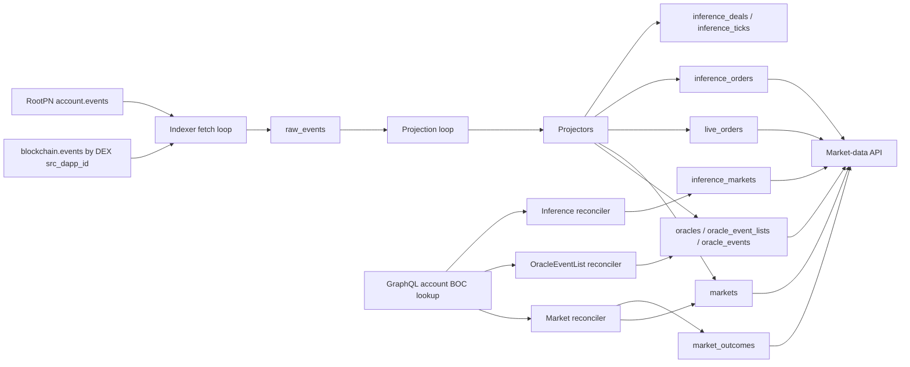

# Market Data Indexer Technical Specification

Implementation-facing requirements for the indexer side of the market-data path. This document covers how data gets *into* the read-model: ingestion from events stream, projection of contract events, and reconciliation of fields that events alone do not carry. The HTTP layer that serves these tables is described in [read-api.md](read-api.md). Postgres tables referenced below are documented column-by-column in [data-schema.md](data-schema.md).

## Glossary

**Read-model** — Postgres tables prepared for API reads. The indexer builds them from chain events and contract state.

**Raw event** — one message from the chain event stream stored in `raw_events`, decoded or not. It is kept so projections can be retried or rebuilt later.

**Projector** — code that applies one decoded on-chain event to the read-model. For example, the `OrderBook.OrderPlaced` event updates `live_orders`.

**Reconciler** — background task that periodically reads contract state through getters and fills fields that events alone do not provide.

**Reconciliation** — the process where reconcilers periodically fetch contract state and copy missing fields into the read-model. It complements event projection because some fields are available only through getters, not through chain events.

**Projection loop** — the single consumer that drains decoded `raw_events` rows (`processed_at IS NULL`) in `chain_order` and applies each to the read-model. It is the sole projector: the capture path no longer projects inline. A row that cannot apply yet (a child arriving before its parent) is left `processed_at NULL` and retried on the next pass — the loop is both first-projection and retry.

**BOC** — serialized contract state fetched from GraphQL and passed to the local TVM runner so getters can be executed off-chain.

## Data Flow



## Ingestion

The indexer follows two independently paginated GraphQL message-edge streams. Every in-scope edge becomes one row in [`raw_events`](data-schema.md#raw_events) regardless of whether it could be decoded — the raw log is the recovery boundary, and any downstream table can be rebuilt from `raw_events` plus a clean schema. The unique `raw_events.msg_id` constraint deduplicates an event if the streams ever overlap.

### Server-side capture scope

The primary stream uses the gateway's indexed ExtOutV2 source-dApp field:

```graphql
blockchain {
  events(src_dapp_id: "0000000000000000000000000000000000000000000000000000000000000004", first: $first, after: $after) { ... }
}
```

The value comes from `dodex_chain::DEX_DAPP_ID` (`SystemDapp::Dex`), not configuration. This one query selects events from every current DEX contract without issuing one request per event `dst`.

`RootPN` is the sole legacy contract whose ExtOut messages do not carry `src_dapp_id`, so the primary query cannot return them. Its events come from a second, address-scoped query:

```graphql
blockchain {
  account(
    account_id: "1010101010101010101010101010101010101010101010101010101010101010"
    dapp_id: "0000000000000000000000000000000000000000000000000000000000000004"
  ) {
    events(first: $first, after: $after) { ... }
  }
}
```

The account id is `RootPn::DEFAULT_ADDRESS` without its `0:` workchain prefix. The account-events query deliberately has no `dst` argument; local routing filters run after this server-side source selection and before ABI decode. A protected gateway may use optional `graphql.bearer_token`; the indexer sends it as `Authorization: Bearer ...` on both GraphQL queries.

These are the only live capture queries. In particular, the indexer does not issue one query per OrderBook event route or per-deal `TokenContract`: OrderBook traffic is covered by the DEX dApp stream, and the legacy RootPN traffic is covered by its fixed account address. Since contracts 4.0.36 a deal is deployed by its seller's `PrivateNote` (`deployDeal`) rather than by an external message, so it lives in the note's dApp — the DEX one — and its events arrive on the DEX dApp stream with everything else. No per-deal query is needed to reach them, and none is issued.

### Pre-decode filters

Three local filters run against the already source-scoped message edge — before any ABI decode — and drop matching edges entirely: `ignored_addresses`, the emitted-event `dst` allow-list, and `ignored_event_types`. The page cursor still advances past every dropped edge, so the indexer makes forward progress without storing or projecting them. Dropped edges do not produce a `raw_events` row and are outside the recovery boundary (they cannot be reprojected or rebuilt from `raw_events`).

Only the first **selects**; the other two subtract. That asymmetry is the point — on a shared chain a set of deny-lists cannot bound what is ingested.

#### Ingest scope: emitted-event `dst` (not configurable)

After the gateway has selected the DEX dApp or RootPN source, capture keeps an edge only when its `dst` is one of the 84 routing destinations in `config::SCOPED_EVENT_IDS`. Everything outside the allow-list is dropped before decode and counted as `out_of_scope`. `dst` is a 1:1 discriminator of event type readable from the message header, so this costs no decode.

The 15 `TokenContract.*` settlement destinations (the 7xx block) are **in** the list as of contracts 4.0.36. They were excluded before it, and the exclusion cost nothing while it held: a deal was deployed by an external message and was therefore the root of its own dApp, so its events could not appear on the DEX dApp stream at all. Once the deal moved into the note's dApp, keeping the exclusion would have meant dropping — every tick, from a stream already being drained — exactly the events [`inference_deals`](data-schema.md#inference_deals) and [`inference_ticks`](data-schema.md#inference_ticks) are built from. Note that the deal's `ContractDeployed` routes to **732** (`DealDeployedEmit`), not to 703: it carries the same name and body as `RootModel.ContractDeployed` and shared its channel until contracts 4.0.35 split the two.

An edge with **no** `dst` is dropped too — every event we emit is routed to one — but counted separately as `dst_missing`, and any nonzero count emits a `warn!`.

This filter is unconditional and has no config key. Server-side source selection prevents the global-chain scan; the local `dst` allow-list prevents unrelated DEX-dApp or RootPN outbound messages from reaching decode or storage.

The id list is pinned by `crates/infrastructure/tests/ingest_scope.rs`, which re-derives it from every `makeAddrExtern` call site under `contracts/**` on every run, and separately asserts the `TokenContract` block as a group. It cannot be derived from the ABI bundle: the ABI carries the event's *signature-hash* id, which is a different number from the EVENT_ID constant that forms the `dst`.

The list is load-bearing in both directions. An indexed id missing from it is lost before `raw_events` and is **not** recoverable by reprojection; a stale id admits a route the indexer does not intend to store. The pinning test fails on either. The separate TokenContract test names those 15 routes as a group because their presence is a decision rather than a consequence: put the deal back outside the DEX dApp and it is the test that says what has to be reconsidered.

#### No-op filter: `indexer.ignored_event_types`

`indexer.ignored_event_types` accepts a list of event-type names (e.g. `"OrderBook.Queued"`). An edge whose external `dst` matches a configured entry is dropped before decode. The `dst` of an external event is `makeAddrExtern(EVENT_ID, 256)`, rendered as `:` followed by 64 lowercase hex digits; because the width is fixed, each `EVENT_ID` yields one stable `dst` string that acts as a 1:1 discriminator of event type — readable from the message header before the body is decoded. See [dex-events-routing.md](../contract-specs/dex-events-routing.md) for the full `dst` derivation and per-event values.

Matching is by `dst` alone, but it runs only after the GraphQL query has selected the DEX dApp or RootPN source. Our own non-no-op events use distinct EVENT_IDs outside the no-op set, so a wanted event is never dropped by this filter.

Each per-tick log line includes a `type_ignored` count of edges dropped by this filter. A high `type_ignored` rate is not warned by itself because this filter is deliberately used to shed observability-only floods such as `OrderBook.Queued`.

The startup guard accepts **only** the known droppable no-op types — `OrderBook.Queued` / `FullyFilled` / `Rejected` / `CallbackBounced` and `PMP.StakeAccepted` / `PMP.MergeProcessed` (the `IGNORABLE_EVENT_TYPES` allow-list) — and refuses any other entry. It fires at startup, not at ingest time, so a bad entry prevents the service from starting rather than failing silently. The allow-list closes three otherwise-silent failures:

- A **metric-critical** type (`OrderBook.OrderPlaced`, `OrderBook.PartialFill`) is rejected because those must always land in `raw_events` for the OTLP counters to stay accurate.
- A **state-changing** type (anything the projector routes to a real handler, e.g. `OrderBook.OrderFilled`) is rejected before it could corrupt `live_orders`.
- A **typo** (e.g. `OrderBook.Quued`) is rejected rather than silently matching nothing. Because matching is by `dst`, a misspelled name would map to a wrong or absent ID and never drop an edge — `type_ignored=0` is indistinguishable from "configured correctly, zero volume". The guard catches this at startup instead.

Intended use: shed confirmed observability-only floods (e.g. `OrderBook.Queued`, which fires at queue entry before any order ID exists and has no read-model effect) without decoding or projecting them.

### Ingestion sequence per edge

1. The gateway selects the edge through either the DEX `src_dapp_id` stream or the RootPN account stream.
2. If the edge's `src` is in `indexer.ignored_addresses`, drop it. The page cursor still advances.
3. If the edge's `dst` is not one of the emitted-event destinations in `config::SCOPED_EVENT_IDS` — including when the edge carries no `dst` at all — drop it. `out_of_scope` is incremented, and a missing `dst` additionally increments `dst_missing`.
4. If the edge's `dst` matches a configured `indexer.ignored_event_types` entry, drop it and increment `type_ignored`.
5. Try to decode the message body against the ABI bundle (`crates/infrastructure/src/decoder.rs`). The decoder is **route-aware**: when an event id is ambiguous it resolves `event_type` by the message's `dst` address (the external `makeAddrExtern(EVENT_ID, 256)` in the message header) rather than a flat event-name scan. No loaded ABI currently collides — the `InferenceOrderBook` events carry an `Inference` prefix, so `InferenceOrderBook.InferenceOrderCancelled` no longer shares an event id with `OrderBook.OrderCancelled`, and every event resolves directly by its unique id. The decoder still does **not** assume event ids are globally unique: its id index tolerates collisions (one id may map to several `(contract, event)` entries), and any colliding pair would be disambiguated by a small `dst` route table. The two `OrderCancelled` dsts are pinned in that table defensively; each route records the event's expected id, so a decoded body whose own id does not match its route is left undecoded with a warning rather than mis-attributed. On success, store the decoded JSON payload alongside `event_type`.
6. Persist the row in `raw_events` with `processed_at = NULL`. The unique `msg_id` constraint deduplicates overlapping page fetches and any cross-stream overlap.
7. After the page commits, persist that source stream's resume cursor in [`indexer_cursors`](data-schema.md#indexer_cursors). An empty `endCursor` is refused before persistence and local assignment (`warn!`, cursor not advanced).
8. Only after both streams complete successfully in the same tick, update the aggregate `blockchain_events` projection barrier and `at_head` state. A failed stream leaves the aggregate row unchanged and eventually makes the API freshness gate fail closed.

### Dual-stream ordering barrier

The DEX-dApp and RootPN queries have independent `after` cursors because either filtered stream can advance without returning an event from the other. Their source rows are `blockchain_events_dex_dapp` and `blockchain_events_root_pn`. The existing `blockchain_events` row is retained as an aggregate compatibility row consumed by the projector, metrics, inference orphan gate, and read API.

The aggregate cursor is the largest globally ordered prefix known complete across both streams:

- While one or both streams are still backfilling (`at_head=false`), the barrier is the minimum cursor among only those backfilling streams. A stream already at head imposes no bound; otherwise a quiet RootPN stream would freeze projection at its last event forever.
- When both streams are at head, the maximum of their last event cursors becomes a **candidate** barrier. A head stream with no cursor is ignored because it has proved that it currently has no matching events.
- A backfilling stream with no cursor makes the aggregate cursor NULL and blocks projection until that stream establishes progress.

The all-head candidate is published only after the **next** successful poll of both streams. The two filtered queries do not share a database snapshot: if one answer returns before the other, a new event for the first stream can have a lower `chain_order` than an event observed by the second. The next poll captures any such event before releasing the previous candidate. Backfill barriers are safe immediately because their limiting cursor is behind the chain head. This one-poll stabilization is process-local; after a restart, the persisted safe barrier remains in place and the first all-head poll establishes a new candidate.

`run_reprojection_loop` always caps its SQL scan at `raw_events.chain_order <= blockchain_events.cursor`. Rows captured by the faster stream or the current all-head poll remain pending above the barrier; they neither project out of order nor cause a busy loop. The aggregate `at_head` is true only when both source drains reached `hasNextPage=false` in the same successful tick.

On the first deployment of this design, the old global-scan `blockchain_events` cursor is not a valid cross-stream barrier. Startup clears it when either source row is absent. On later restarts it preserves the last synchronized cursor but resets aggregate `at_head=false` until both streams have polled again.

### Cold start

With no source [`indexer_cursors`](data-schema.md#indexer_cursors) row — a fresh deployment, or a database restored without one — that source has no resume point. It does **not** ask for `after: null`. That is a legal query, but an unfiltered gateway query cannot answer it on a chain the size of mainnet: it fails the `blockchain` resolver with a `TIMEOUT` extension after ~2s. A stored empty-string cursor is treated as no resume point and logs a `warn!`. Capture sends the sentinel `after: "0"` instead (`EARLIEST_CURSOR`, `crates/infrastructure/src/graphql.rs`): cursors are `msg_chain_order` values — lex-sortable and always ordered above `"0"` — so the sentinel names the earliest retained matching event while staying on the indexed cursor path. Each source logs its cold start separately.

The sentinel is load-bearing, not a tidiness fix. Sent verbatim, `after: null` deadlocks the deployment: the page fails, so no cursor is persisted, so the next tick asks the same unanswerable question. The read-model stays empty indefinitely instead of degrading, and every page failure is retried forever at the polling interval.

A cold start recovers only what the gateway still holds. The event index keeps a bounded window (~39h on mainnet as measured 2026-08-19), so events older than that window are unreachable at any cursor; replaying them requires an archive node.

### Noise log

When `LOG_DIR` is set, the projector's "no handler for event type" warnings are split by novelty. The projection loop is the sole emitter of these warnings (the capture path no longer projects). The **first** time the process sees a given unhandled `event_type`, the warning is emitted at the normal target, so it reaches stdout and the main `<service>.log` — this is the operator's signal that a deployed contract emits an event the indexer does not yet handle. Every **later** repeat of that same type is written to `<service>.noise.log` (a separate daily-rotating file in `LOG_DIR`, like the main log) via the `dodex::event_noise` tracing target, configured by the `dodex-logging` crate (`EVENT_NOISE_TARGET`), so a steady flood does not drown the main log. When `LOG_DIR` is not set, all of these warnings appear on stdout alongside the rest of the log output.

## Projection — lifecycle events

Lifecycle events drive transitions on [`markets`](data-schema.md#prediction-markets) and the [`oracles`](data-schema.md#oracles) / [`oracle_event_lists`](data-schema.md#oracle_event_lists) / [`oracle_events`](data-schema.md#oracle_events) hierarchy. Each projector identifies its row by `pmp_address` (or the relevant parent address); if that row does not exist yet, the projector returns `Deferred` so the projection loop will retry once the parent event has landed.

| Event | Read-model effect |
| --- | --- |
| `RootOracle.OracleDeployed` | Inserts into [`oracles`](data-schema.md#oracles). Sets `address`, `name`, `pubkey`. |
| `Oracle.OracleEventListDeployed` | Inserts [`oracle_event_lists`](data-schema.md#oracle_event_lists) under the parent oracle, including the per-list `description` carried by the event. The field is read **strictly** (a missing `description` fails the projection) and written via `coalesce` so replays do not clobber it; the column is `NOT NULL`. |
| `OracleEventList.EventAdded` | Upserts [`oracle_events`](data-schema.md#oracle_events) with `event_name`, `oracle_fee`, `deadline`. Does NOT carry `describe`, `trust_addr`, or `outcome_names_jsonb` — those come from the OracleEventList reconciler. |
| `OracleEventList.EventConfirmed` | Stamps `oracle_events.confirmed_pmp_address` and `confirmed_at`. Links an event to the PMP that will market it. |
| `OracleEventList.RangeEventAdded` | Fills [`oracle_events.range_ob_address`](data-schema.md#oracle_events) (the settling `InferenceOrderBook`) and `range_bounds_jsonb` (decimal-string bounds) on the matching event. The event carries both, so this is **projector-sourced** (not reconciler `getRangeData`). Emitted alongside `EventAdded` with the same `eventId`; if the `oracle_events` row is not yet present, it **defers**. Backs the `resolvesFrom` block/filter on `/api/v1/prediction/markets` (read-time join via `confirmed_pmp_address`). |
| `PrivateNote.PMPDeployed` | Inserts a row in [`markets`](data-schema.md#prediction-markets) with `pmp_address`, `event_id`, `token_type`, `token_code`. Lifecycle columns (`stake_*`, `result_*`, `frozen_at`, etc.) stay NULL — they belong to later events. The row is invisible to the API until the reconciler stamps `last_reconciled_at`. |
| `PMP.TimingsSet` | Updates `stake_start`, `stake_end`, `result_start`, `result_end`, sets `approved = true`. May fire repeatedly while `now < resultStart` — keep the latest by block time. This projector is the **sole writer** of the four timing columns. |
| `PMP.PoolsFrozen` | Sets `frozen_at` via `coalesce` (never overwritten). This is the on-chain signal that the OrderBook contract has been deployed — `_ensureFrozen()` emits it after the freeze snapshot and after the deploy (see [dex-events-routing.md](../contract-specs/dex-events-routing.md#pmp)). |
| `PMP.Resolved` | Sets `resolved_at` and `resolved_outcome_id`. |
| `PMP.PMPRejected` | Sets `is_cancelled = true`, `cancelled_at`, `cancel_reason = 'PMP_REJECTED_BY_ORACLE'`. |
| `PMP.EventCancelled` | Same shape but `cancel_reason = 'EVENT_CANCELLED'`. The two reasons distinguish cancellation source and have different UI meaning. |
| `PMP.StakeAccepted` / `PMP.MergeProcessed` | Observability-only — no read-model table is touched (`ProjectionOutcome::Applied` no-op). Both are in the `IGNORABLE_EVENT_TYPES` allow-list and listed in the deployed `indexer.ignored_event_types`, so the edge is dropped before decode and no `raw_events` row is written. |

## Projection — order events

OrderBook events drive [`live_orders`](data-schema.md#live_orders), the
per-order read model backing `/api/v1/prediction/depth` and account-scoped
`GET /api/v1/prediction/orders`.

Three OrderBook events mutate order book state, one
PrivateNote confirmation event attaches ownership for private reads, and five OrderBook
events are observability-only.

| Event | Effect |
| --- | --- |
| `OrderBook.OrderPlaced` | Upserts into `live_orders` with `status = 'OPEN'`, full `amount_initial`, and full `amount_remaining`. `owner_pn_address` remains NULL until the matching PrivateNote confirmation arrives. `last_chain_order` is set to the event’s `msg_chain_order`. On conflict the upsert is `WHERE`-guarded against terminal rows (`FILLED` / `CANCELLED` / `REJECTED`): an isolated replay landing on a closed row is a no-op rather than reopening to OPEN, surfaced at `warn!` with `msg_id` / `chain_order` for triage. The handler sets: `chain_created_at` using first-write-wins semantics via `coalesce(...) on conflict` — the creation timestamp must never move once recorded; `chain_updated_at` using `greatest(...) on conflict`; `placed_chain_order` using `coalesce(live_orders.placed_chain_order, excluded.placed_chain_order)` from the event’s msg_chain_order. `placed_chain_order` is the sole sort key for `/api/v1/prediction/orders` and never changes once recorded, matching the first-write-wins semantics of chain_created_at. |
| `OrderBook.OrderFilled` | For a non-terminal row: decrements `amount_remaining` by `filledAmount`, flips `status` to `FILLED` when the remainder reaches zero, advances `last_chain_order` via `greatest(existing, new)`, advances `chain_updated_at` via `greatest`. For a row whose prior status is already terminal (`FILLED` / `CANCELLED` / `REJECTED`) all four mutation columns (`amount_remaining`, `status`, `last_chain_order`, `chain_updated_at`) are CASE-gated to leave the row unchanged; the event is logged at `warn!` and the projector still reports `Applied`. |
| `OrderBook.OrderCancelled` | For a non-terminal row: preserves `amount_remaining` as the unfilled cancelled remainder, flips `status` to `CANCELLED`, advances `last_chain_order` and `chain_updated_at` via `greatest`. For a row whose prior status is already terminal (`FILLED` / `REJECTED`) all three mutation columns are CASE-gated to leave the row unchanged; the event is logged at `warn!` and the projector still reports `Applied`. The terminal-state guard prevents a late cancel from demoting `FILLED` or rewriting `REJECTED`. |
| `PrivateNote.OrderPlacedConfirmed` | Updates the matching `(orderBook, orderId)` row with `owner_pn_address = event.src`, where `event.src` is the authenticated account's trading PrivateNote address. If the OrderBook row has not arrived yet, the confirmation is deferred and replayed later. This ownership update does not advance `last_chain_order`, so public depth cursors continue to represent OrderBook activity only. Refuses to overwrite an already-attached `owner_pn_address`; that path is reported as `Applied` (no-op). |
| `OrderBook.PartialFill` / `FullyFilled` / `Queued` / `Rejected` / `CallbackBounced` | Observability-only — no read-model table is touched. The row is recorded in `raw_events` for audit, unless its type is listed in `indexer.ignored_event_types` (e.g. `OrderBook.Queued` in the deployed config), in which case the edge is dropped before decode — no `raw_events` row is written. |

`PartialFill` / `FullyFilled` are derived aggregates that the contract emits for MM-friendly UX; the underlying state is already captured by `OrderFilled`. `Queued` / `Rejected` occur at the queue level, before any order ID is assigned. `CallbackBounced` is a diagnostic event — the OrderBook state is not automatically rolled back, and the bounced credit requires operator-driven recovery.

Event ordering is anchored on `raw_events.chain_order` (set from the GraphQL gateway’s `msg_chain_order`). All projection now runs through the projection loop, which reads pending rows from Postgres ordered by `chain_order ASC`; a single consumer applies them so `OrderPlaced → OrderFilled → OrderCancelled` preserves the natural sequence. Fills reduce `amount_remaining`, and cancellation then closes the order without erasing the unfilled remainder. `greatest(existing, new)` on `last_chain_order` is a belt-and-suspenders monotonicity guard for the row’s column, not the primary correctness mechanism.

## Projection — public trades

The public trade tape behind [`GET /api/v1/prediction/trades`](../api-spec.md#prediction-trades) is built from the
same `OrderBook.OrderFilled` event that drives `live_orders`, written into a separate
append-only `trades` table. Only the `tradeId` derivation is specified here; the table
shape lives in [data-schema.md](data-schema.md#trades) and the HTTP layer in
[read-api.md](read-api.md#apiv1predictiontrades).

A single match emits **two** `OrderFilled` events — one for the resting (maker) order
and one for the aggressor (taker) order, distinguished by the boolean `isTaker` field.
Recording a trade row on both would double-count the match, and the two events carry
different `msg_chain_order` values, so the algorithm canonicalises on one side:

1. On `OrderFilled` with **`isTaker == true`**, insert one `trades` row. On
   `isTaker == false`, do not write to `trades` (the maker-side event only mutates its
   `live_orders` row). Selection is by the explicit `isTaker` flag, not by
   observed emission order — the flag is authoritative and independent of how the pair
   landed in the stream.
2. `tradeId` is the **`chain_order` of that taker-side event** (`raw_events.chain_order`,
   the gateway's `msg_chain_order`). It is globally unique per match and lex-comparable,
   matching the cursor convention used elsewhere in the read-model.
3. Trade fields come from the same event: `price` from `clearingPrice`, `qty` from
   `filledAmount`, `time` from the event's chain time. `feeAmount` is deliberately not
   projected into the public tape. `isBuyerMaker` is derived from the taker order's side
   — taker selling ⇒ buyer is the maker ⇒ `true`; taker buying ⇒ `false`.

No pairing of the two per-side events is required for the tape: each taker-side fill is
exactly one trade. One taker order crossing N makers produces N taker-side `OrderFilled`
events and therefore N trades, each with its own `chain_order` as `tradeId`.

Idempotency follows from the key: `tradeId` is unique, so a replayed insert conflicts on
it and leaves every immutable column alone — the conflict arm's only action is
`chain_time = coalesce(trades.chain_time, excluded.chain_time)`, a first-write-wins fill
of a `NULL` chain time, and even that fires only when the replayed values match the
recorded row on every immutable column (a divergent conflict — drifted payload or
duplicate `msg_chain_order` — skips the arm and is logged at `error!`; first write wins,
never silently). `chain_time` itself is not guarded: a replay differing only in
timestamp passes the guard and the coalesce silently keeps the first value. This makes
the *trades* write replay-safe; the surrounding
`OrderFilled` projection as a whole is not (the `live_orders` fill arm re-subtracts
`filledAmount` on a non-terminal order — see `reproject_pending`'s doc), so a hidden
`NULL`-`chain_time` row on a live order is recovered by updating the `trades` row
directly, never by clearing `processed_at`; see the recovery notes in
[`data-schema.md`](data-schema.md#trades). As with `OrderFilled` on `live_orders`, an
event observed before its parent `OrderPlaced` is `Deferred` and retried.

The same canonical `tradeId` is the value the private `orderUpdate` WebSocket frame must
surface as `t` (see [api-spec.md](../api-spec.md#prediction-trades)); associating it with the
maker side's frame as well is part of that stream's implementation and is out of scope
here.

## Projection — inference order events

`InferenceOrderBook` events drive [`inference_orders`](data-schema.md#inference_orders), the per-order read model behind `/api/v1/inference/depth` (order-book depth) and `/api/v1/inference/orders` (per-order listing). The shape mirrors [order events](#projection--order-events): one row per chain-side order, mutated in place, never deleted. The unit is a **tick** (one unit of inference); `price` is price-per-tick in SHELL atoms.

| Event | Effect |
| --- | --- |
| `InferenceOrderBook.InferenceOrderPlaced` | Upserts into `inference_orders` with `status = 'OPEN'`, `amount_initial = amount_remaining = ticks`, `price`, `is_buy`, `note_address = note`, `last_chain_order = msg_chain_order`. `tokenContract` and `deadline` are mandatory in the ABI and decoded strictly — a missing field fails the projection rather than inserting a row with a NULL that nothing would ever repair. A successfully decoded zero address or zero deadline normalizes to SQL NULL (`non_zero_address` / `non_zero_uint`): on chain a BUY carries the zero address and a resting SELL carries deadline 0. The upsert's conflict arm is NULL-preserving on both columns (`coalesce(excluded.…, inference_orders.…)`), so a replay — including an `InferenceSubscriptionPlaced` replay, which carries neither field — cannot erase a value the reconciler later recovered from chain. `chain_created_at` first-write-wins via `coalesce`; `chain_updated_at` via `greatest`. Conflict is `WHERE`-guarded against terminal rows (an isolated replay on a closed row is a no-op, logged at `warn!`). If `orderbook_address` is unknown, the projector also seeds a skeleton [`inference_markets`](data-schema.md#inference_markets) row (`orderbook_address`, `created_at_chain`, `last_reconciled_at = NULL`) so the inference reconciler picks it up — this first-order-event seed is the discovery trigger (the book does emit an `InferenceOrderBookDeployed` event, recognized as observability but no `inference_orders` mutation). **Caveat:** `InferenceOrderPlaced` carries no `flags`, and it is emitted for *every* placement — including pure-taker (`IOC`/`FOK`/`MARKET`) and rejected `POST_ONLY` orders that never rest. See [Non-resting orders](#non-resting-orders). **Also ends a deal's funding cycle** when `isBuy=false` and `tokenContract` is non-zero: a funded deal cannot post an ask, so one that does proves its match was wound down — the only trace a silent `cleanupUnopened` leaves. See [Deal-address reuse](#deal-address-reuse). |
| `InferenceOrderBook.InferenceFilled` | Decrements `amount_remaining` by `ticks` on **both** the `makerId` and `takerId` rows; advances `last_chain_order` / `chain_updated_at` via `greatest`. Close rule, mirroring the contract's one-deal-slot semantics: a **SELL offer** (`is_buy = false`) is consumed by the book on any match — flip it to `FILLED` on the first `InferenceFilled` that names it, even a partial one. A **BUY maker** spans deals — it stays `OPEN` until `amount_remaining` reaches zero, then flips to `FILLED`. A named row that has not arrived yet defers the event. **Also upserts [`inference_deals`](data-schema.md#inference_deals)** using the `sellerTC` field as the PK: sets `orderbook_address` (the source contract), `seller_note` (resolved from the SELL leg's `note_address` in `inference_orders`), and `buyer_note` (`buyerNote` field). Uses `coalesce` so a row seeded by an earlier `TokenContract.*` event keeps any columns already filled. This is the only event carrying both `sellerTC` and `buyerNote`, so it is the authoritative source for the orderbook↔deal cross-link. **Also appends one row to [`inference_trades`](data-schema.md#inference_trades)** — unlike `OrderFilled` on the prediction side there is no taker-side gate, since `InferenceFilled` is already one-per-match. `price`/`qty` come from `clearingPrice`/`ticks`; `isBuyerMaker` (not carried by the event) is read off the locked MAKER leg's `is_buy`, falling back to the inverse of the taker leg's `is_buy` when the maker leg is absent. The append is skipped only when neither leg is present (the direction is then unrecoverable) — see the orphan-repair note below. |
| `InferenceOrderBook.InferenceOrderCancelled` | Flips `status` to `CANCELLED`, preserves `amount_remaining` as the unfilled remainder, advances `last_chain_order` / `chain_updated_at` via `greatest`. Terminal-state guard prevents a late cancel from demoting a `FILLED` row. |
| `InferenceOrderBook.InferenceSubscriptionPlaced` | Upserts the resting BUY created by a §8 subscription: `status = 'OPEN'`, `is_buy = true`, `is_subscription = true`, `price = maxPrice`, `amount_initial = amount_remaining = ticks`. Carries neither `tokenContract` (a subscription is a bid, never a deal-naming SELL) nor `deadline`, so the upsert passes `NULL` for both; the NULL-preserving conflict arm (see above) means a value the reconciler later recovers via its `getOrder` probe is never erased by a replay of this event. It rests as a standing bid and is matched by incoming sells like any other buy maker. |
| `InferenceOrderBook.InferenceExecuted` / `InferenceRefunded` / `InferenceOrderCancelRejected` / `InferenceOrderBookDeployed` | Observability-only — no `inference_orders` mutation. In particular `InferenceRefunded` carries `(note, amount)` with **no order id**, so it cannot close a specific row; non-resting and rejected orders are healed by the reconciler (below), never projected from `InferenceRefunded`. `InferenceOrderCancelRejected` reports a cancel that matched no resting order (`reason = 0`) or came from a foreign owner (`reason = 1`) — the book is unchanged by construction, so there is nothing to project. |

Ordering is anchored on `raw_events.chain_order` as elsewhere. `InferenceOrderPlaced` for a taker is emitted at queue-entry before its `InferenceFilled` events, so the parent row always exists by the time a fill applies; a `InferenceFilled` seen first is `Deferred` and retried.

### Non-resting orders

The contract emits `InferenceOrderPlaced` *before* it knows whether the order will rest: pure-taker orders (`IOC` / `FOK` / `MARKET`) and a crossing `POST_ONLY` are placed, emit `InferenceOrderPlaced`, then either fill or are refunded — without resting. Three closure paths exist:

- **Fully filled** — `InferenceFilled` reduces `amount_remaining` to zero → `FILLED`. Correct from events alone.
- **Explicitly cancelled** — `InferenceOrderCancelled` → `CANCELLED`. Correct from events alone.
- **Placed-but-never-rested** (FOK/POST_ONLY rejected, IOC/MARKET leftover, expired subscription) — the only on-chain signal is a `InferenceRefunded` event that carries **no order id**, so the projector cannot close the specific row. Left untreated, the `InferenceOrderPlaced` row sits `OPEN` and pollutes depth (a phantom level).

The inference reconciler closes this gap: it sweeps the book's `OPEN` rows with a **bounded round-robin cursor** — each tick reads a fixed batch via `InferenceOrderBook.getOrder(orderId)` and, when an order is no longer in the book (`getOrder` reports zero amount), flips the row to `CANCELLED`. This is the same getter-fills-what-events-miss pattern used by the market reconciler. The cursor advances per tick and resets to the start once a batch returns fewer rows than the batch size (the `(cursor, max]` range is exhausted), so every `OPEN` row — including long-lived subscriptions — is revisited over successive cycles without scanning the whole book in one pass. See [Inference reconciler](#inference-reconciler) for the cursor/cycle mechanics and the catch-up gates.

> **Recommended contract-side follow-up.** Add `flags` to `OrderPlaced` (so a taker-only order is never recorded as resting), an `orderId` to `Refunded`, or an explicit `OrderClosed(orderId)` event. Any one removes the getter sweep and makes depth event-exact — the analogue of the [`REJECTED` follow-up](read-api.md#rejected-status) on the prediction-market side. Tracked as an open item because it touches `InferenceOrderBook` (and re-pins the note↔book code hash).

## Projection — TokenContract SETTLEMENT events

These handlers run on live traffic as of contracts 4.0.36. Until then they applied only to retained rows — the deal lived in a dApp of its own and its events never reached capture — and the section described a replay-only path; see [Ingest scope](#ingest-scope-emitted-event-dst-not-configurable) for what changed. Public inference endpoints still derive their order and trade data from `InferenceOrderBook.*` and do not depend on settlement-event capture.

`TokenContract.*` events drive [`inference_deals`](data-schema.md#inference_deals) and [`inference_ticks`](data-schema.md#inference_ticks) — the per-deal read model for the inference SETTLEMENT phase. A `TokenContract` is deployed per matched SELL offer; its address is the PK for `inference_deals`.

The projector seeds a skeleton `inference_deals` row on the **first** `TokenContract.*` event it sees for a given address (keyed by `src_address = event.src`), so out-of-order or early delivery still records the deal. That seed is a write, which is why no `TokenContract.*` type may be added to `IGNORABLE_EVENT_TYPES`: that list admits only genuine projector no-ops, and every event here goes through the seed.

The `orderbook_address` and `seller_note` cross-link columns are filled by the `InferenceOrderBook.InferenceFilled` handler (see the table above) — it is the only event carrying `sellerTC` + `buyerNote` together — and the SETTLEMENT projector never touches them. `buyer_note` is written by both sides.

### Deal-address reuse

**A deal address serves more than one match as of contracts 4.0.36**, and the read model is keyed by that address. `cleanupUnopened` used to end in `_die`, so a buyer no-show destroyed the `TokenContract` and the next match needed a fresh deploy at a fresh address. It no longer does: it returns the deal to unfunded and the same contract takes a new offer through `postFromNote`, with a different buyer and a different deposit.

**The wind-down itself is silent.** `cleanupUnopened` emits nothing — it no longer dies, so no `TokenContract.ContractDestroyed`, and no `PrivateNote.InferenceDealClosed` either, since that fires only when a deal dies. Nothing on chain announces that a match is over, which is why the cycle is ended by inference from what happens next.

**A fresh SELL offer naming the deal is the signal.** `InferenceOrderBook.InferenceOrderPlaced` with `isBuy=false` and a non-zero `tokenContract` ends that deal's cycle. The inference is sound rather than merely plausible: `postFromNote` opens with `if (_offerPosted || _funded) { return; }`, and a funded deal never clears `_offerPosted` — `onSellClosed` returns early while `_funded`. A funded deal therefore **cannot** put a new ask up, so an ask that reaches the book naming one proves its funding was undone.

`StreamFunded` ends a cycle too, as the backstop for a deal whose re-offer we never saw.

Either way the projector clears everything that belongs to a cycle — `buyer_note`, `deposit`, `funded_at_chain`, `price_per_tick`, `opened_at_chain`, `settled_at_chain`, `close_kind`, `clean_settlement`, `disputed_at_chain`, `trusted_ticks`, `claimed_ticks`, `finalized_ticks` back to 0 — and deletes the deal's `inference_ticks` rows, so the counter and the log it counts stay in agreement. `orderbook_address` and `seller_note` survive: the deal address derives from the seller's key and nonce, so neither can change while the address does not.

Both are gated on `msg_chain_order` being **newer** than the row's `last_chain_order`, and on the row having been funded at all. That gate is what makes the rule replay-safe and what separates a re-listing from the ask that produced the current match: in the ordinary flow the SELL rests *before* the funding it leads to, so a late delivery of it is older than the row and says nothing. A replay of cycle one's `StreamFunded` after cycle two has begun is inert for the same reason, and a deal that has never been funded has no cycle to end.

`InferenceOrderBook.InferenceFilled` writes `buyer_note` under the same rule — newest `last_chain_order` wins rather than first-write-wins — so the party recorded against a deal is the one from its current match.

One gap is left open deliberately: this orders cycles, not events within one. A cycle-one event delivered out of order *after* cycle two's funding still writes into cycle two through its own `coalesce`. Closing it needs a cycle number on the deal row and on every event that touches one — a migration and a wider primary key, against a case that has not been observed.

| Event | Effect |
| --- | --- |
| `ContractDeployed` | Seeds the `inference_deals` skeleton only; no additional columns. |
| `StreamFunded` | Cycle boundary, as the backstop behind the SELL-offer signal — see [Deal-address reuse](#deal-address-reuse). On a funding newer than `last_chain_order` for an already-funded row, clears the per-cycle columns and the deal's `inference_ticks` rows first. Then sets `buyer_note`, `deposit`, `funded_at_chain` (first-write-wins into the cleared row) and advances `last_chain_order`. |
| `StreamOpened` | Sets `buyer_note` (first-write-wins), `price_per_tick` (first-write-wins), `opened_at_chain` (first-write-wins). |
| `TickFinalized` | Inserts one `inference_ticks` row keyed by `(token_contract_address, chain_order)` — idempotent on replay via `ON CONFLICT DO NOTHING`. Increments `finalized_ticks` on `inference_deals` **only** when the insert was a real insert (rows affected = 1), so `finalized_ticks` = count of `TickFinalized` events and replay does not double-count. The event's `finalizedOwed` is the contract's cumulative `_finalizedOwed`; it is stored on the tick row, not summed. |
| `StreamStopped` | Sets `settled_at_chain` (first-write-wins), `close_kind = 'STOPPED'`, `clean_settlement = true` (first-write-wins). |
| `DisputeResolved` | Sets `settled_at_chain` (first-write-wins), `close_kind = 'DISPUTE_RESOLVED'`, `clean_settlement = false` (first-write-wins). |
| `StreamReclaimed` | Sets `settled_at_chain` (first-write-wins), `close_kind = 'RECLAIMED'`, `clean_settlement = false` (first-write-wins). The contract no longer emits it — the event went with `reclaimOnTimeout` — so the arm serves retained rows only. |
| `StreamDisputed` | Sets `disputed_at_chain` (first-write-wins), `clean_settlement = false`. |
| `ContractDestroyed` | Sets `settled_at_chain` (first-write-wins), `close_kind = 'DESTROYED'`. |
| `ProbeBurned` | Terminal close (buyer stop before probe-accept, or dispute-burn): sets `close_kind = 'PROBE_BURNED'` + `settled_at_chain` (first-write-wins). Does NOT set `clean_settlement` (stays NULL → not a clean settlement, no settlement-complete reward). |
| `SellerBondFunded` / `BuyerBondFunded` / `ProbeAccepted` / `ShellWithdrawn` / `EndpointSet` | No-op beyond skeleton seed — these carry no deal-level state the SETTLEMENT read-model needs. `EndpointSet` carries the buyer's endpoint as ciphertext only the two parties can read, so there is nothing in it a read model could serve. |

The projector never returns `Deferred`; the skeleton seed ensures the row always exists before the event-specific handler runs. All close columns use `coalesce(existing, new)` first-write-wins so late or replayed close events cannot overwrite an already-settled row — first-write-wins *within a cycle*, which the `StreamFunded` reset above starts.

**Read-model contract intended for the forthcoming rewards service.** Given a deal's `TokenContract` address, a single query — `SELECT orderbook_address, seller_note, buyer_note, finalized_ticks, clean_settlement, settled_at_chain FROM inference_deals WHERE token_contract_address = $1` — resolves the originating order book, both parties, and the tick/settlement outcome without replaying raw events. `inference_ticks` provides per-tick granularity (one row per finalized tick) for tick-level scoring such as "Tick выдан / Tick потрачен".

## Reconciliation

Three reconcilers (market, OracleEventList, inference) fill metadata that the event stream alone does not carry. All run on a fixed cadence (configured under `indexer:` in `config/indexer.<env>.yaml`) and share a failure-backoff pattern (`last_reconcile_failed_at`, `reconcile_attempts` on the parent row) so a permanently broken contract cannot starve the queue. The inference reconciler additionally exposes three cadence knobs (`inference_reference_price_refresh_ms`, `inference_sweep_interval_ms`, `inference_orphan_cutoff_ms`) beyond its base interval; see [Inference reconciler](#inference-reconciler) for the full table.

### Market reconciler

For each [`markets`](data-schema.md#prediction-markets) row that needs catch-up, the reconciler:

1. Fetches the PMP account BOC from chain.
2. Runs `PMP.getDetails()` off-chain through the local TVM emulator (`crates/infrastructure/src/tvm_runner.rs`).
3. Runs `PMP.getOrderBookAddress()` the same way.
4. Writes `market_id`, `name`, `oracle_list_hash`, `approved`, `is_cancelled`, `num_outcomes`, and outcome rows in [`market_outcomes`](data-schema.md#market_outcomes).
5. Stamps `last_reconciled_at`. The market becomes visible to the API only after this point.

Two invariants the reconciler enforces on the write side:

- **`orderbook_address` is stamped on the first reconcile pass — pre-freeze rows included.** `getOrderBookAddress()` is deterministic (`contracts/dex/PMP.sol:1360`) and returns the precomputed address regardless of `frozen_at`, so any market visible to the API carries a usable address. DB schema pins this with a CHECK constraint (`last_reconciled_at IS NOT NULL ⇒ orderbook_address IS NOT NULL`) and un-stamps `last_reconciled_at`.
- **Timing columns (`stake_*`, `result_*`) are never written by the reconciler.** On pre-`TimingsSet` PMPs `getDetails()` returns contract-default zeros; copying those would make the API flip out of PENDING. The `TimingsSet` projector is the sole writer of those columns.

Queue ordering (the SELECT in `MarketReconciler::run_once`):

- A row enters the queue when `last_reconciled_at IS NULL` (never reconciled). The first successful pass stamps both the address and `last_reconciled_at`; the getter result is stable, so there is no later re-queue trigger.
- Failed rows go to the back via `nulls first` ordering on `last_reconcile_failed_at`. A 5-minute backoff filter excludes recently-failed rows entirely so they don't dominate the batch.

### OracleEventList reconciler

For each [`oracle_event_lists`](data-schema.md#oracle_event_lists) row that has at least one event still missing reconciler-only metadata, the OracleEventList reconciler runs `OracleEventList._events` and fills `describe` / `trust_addr` / `outcome_names_jsonb` per event. The `outcomeNames` map (used to render `/api/v1/oracles` `events[].outcomes`) lives only in the getter, not in `EventAdded`, so it is reconciler-sourced like the other two.

For a numeric **range event**, [`oracle_events.range_ob_address`](data-schema.md#oracle_events) (the `InferenceOrderBook` the event resolves from) and `range_bounds_jsonb` are **projector-sourced** — the `RangeEventAdded` event carries both, so no reconciler getter is needed (see the projector table above). They are what links a prediction market to an inference market: `/api/v1/prediction/markets?resolvesFrom=<inferenceOrderBookAddress>` reverse-looks-up markets by `range_ob_address`. A plain (non-range) event leaves both NULL.

Not yet projected: `OracleEventList.DescriptionUpdated` (post-deploy edits to a list's description) and `Oracle.EventPublished`. The read-model therefore reflects the list `description` as of deploy time; a later on-chain description update is not surfaced until a projector for that event is added. The decoder counts these events (they are part of the pinned ABI total) but no projector consumes them today.

Key column: [`oracle_events.meta_reconciled_at`](data-schema.md#oracle_events). The reconciler stamps this **unconditionally** on every successful pass — even when the on-chain `trustAddr` is legitimately null, the marker is set so the row drops out of the pending queue. The marker replaced an earlier `describe IS NULL OR trust_addr IS NULL` predicate that never cleared for events with null on-chain metadata.

The reconciler selects an OracleEventList when this condition is true:

```sql
exists (select 1 from oracle_events oe
         where oe.eventlist_id = oel.id
           and oe.meta_reconciled_at is null)
```

Two anti-starvation outcomes share the failure-backoff path with the market reconciler (`last_reconcile_failed_at`, 5-minute cooldown):

- **`NoBoc`** — the OracleEventList account BOC is not yet available from the gateway.
- **`Reconciled(0)` — no-progress pass.** The BOC is queryable but the run does not stamp any child. Two shapes collapse into this: an empty `_events` map, and a non-empty map whose items all target children that are already `meta_reconciled_at IS NOT NULL`. Both mean the indexed contract state lags the event stream — `EventAdded` persisted a pending child that `_events` does not yet reflect. Without the backoff the OracleEventList would be picked every sweep (the pending SELECT still matches it) and starve later rows behind the LIMIT 16 batch until the node catches up.

### Inference reconciler

The inference reconciler is the third reconciler — a sixth long-running indexer loop alongside capture, projection, the market and OracleEventList reconcilers, and metrics. It manages two work queues with separate cadences:

- **Queue A — Discovery** (`last_reconciled_at IS NULL`): newly seeded books that need identity + static columns filled.
- **Queue B — Refresh** (already-reconciled rows): periodic re-fetch of the reference price and sweep of phantom open orders.

**Config knobs** (all under `indexer:` in `config/indexer.<env>.yaml`):

| Key | Default | Purpose |
| --- | --- | --- |
| `inference_reconciliation_interval_ms` | `15000` | How often Queue A runs. |
| `inference_reference_price_refresh_ms` | `3600000` | Minimum age before a book's `reference_price` is re-fetched. |
| `inference_sweep_interval_ms` | `30000` | Minimum age before a book's sweep cycle re-runs. |
| `inference_orphan_cutoff_ms` | `1800000` | Projection-loop dead-letter window: an inference `InferenceFilled` or `InferenceOrderCancelled` whose parent `InferenceOrderPlaced` row is absent and whose ingest age exceeds this is dropped (marked `Applied`, with a counter increment) rather than deferred forever. Keyed on `raw_events.created_at` (wall-clock ingest time), not `created_at_chain`. |

**Discovery pass (Queue A)**

For each `inference_markets` row with `last_reconciled_at IS NULL` and `superseded_at IS NULL`, the reconciler:

1. Fetches the `InferenceOrderBook` account BOC from chain.
2. Runs `getParams()` off-chain → resolves `model_hash`, `platform_fee_bps`. Runs `getModelName()` → the model-name string, parsed into the identity columns `model_ref` / `producer` / `model_name` / `model_version` (see [Model identity](#model-identity-from-getmodelname) below). Runs `getVersion()` off-chain (on the same already-fetched BOC) → resolves the **contract** `version` string (e.g. `4.0.14`), stored in the `version` column — distinct from the model's `model_version` — and used by the **model-slot claim** (see below). Also sets the **constant** precision/quote columns that do not come from the getter but are protocol-fixed: `quote_token_type = SHELL (2)`, `price_precision = 9`, `quantity_precision = 0`, `tick_size = "0.000000001"`, `step_size = "1"`, `min_notional = "0.000000001"`. Note: `getParams()` no longer returns `tickSize`/`stepSize`/`minNotional` — these are reconciler-set constants, not getter-sourced.
3. Runs `getWeeklyMedianPrice()` → writes `reference_price` (+ `reference_price_at`). The getter **reverts with TVM exit code `ERR_NO_LIQUIDITY`** on a dry book; the reconciler recognises this typed revert, writes `reference_price = NULL` (the API surfaces `referencePrice: null`), and continues — it is not a failure.
4. Runs a **bounded round-robin phantom-cancel sweep** over `OPEN` [`inference_orders`](data-schema.md#inference_orders) for the book (see [Non-resting orders](#non-resting-orders)). Each tick advances `sweep_cursor`; the cycle completes when a batch returns fewer than `sweep_batch_n` OPEN rows in `(sweep_cursor, sweep_cycle_max)` (the range is exhausted), which resets `sweep_cursor` to NULL so the next cycle restarts from the lowest `order_id`. Completion is *not* keyed on the cursor reaching `sweep_cycle_max`: `sweep_cycle_max` is `nextOrderId` and normally has no OPEN row at the boundary, so an equality test would never reset and would starve long-lived rows. Newly-minted orders above `sweep_cycle_max` (the snapshot of the highest `order_id` at cycle start) are deferred to the next cycle. The upper bound is **exclusive** — `nextOrderId` names the next *unassigned* id, so an inclusive bound could probe an id a placement projected after the BOC was fetched now occupies, reading `amount == 0` on a live order and cancelling it. The bound is additionally **clamped** to `min(sweep_cycle_max, boc_next_order_id)`, where `boc_next_order_id` is re-read from `getStats()` on every step rather than replayed from the cycle's stored `sweep_cycle_max`: mid-cycle, `sweep_cycle_max` describes the account state that opened the cycle, and a gateway serving a rolled-back state must never be asked about an id it has not assigned yet. When the BOC clamps the bound below `sweep_cycle_max`, the cycle is **not** reported complete — even a short batch — because the ids in `[boc_next_order_id, sweep_cycle_max)` were never probed; the cursor keeps whatever progress the clamped batch made (or stays put on an empty clamped batch) and the cycle retries next tick against a fresh BOC. This is the load-bearing correctness fix for the phantom sweep: no downstream check catches a wrongly-cancelled row.
5. The sweep runs only when **all three** catch-up gates pass:
   - **(i) idle gate**: `getQueueSize() == 0` — the book has no in-flight queue continuation. A book with a pending queue item must not be swept yet.
   - **(ii) `at_head` gate**: `indexer_cursors.at_head = true` — the capture loop is caught up to the chain tip. If false, the indexer is still replaying old pages; a sweep firing now would cancel orders that have already been filled by events not yet projected.
   - **(iii) pending-events gate**: no `raw_events` row for this book remains `processed_at IS NULL` (checked via `raw_events_pending_src_idx`). An unprocessed event could be a `InferenceFilled` that closes the phantom order the sweep would otherwise cancel.
6. **All-or-nothing visibility stamp**: stamps `last_reconciled_at` only after a complete sweep cycle (not mid-cycle). The stamp is guarded by a CAS on `sweep_override_seq` — if a `InferenceFilled` event overrode a provisionally cancelled order mid-cycle (bumping `sweep_override_seq`), the stamp is deferred until a fresh cycle completes cleanly. This prevents a book from becoming API-visible with phantom `CANCELLED` rows that events will later re-open. The stamp is additionally blocked by `AND superseded_at IS NULL` in the UPDATE WHERE, so a row retired mid-batch can never be stamped visible.

**Model-slot claim and version-based supersede**

One book per `model_hash` is an on-chain invariant: every `InferenceOrderBook` contract has a single static `_modelHash`. Duplicates only appear after cross-version redeploys, where a new code-hash contract is deployed for the same model before the old one is retired. Without a resolution strategy the new book would fail discovery forever on the `model_hash` partial unique index.

The reconciler resolves collisions transactionally (`claim_model_slot`) using the `getVersion()` getter (run on the already-fetched BOC — no extra round-trip):

- If no other `inference_markets` row currently holds the `model_hash` slot (no collision), the book claims it unconditionally and proceeds normally.
- On a collision with a different address, the incoming book's version is compared against the incumbent's:
  - **Incoming version is unknown / unparseable** (getter returned no `value0`): the reconciler returns `Err` without modifying either row. Discovery fails and the book retries on the next tick. This prevents a malformed-getter result from silently retiring a good incumbent.
  - **Incoming version is higher**: the incumbent is retired — its `model_hash` and `last_reconciled_at` are cleared and `superseded_at` is set. The incoming book then claims the slot and continues discovery normally.
  - **Incoming version is lower or equal**: the incoming book is retired — its `model_hash` and `last_reconciled_at` are cleared and `superseded_at` is set (recording the fetched `version` for audit). Discovery returns `Superseded` and the book no longer enters the visible or metric sets.

Both retire branches clear `model_hash` and `last_reconciled_at` symmetrically, so a superseded row can never hold a slot or appear API-visible. The `superseded_at IS NULL` guard on the Queue A SELECT and on the stamp UPDATE keeps this invariant stable across ticks — a retired row drops out of discovery immediately and can never be stamped back in.

Superseded books are excluded from all three `indexer_inference_markets{state=discovering|visible|failing}` buckets. Each `count(*) filter` in `inference_market_state_counts` carries an explicit `AND superseded_at IS NULL` guard so a superseded row contributes to none of the buckets — even one that also has `last_reconcile_failed_at` set from a prior discovery attempt before it was retired.

**Provisional sweep-cancel**

When `getOrder(orderId)` confirms an order is no longer in the book (zero amount), the reconciler writes `status = 'CANCELLED'` and stamps `swept_at`. This is provisional: a `InferenceFilled` or `InferenceOrderCancelled` event that arrives later will advance the row normally. Terminal-row guards ensure a late event on an already-`FILLED` row is a no-op.

**`token_contract` / `deadline` repair**

The same `getOrder(orderId)` call the sweep already makes for the phantom-cancel check also carries `tokenContract` and `deadline` — the reconciler repairs a row missing either at no extra chain cost. Two gaps this closes: a live SELL whose `token_contract` the indexer does not yet know (see [`inference_orders.token_contract`](data-schema.md#inference_orders) — the read path's fail-closed probe exists precisely because this state is possible), and every subscription-placed BUY (`InferenceSubscriptionPlaced` carries neither field), which always starts with `deadline IS NULL`. The batch `SELECT` behind the sweep carries `token_contract IS NULL AS tc_missing` and `deadline IS NULL AS deadline_missing` alongside each `order_id`, and the two columns repair **independently**: `token_contract` is written only when `tc_missing` is true and the getter's `tokenContract` decodes to a non-zero address (`non_zero_address`), and `deadline` only when `deadline_missing` is true and the getter's `deadline` decodes to a non-zero value (`non_zero_uint`) — the same normalization the placement projector applies. A row with both columns already set costs a `getOrder` call but never reaches the UPDATE; a BUY's permanently-zero `token_contract` and a resting SELL's permanently-zero `deadline` are intentional NULLs and are never targeted, so a healthy row's `updated_at` never churns on a sweep cycle it does nothing for.

**Refresh pass (Queue B)**

For each already-reconciled, non-superseded book (`last_reconciled_at IS NOT NULL AND superseded_at IS NULL`) that is due for refresh:

1. If the price cadence is due (reference_price_at stale), re-fetches `getWeeklyMedianPrice()` → updates `reference_price` / `reference_price_at`. The `ERR_NO_LIQUIDITY` revert maps to NULL as on the discovery pass.
2. Runs the phantom-cancel sweep under the same `at_head` + pending-events gates, over OPEN rows only (the sweep is a no-op if there are no open orders).

**Orphan dead-letter (projection loop)**

The projection loop applies the `inference_orphan_cutoff_ms` window as a dead-letter for inference events that have waited beyond the cutoff without their parent arriving. Specifically: an `InferenceOrderBook.InferenceFilled` or `InferenceOrderBook.InferenceOrderCancelled` event whose `raw_events.created_at` (wall-clock ingest time) is older than `inference_orphan_cutoff_ms` and whose parent `InferenceOrderPlaced` row is absent is dropped (marked `Applied` with a counter increment) rather than deferred forever. The cutoff is keyed on ingest time — a row with an old `created_at_chain` but recent `created_at` (e.g. a late-arriving event) is not dropped. An expired `InferenceFilled` orphan still records the `inference_deals` link (`orderbook_address` + `buyer_note` from the event; `seller_note` resolved from the SELL leg when it is present) so the deal remains visible to settlement rewards even when one or both `InferenceOrderPlaced` parents were dropped at capture. The same repair also appends the [`inference_trades`](data-schema.md#inference_trades) row whenever the direction still resolves from whichever leg IS present; with neither leg present the match is omitted from the public tape (logged at `warn!`) rather than landing with a guessed side.

#### Model identity (from `getModelName`)

The order book carries only `model_hash`; the human-readable name is not in `getParams()`. On the discovery pass the reconciler reads it from the book's `getModelName()` getter and stores it **verbatim** in `model_ref` — the column the API serves as `modelRefName`. Surrounding whitespace is kept, because the contract feeds the name into `sha256(modelName) == modelHash`: a padded name is a different model at a different book address, so trimming would serve two markets under one label. A name that is blank or all whitespace leaves the column NULL and the API renders the model by `model_hash`.

**Nothing is parsed out of the name.** It used to be split on exactly three `--`-separated parts into `producer` / `model_name` / `model_version`, with all three left NULL for anything else. The model registry has since been re-seeded with names that are not in that shape — `Qwen2.5-32B-Instruct`, not `qwen--qwen2.5-32b--instruct` — so the parts would have been NULL for every new market, and the split was a guess at structure the names never guaranteed. The three columns are gone (`0005_drop_inference_model_name_parts.sql`) and the whole string is served instead.

This follows the "getter backfills what events don't carry" pattern: discovery is still triggered by the first order event ([projection](#projection--inference-order-events) routes `InferenceOrderBookDeployed` to observability-only), and the reconciler completes identity from the getter. Note that `model_ref` is the MODEL's label while the `version` column is the **contract** version from `getVersion()`, used only by the supersede logic — the two are unrelated.

> 🚧 **Still deferred — registry-walk fields.** `owner_pubkey`, `manifest_address`, and `root_model_address` require a registry walk (`SuperRoot` → `RootModel`) that is not yet implemented (the `ManifestMetadata` contract that earlier held the manifest was removed upstream in v4.0.10). These columns stay NULL.

## Failure handling

Two outcomes leave a `raw_events` row pending:

- **`Deferred`** — the projector knows it cannot apply this event yet (typically a child arriving before its parent). `processed_at` stays NULL and the projection loop retries it on a later pass. Forward passes resume above the last-drained ceiling; a separate retry pass rewinds to the front of the pending queue on a timer — roughly every `polling_interval_ms`, independent of whether the loop idled, so stuck rows are re-attempted on that cadence even under sustained ingest. A permanently deferred row is therefore retried at most once per interval, not on every ingest batch.
- **`Err`** — the projector hit an unexpected error. Same effect on `processed_at`, plus a warn log and an increment in the failure counter. Useful for spotting ABI drift.

The projection loop (`indexer_repo.rs::run_reprojection_loop`, draining via `reproject_pending_from`) picks pending rows in `chain_order` sequence up to the synchronized dual-stream barrier, holds them with `for update skip locked` so a row is never projected twice even if a second consumer is ever added, and reuses the already-decoded payload from `raw_events.decoded` — bodies are not re-decoded. It is the sole projector: the capture path writes `raw_events` rows with `processed_at NULL` and never projects inline.

A batch is drained optimistically in a single transaction with **no per-row savepoint**, so an applied row costs only its projector statements — not an extra `SAVEPOINT`/`RELEASE` round-trip pair, which matters when the database is far (high per-round-trip latency). If a projector returns `Err`, that transaction is rolled back untouched and the same range is replayed with per-row savepoints, which applies the clean rows and leaves the failing one pending — the identical outcome to savepointing every row, paid for only when a failure actually occurs. The savepointed replay is paid only on passes that hit a projector error — in practice the periodic retry pass re-attempting a stuck row, though a newly captured row that errors on first sight also drops its forward pass to the fallback. A clean forward drain stays on the savepoint-free fast path.

Reconciler-side failures use a separate mechanism — `last_reconcile_failed_at` and `reconcile_attempts` on the [`markets`](data-schema.md#prediction-markets) and [`oracle_event_lists`](data-schema.md#oracle_event_lists) rows. The 5-minute backoff window prevents a permanently broken `getDetails()` from blocking the batch every tick.

## Metrics

The indexer exports two OpenTelemetry counters over OTLP, covering all markets and users (no per-market or per-user labels):

| Metric | Source |
| --- | --- |
| `orders_created_event_cnt` | `count(*)` of `raw_events` where `event_type = 'OrderBook.OrderPlaced'` |
| `order_partially_filled_event_cnt` | `count(*)` of `raw_events` where `event_type = 'OrderBook.PartialFill'` |

Both are `ObservableCounter`s whose value is read from `raw_events`. Because `raw_events` is the append-only, `msg_id`-deduplicated event log, the counts are exactly-once, monotonic, replay-safe, and recovered from the database after a restart — no hot-path instrumentation.

A background loop (`services/indexer/src/metrics_refresh.rs`) refreshes the cached counts every 15s; the OTLP `PeriodicReader` pushes them every 30s. Collection follows the OpenTelemetry env convention: metrics are exported only when `OTEL_EXPORTER_OTLP_METRICS_ENDPOINT` or `OTEL_EXPORTER_OTLP_ENDPOINT` is set. With neither set the meter provider is not created and nothing is collected. The OTLP setup is encapsulated in the `dodex-metrics` crate. The healthcheck endpoint and the monitoring stack (collector, dashboards, alerts) are out of scope.

### Gauges

Four gauges complement the counters, covering projection health and connection saturation:

| Metric | Type | What it measures | Source |
| --- | --- | --- | --- |
| `indexer_projection_backlog` | gauge | `raw_events` rows waiting for the projection loop (typed + decoded, `processed_at NULL`) | `count(*)` from `raw_events` |
| `indexer_projection_lag_seconds` | gauge | Wall-clock age of the oldest eligible-but-unprojected `raw_events` row; read-model staleness | `extract(epoch from now() - min(created_at_chain))` over pending rows |
| `indexer_capture_cursor_age_seconds` | gauge | Seconds since both capture streams last completed a synchronized tick | `extract(epoch from now() - updated_at)` from the aggregate `blockchain_events` cursor row |
| `indexer_db_pool_connections{state=in_use\|idle}` | gauge | sqlx DB pool connections by state | `pool.size()` / `pool.num_idle()` — in-memory, no DB query |

All four ride the same OTLP path as the counters: exported only when `OTEL_EXPORTER_OTLP_METRICS_ENDPOINT` or `OTEL_EXPORTER_OTLP_ENDPOINT` is set, refreshed every `REFRESH_INTERVAL` (15s). The pool gauge is sampled in the refresh loop (≤15s granularity). Diagnostic shape: backlog rising + pool `in_use` at max + cursor age small = projection stalled on connection exhaustion.

### Fallback counter

| Metric | Type | What it measures | Source |
| --- | --- | --- | --- |
| `indexer_projection_fallbacks` | counter | Projection batches that aborted the optimistic (savepoint-free) pass and replayed with per-row savepoints | in-process counter, polled each refresh |

Unlike `orders_created_event_cnt` and `order_partially_filled_event_cnt` (read from `raw_events`), this is an in-process count: the projection loop increments it whenever an optimistic batch hits a projector error and falls back, and the refresh loop polls it like the gauges. A steadily climbing rate means the fast path is routinely aborting — each fallback adds one extra SAVEPOINT/RELEASE round-trip pair per row on top of each projector's own statements, a per-row cost the backlog/lag gauges only surface as a symptom (slower drain), so this pins the cause. The per-row failure is logged once: a `warn` from the savepointed replay for a deterministic error, or from the optimistic pass itself for a DB-layer/transient error (so a transient hiccup the replay silently recovers from is still visible). The deterministic fallback transition is otherwise `debug`-level, so the counter — not a log — is the dashboard signal for fallback frequency.

### Decode + orphan counters

| Metric | Type | What it measures | Source |
| --- | --- | --- | --- |
| `indexer_inference_orphans_dropped` | counter | Inference `InferenceFilled`/`InferenceOrderCancelled` events dead-lettered because their parent `InferenceOrderPlaced` never arrived within `inference_orphan_cutoff_ms` | in-process counter, polled each refresh |
| `indexer_decode_errors` | counter | Event bodies that failed to decode (`decode_output`/`detokenize` error or an unparseable cell) and were stored undecoded | in-process counter, polled each refresh |

Both are in-process counts polled by the refresh loop, like `indexer_projection_fallbacks`. `indexer_decode_errors` is the durable signal for a *hard* decode failure of a delivered body — distinct from an unknown/ambiguous event id, which is a normal, uncounted outcome (`Ok(None)` from the decoder). A non-zero rate means ABI drift or a malformed cell for an otherwise known event; the row is stored undecoded (`event_type`/`decoded` NULL), skipped by projection, and invisible to the inference sweep's `decoded IS NOT NULL` pending-events gate — so the counter, not a log, is the operator's signal.

### Inference market gauges

| Metric | Type | What it measures | Source |
| --- | --- | --- | --- |
| `indexer_inference_markets{state=discovering\|visible\|failing}` | gauge | Inference order-book markets by lifecycle state | `count(*) filter (…)` over `inference_markets` |
| `indexer_inference_reference_price_lag_seconds` | gauge | Age of the most stale `reference_price_at` across visible markets; price-refresh (Queue B) staleness | `extract(epoch from now() - min(reference_price_at))` over visible rows |
| `indexer_inference_sweep_lag_seconds` | gauge | Age of the most stale `last_swept_at` across visible markets; order-book-depth staleness | `extract(epoch from now() - min(last_swept_at))` over visible rows |
| `indexer_inference_orders{status=open\|filled\|cancelled}` | gauge | Resting inference orders by status; `open` is live order-book depth | `count(*) filter (…)` over `inference_orders` |
| `indexer_inference_wedged_books` | gauge | Visible inference books where a `tokenContract` query scoping live SELLs currently fails `GET /api/v1/inference/orders` with `MarketInconsistent` (503), because of an unprojected `raw_events` row under their address | `count(*)` over `inference_markets` with a correlated `EXISTS` on `raw_events` |

These ride the same OTLP path and `REFRESH_INTERVAL` (15s) as the other gauges. `discovering` is a seeded skeleton not yet stamped visible; `visible` has `last_reconciled_at` set and is served by the API; `failing` is still invisible but the reconciler has recorded a failure (`last_reconcile_failed_at` set) — the bucket where an ABI-drift book or a never-deployed / wrong-dApp address surfaces instead of accruing `reconcile_attempts` silently. All three buckets exclude superseded rows (`superseded_at IS NOT NULL`): a retired book — even one that has a `last_reconcile_failed_at` stamp from a prior attempt — contributes to none of the counts. The two lag gauges read `now() - min(ts)` over visible markets (oldest timestamp = largest age) and report 0 when nothing is visible yet; a visible book always has both timestamps stamped because discovery refreshes the price and completes a sweep cycle before stamping visibility.

`indexer_inference_wedged_books` mirrors the read gate's arm-2 exactly (`inference_read_repo::build_snapshot_query`): a visible book (`last_reconciled_at IS NOT NULL AND superseded_at IS NULL`) with at least one `raw_events` row where `src_address = orderbook_address AND processed_at IS NULL` — pending, undecodable, bodyless, or an unknown id, any of which means the read model cannot vouch for that book's completeness. The gate returns `MarketInconsistent` for a `tokenContract` query that scopes live SELLs (`side` not BUY and a status set including LIVE) against such a book until the row clears; other reads of the same book — a `note` filter, a `side=BUY` query, or a status set without LIVE — still succeed. Because every event an `InferenceOrderBook` emits is in the ABI this indexer loads, a row that never clears usually means a deployed contract upgrade outran the indexer's ABI. Without this gauge that state reads to an operator as an unexplained wave of 503s rather than a fail-closed gate wedged on one specific book; a non-zero, non-transient value should page. The correlated `EXISTS` rides `raw_events_unprocessed_src_idx`, the same partial index the gate's own probe uses. That page must be paired with `indexer_metrics_refresh_failures` (or the underlying error log): the same DB outage that wedges books also stops the refresh loop from reading `raw_events`, so `set_inference_wedged_books` is skipped and the gauge freezes at its last value rather than climbing — a frozen `0` from before the outage started would otherwise read as healthy.

### Inference reconcile counter

| Metric | Type | What it measures | Source |
| --- | --- | --- | --- |
| `indexer_inference_reconcile_failures` | counter | Hard inference reconcile failures — `Err` outcomes from a discovery or refresh tick | in-process counter, polled each refresh |

In-process count like `indexer_projection_fallbacks`: the inference reconciler bumps it on each per-book `Err` (a BOC-fetch error, a getter error, or a write error during discovery/refresh). It excludes the benign `NoBoc` skip (a book whose account is not on chain) — that case is already visible as the `failing` bucket of `indexer_inference_markets`. A climbing rate points at a getter ABI mismatch or a persistently unreachable dApp, distinct from the steady-state staleness the lag gauges track.

### Metrics-refresh failure counter

| Metric | Type | What it measures | Source |
| --- | --- | --- | --- |
| `indexer_metrics_refresh_failures` | counter | DB query failures inside the metrics-refresh loop itself (`services/indexer/src/metrics_refresh.rs`) | in-process counter, incremented by the refresh loop |

Unlike every other counter and gauge on this page, this one is owned and incremented by the refresh loop, not polled from a value the loop reads elsewhere — it is the loop's own health signal. Every `Err` arm on a DB query in `run_refresh_loop` (the counts backing `orders_created_event_cnt`/`order_partially_filled_event_cnt`, `indexer_projection_backlog`, `indexer_projection_lag_seconds`, `indexer_capture_cursor_age_seconds`, `indexer_inference_markets`, the two inference staleness gauges, `indexer_inference_orders`, and `indexer_inference_wedged_books`) logs an `error!` and now also bumps this counter; the `set_*` call for that metric is skipped, so that metric's reported value freezes at its last-known value rather than updating. The in-memory reads that back the other in-process counters (`indexer_projection_fallbacks`, the decode/orphan counters, `indexer_inference_reconcile_failures`) have no `Err` arm and do not bump it.

A rising rate means the refresh loop cannot read the DB and every gauge it feeds is stale, not merely quiet — most importantly `indexer_inference_wedged_books`, whose entire purpose is outage visibility: a `>0` alert on that gauge can never fire during the DB outage it exists to surface, because the same outage blocks the query that would raise it. Pair any alert on `indexer_inference_wedged_books` (or on the other refresh-loop-fed gauges) with this counter, or with the `error!` log it accompanies, so a frozen gauge during an outage is not mistaken for a healthy one.

## Schema invariants — write side

| Invariant | Enforced by |
| --- | --- |
| `markets.last_reconciled_at IS NOT NULL ⇒ orderbook_address IS NOT NULL` | CHECK constraint `markets_orderbook_address_set_after_reconcile`. The reconciler writes `orderbook_address` unconditionally from `getOrderBookAddress()`. |
| Lifecycle timings (`stake_*`, `result_*`) are projector-only | Reconciler does not write these columns. |
| `oracle_events.meta_reconciled_at` set after every successful reconciler pass | OracleEventList reconciler UPDATE always stamps it. |
| `live_orders.last_chain_order` lex-monotonic per row | `greatest(existing, new)` on every UPDATE; chain-order sorted reproject keeps natural arrival order monotonic too. |
| `live_orders.placed_chain_order` set once and never moves | `coalesce(live, excluded)` on every `OrderPlaced` upsert; column is `text not null` so a missing `chain_order` fails the insert outright. |
| Cancellation reason matches its source | Projector picks `PMP_REJECTED_BY_ORACLE` or `EVENT_CANCELLED` based on event type, never NULL. |
| `inference_markets.last_reconciled_at IS NOT NULL ⇒ model_hash IS NOT NULL` | Inference reconciler writes `model_hash` from `getParams()` on the discovery pass before stamping `last_reconciled_at`. |
| `inference_markets.superseded_at IS NOT NULL ⇒ model_hash IS NULL AND last_reconciled_at IS NULL` | `claim_model_slot` clears both columns on both retire branches (symmetric); the `AND superseded_at IS NULL` stamp guard prevents them being re-set after retirement. |
| `inference_orders.last_chain_order` lex-monotonic per row | `greatest(existing, new)` on every book-event UPDATE. |
| A SELL offer never rests after a match | `InferenceFilled` flips an `is_buy = false` row to `FILLED` on first match (one-deal slot), independent of `amount_remaining`. |

The API enforces complementary read-side invariants on the assembled DTO — see [read-api.md](read-api.md#fail-closed-validation). Together they guarantee that an inconsistent indexer state (e.g. `PMP.Resolved` indexed before `PoolsFrozen`) cannot leak into a client response.

## Visibility gate

A market is visible to the public API only when `markets.last_reconciled_at IS NOT NULL`. Until the market reconciler runs, the row exists internally (`PMPDeployed` inserted it) but is hidden — clients see consistent, fully-populated markets only.

This pairs with the API's PENDING short-circuit: a row with NULL timing columns (reconciled but pre-`TimingsSet`) surfaces as `status = "PENDING"` with `timings = null`, per [read-api.md](read-api.md#status-derivation).

The same gate applies to inference markets: an [`inference_markets`](data-schema.md#inference_markets) row is hidden until the inference reconciler stamps `last_reconciled_at`, so a book seeded by a first `InferenceOrderPlaced` but not yet reconciled (no `model_hash` / precision) never reaches `/api/v1/inference/markets`.

## Capture-freshness / polling-interval coupling

`GET /api/v1/inference/orders` fails closed whenever it cannot vouch for the completeness of its view of a book — see [read-api.md § Fail-closed gate](read-api.md#fail-closed-gate). One of that gate's three arms reads the aggregate [`indexer_cursors`](data-schema.md#indexer_cursors) row for `CAPTURE_STREAM` (`blockchain_events`). Its `at_head` is true only when both the DEX-dApp and RootPN drains reached head in the same successful tick; its `updated_at` is refreshed only after that synchronization. The gate additionally requires the row to be newer than `CAPTURE_FRESHNESS_SECS` (30s, `crates/infrastructure/src/config.rs`). A failed or stopped source therefore turns every book's TokenContract-filtered live-SELL queries into `MarketInconsistent` / 503 once the aggregate row ages past that bound.

`IndexerConfig::validate` refuses to start a config whose `indexer.polling_interval_ms` cannot land at least two polls inside that window: `2.0 * polling_interval_ms / 1000.0 <= CAPTURE_FRESHNESS_SECS`. Two polls, not one, because a single slow poll near the boundary must not be able to make every book unqueryable on its own — the margin absorbs one missed or delayed tick. The shipped configs poll every 3 s (`polling_interval_ms: 3000`), ten polls inside the 30 s window; raising it above 15 s trips this check at startup rather than failing silently at request time with no indication of why.
