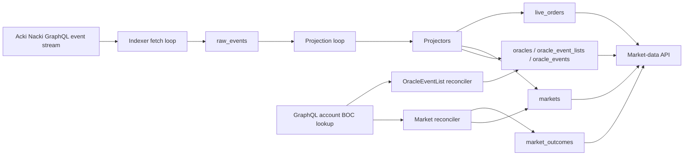

# Market Data Indexer Technical Specification

Implementation-facing requirements for the indexer side of the market-data path. This document covers how data gets *into* the read-model: ingestion from events stream, projection of contract events, and reconciliation of fields that events alone do not carry. The HTTP layer that serves these tables is described in [read-api.md](read-api.md). Postgres tables referenced below are documented column-by-column in [data-schema.md](data-schema.md).

## Glossary

**Read-model** — Postgres tables prepared for API reads. The indexer builds them from chain events and contract state.

**Raw event** — one message from the chain event stream stored in `raw_events`, decoded or not. It is kept so projections can be retried or rebuilt later.

**Projector** — code that applies one decoded on-chain event to the read-model. For example, the `OrderBook.OrderPlaced` event updates `live_orders`.

**Reconciler** — background task that periodically reads contract state through getters and fills fields that events alone do not provide.

**Reconciliation** — the process where reconcilers periodically fetch contract state and copy missing fields into the read-model. It complements event projection because some fields are available only through getters, not through chain events.

**Projection loop** — the single consumer that drains decoded `raw_events` rows (`processed_at IS NULL`) in `chain_order` and applies each to the read-model. It is the sole projector: the capture path no longer projects inline. A row that cannot apply yet (a child arriving before its parent) is left `processed_at NULL` and retried on the next pass — the loop is both first-projection and retry.

**BOC** — serialized contract state fetched from GraphQL and passed to the local TVM runner so getters can be executed off-chain.

## Data Flow



## Ingestion

The indexer follows a GraphQL message-edge stream. Every edge becomes one row in [`raw_events`](data-schema.md#raw_events) regardless of whether it could be decoded — the raw log is the recovery boundary, and any downstream table can be rebuilt from `raw_events` plus a clean schema. Two pre-decode filters can drop edges before they reach the decoder; both are outside the rebuild boundary by design (see [Pre-decode filters](#pre-decode-filters) below).

### Pre-decode filters

Two filters run against the raw message edge — before any ABI decode — and drop matching edges entirely. The page cursor still advances past every dropped edge, so the indexer makes forward progress without storing or projecting them. Dropped edges do not produce a `raw_events` row and are outside the recovery boundary (they cannot be reprojected or rebuilt from `raw_events`).

#### Scope filter: `indexer.dapp_id`

`indexer.dapp_id` (optional string; omit or leave unset to disable) scopes ingestion to one DEXDO application. When set, only edges whose `src_dapp_id` matches the configured value are kept; edges with no `src_dapp_id` field are also kept (so a gateway that omits the field does not silently drop everything); edges with a mismatching `src_dapp_id` are dropped before decode. When unset (the local default), the filter is inert and every edge is processed. Each per-tick log line includes a `foreign_skipped` count of edges dropped by this filter, and any nonzero `foreign_skipped` emits a `warn!` with the tick drop rate because a correctly scoped single-dapp deployment should see effectively no foreign traffic.

Setting `dapp_id` to an empty string is rejected at startup by `IndexerConfig::validate` (it would otherwise deserialize to `Some("")` and treat every edge with a real `src_dapp_id` as foreign); omit the key to disable scoping.

#### No-op filter: `indexer.ignored_event_types`

`indexer.ignored_event_types` accepts a list of event-type names (e.g. `"OrderBook.Queued"`). An edge whose external `dst` matches a configured entry is dropped before decode. The `dst` of an external event is `makeAddrExtern(EVENT_ID, 256)`, rendered as `:` followed by 64 lowercase hex digits; because the width is fixed, each `EVENT_ID` yields one stable `dst` string that acts as a 1:1 discriminator of event type — readable from the message header before the body is decoded. See [dex-events-routing.md](../contract-specs/dex-events-routing.md) for the full `dst` derivation and per-event values.

Matching is by `dst` alone — it is not namespaced by contract or dapp — so a foreign contract that emits an event with the same `EVENT_ID` produces the same `dst` and is dropped too (no `raw_events` row). This is intentional: only DEXDO events are of interest, and our own non-no-op events use distinct EVENT_IDs outside the no-op set, so a wanted event is never dropped by this filter. To confine dropping to your own contracts, pair it with the `indexer.dapp_id` scope filter, which runs first.

Each per-tick log line includes a `type_ignored` count of edges dropped by this filter. A high `type_ignored` rate is not warned by itself because this filter is deliberately used to shed observability-only floods such as `OrderBook.Queued`.

The startup guard accepts **only** the known droppable no-op types — `OrderBook.Queued` / `FullyFilled` / `Rejected` / `CallbackBounced` (the `IGNORABLE_EVENT_TYPES` allow-list) — and refuses any other entry. It fires at startup, not at ingest time, so a bad entry prevents the service from starting rather than failing silently. The allow-list closes three otherwise-silent failures:

- A **metric-critical** type (`OrderBook.OrderPlaced`, `OrderBook.PartialFill`) is rejected because those must always land in `raw_events` for the OTLP counters to stay accurate.
- A **state-changing** type (anything the projector routes to a real handler, e.g. `OrderBook.OrderFilled`) is rejected before it could corrupt `live_orders`.
- A **typo** (e.g. `OrderBook.Quued`) is rejected rather than silently matching nothing. Because matching is by `dst`, a misspelled name would map to a wrong or absent ID and never drop an edge — `type_ignored=0` is indistinguishable from "configured correctly, zero volume". The guard catches this at startup instead.

Intended use: shed confirmed observability-only floods (e.g. `OrderBook.Queued`, which fires at queue entry before any order ID exists and has no read-model effect) without decoding or projecting them.

### Ingestion sequence per edge

1. If `indexer.dapp_id` is set and the edge's `src_dapp_id` does not match (and is not absent), drop the edge. The page cursor still advances (step 4). `foreign_skipped` is incremented.
2. If the edge's `dst` matches a configured `indexer.ignored_event_types` entry, drop the edge. The page cursor still advances (step 4). `type_ignored` is incremented.
3. Try to decode the message body against the ABI bundle (`crates/infrastructure/src/decoder.rs`). On success, store the decoded JSON payload alongside `event_type`.
4. Persist the row in `raw_events` with `processed_at = NULL`. The unique `msg_id` constraint deduplicates overlapping page fetches.
5. After the page commits, persist the resume cursor in [`indexer_cursors`](data-schema.md#indexer_cursors). The cursor tracks capture progress, not projection; a restart resumes capture from it while the projection loop independently drains whatever rows remain `processed_at NULL`.

### Noise log

When `LOG_DIR` is set, the projector's "no handler for event type" warnings are split by novelty. The projection loop is the sole emitter of these warnings (the capture path no longer projects). The **first** time the process sees a given unhandled `event_type`, the warning is emitted at the normal target, so it reaches stdout and the main `<service>.log` — this is the operator's signal that a deployed contract emits an event the indexer does not yet handle. Every **later** repeat of that same type is written to `<service>.noise.log` (a separate daily-rotating file in `LOG_DIR`, like the main log) via the `dodex::event_noise` tracing target, configured by the `dodex-logging` crate (`EVENT_NOISE_TARGET`), so a steady flood does not drown the main log. When `LOG_DIR` is not set, all of these warnings appear on stdout alongside the rest of the log output.

## Projection — lifecycle events

Lifecycle events drive transitions on [`markets`](data-schema.md#prediction-markets) and the [`oracles`](data-schema.md#oracles) / [`oracle_event_lists`](data-schema.md#oracle_event_lists) / [`oracle_events`](data-schema.md#oracle_events) hierarchy. Each projector identifies its row by `pmp_address` (or the relevant parent address); if that row does not exist yet, the projector returns `Deferred` so the projection loop will retry once the parent event has landed.

| Event | Read-model effect |
| --- | --- |
| `RootOracle.OracleDeployed` | Inserts into [`oracles`](data-schema.md#oracles). Sets `address`, `name`, `pubkey`. |
| `Oracle.OracleEventListDeployed` | Inserts [`oracle_event_lists`](data-schema.md#oracle_event_lists) under the parent oracle, including the per-list `description` carried by the event. The field is read **strictly** (a missing `description` fails the projection) and written via `coalesce` so replays do not clobber it; the column is `NOT NULL`. |
| `OracleEventList.EventAdded` | Upserts [`oracle_events`](data-schema.md#oracle_events) with `event_name`, `oracle_fee`, `deadline`. Does NOT carry `describe`, `trust_addr`, or `outcome_names_jsonb` — those come from the OracleEventList reconciler. |
| `OracleEventList.EventConfirmed` | Stamps `oracle_events.confirmed_pmp_address` and `confirmed_at`. Links an event to the PMP that will market it. |
| `PrivateNote.PMPDeployed` | Inserts a row in [`markets`](data-schema.md#prediction-markets) with `pmp_address`, `event_id`, `token_type`, `token_code`. Lifecycle columns (`stake_*`, `result_*`, `frozen_at`, etc.) stay NULL — they belong to later events. The row is invisible to the API until the reconciler stamps `last_reconciled_at`. |
| `PMP.TimingsSet` | Updates `stake_start`, `stake_end`, `result_start`, `result_end`, sets `approved = true`. May fire repeatedly while `now < resultStart` — keep the latest by block time. This projector is the **sole writer** of the four timing columns. |
| `PMP.PoolsFrozen` | Sets `frozen_at` via `coalesce` (never overwritten). This is the on-chain signal that the OrderBook contract has been deployed (see [dex-events-routing.md](../dex-events-routing.md): "after deploy OrderBook"). |
| `PMP.Resolved` | Sets `resolved_at` and `resolved_outcome_id`. |
| `PMP.PMPRejected` | Sets `is_cancelled = true`, `cancelled_at`, `cancel_reason = 'PMP_REJECTED_BY_ORACLE'`. |
| `PMP.EventCancelled` | Same shape but `cancel_reason = 'EVENT_CANCELLED'`. The two reasons distinguish cancellation source and have different UI meaning. |

## Projection — order events

OrderBook events drive [`live_orders`](data-schema.md#live_orders), the
per-order read model backing `/api/v1/prediction/depth` and account-scoped
`GET /api/v1/prediction/orders`.

Three OrderBook events mutate order book state, one
PrivateNote confirmation event attaches ownership for private reads, and five OrderBook
events are observability-only.

| Event | Effect |
| --- | --- |
| `OrderBook.OrderPlaced` | Upserts into `live_orders` with `status = 'OPEN'`, full `amount_initial`, and full `amount_remaining`. `owner_pn_address` remains NULL until the matching PrivateNote confirmation arrives. `last_chain_order` is set to the event’s `msg_chain_order`. On conflict the upsert is `WHERE`-guarded against terminal rows (`FILLED` / `CANCELLED` / `REJECTED`): an isolated replay landing on a closed row is a no-op rather than reopening to OPEN, surfaced at `warn!` with `msg_id` / `chain_order` for triage. The handler sets: `chain_created_at` using first-write-wins semantics via `coalesce(...) on conflict` — the creation timestamp must never move once recorded; `chain_updated_at` using `greatest(...) on conflict`; `placed_chain_order` using `coalesce(live_orders.placed_chain_order, excluded.placed_chain_order)` from the event’s msg_chain_order. `placed_chain_order` is the sole sort key for `/api/v1/prediction/orders` and never changes once recorded, matching the first-write-wins semantics of chain_created_at. |
| `OrderBook.OrderFilled` | For a non-terminal row: decrements `amount_remaining` by `filledAmount`, flips `status` to `FILLED` when the remainder reaches zero, advances `last_chain_order` via `greatest(existing, new)`, advances `chain_updated_at` via `greatest`. For a row whose prior status is already terminal (`FILLED` / `CANCELLED` / `REJECTED`) all four mutation columns (`amount_remaining`, `status`, `last_chain_order`, `chain_updated_at`) are CASE-gated to leave the row unchanged; the event is logged at `warn!` and the projector still reports `Applied`. |
| `OrderBook.OrderCancelled` | For a non-terminal row: preserves `amount_remaining` as the unfilled cancelled remainder, flips `status` to `CANCELLED`, advances `last_chain_order` and `chain_updated_at` via `greatest`. For a row whose prior status is already terminal (`FILLED` / `REJECTED`) all three mutation columns are CASE-gated to leave the row unchanged; the event is logged at `warn!` and the projector still reports `Applied`. The terminal-state guard prevents a late cancel from demoting `FILLED` or rewriting `REJECTED`. |
| `PrivateNote.OrderPlacedConfirmed` | Updates the matching `(orderBook, orderId)` row with `owner_pn_address = event.src`, where `event.src` is the authenticated account's trading PrivateNote address. If the OrderBook row has not arrived yet, the confirmation is deferred and replayed later. This ownership update does not advance `last_chain_order`, so public depth cursors continue to represent OrderBook activity only. Refuses to overwrite an already-attached `owner_pn_address`; that path is reported as `Applied` (no-op). |
| `OrderBook.PartialFill` / `FullyFilled` / `Queued` / `Rejected` / `CallbackBounced` | Observability-only — no read-model table is touched. The row is recorded in `raw_events` for audit, unless its type is listed in `indexer.ignored_event_types` (e.g. `OrderBook.Queued` in the deployed config), in which case the edge is dropped before decode — no `raw_events` row is written. |

`PartialFill` / `FullyFilled` are derived aggregates that the contract emits for MM-friendly UX; the underlying state is already captured by `OrderFilled`. `Queued` / `Rejected` occur at the queue level, before any order ID is assigned. `CallbackBounced` is a diagnostic event — the OrderBook state is not automatically rolled back, and the bounced credit requires operator-driven recovery.

Event ordering is anchored on `raw_events.chain_order` (set from the GraphQL gateway’s `msg_chain_order`). All projection now runs through the projection loop, which reads pending rows from Postgres ordered by `chain_order ASC`; a single consumer applies them so `OrderPlaced → OrderFilled → OrderCancelled` preserves the natural sequence. Fills reduce `amount_remaining`, and cancellation then closes the order without erasing the unfilled remainder. `greatest(existing, new)` on `last_chain_order` is a belt-and-suspenders monotonicity guard for the row’s column, not the primary correctness mechanism.

## Projection — public trades

The public trade tape behind [`GET /api/v1/prediction/trades`](../api-spec.md#prediction-trades) is built from the
same `OrderBook.OrderFilled` event that drives `live_orders`, written into a separate
append-only `trades` table. Only the `tradeId` derivation is specified here; the table
shape lives in [data-schema.md](data-schema.md#trades) and the HTTP layer in
[read-api.md](read-api.md#apiv1predictiontrades).

A single match emits **two** `OrderFilled` events — one for the resting (maker) order
and one for the aggressor (taker) order, distinguished by the boolean `isTaker` field.
Recording a trade row on both would double-count the match, and the two events carry
different `msg_chain_order` values, so the algorithm canonicalises on one side:

1. On `OrderFilled` with **`isTaker == true`**, insert one `trades` row. On
   `isTaker == false`, do not write to `trades` (the maker-side event only mutates its
   `live_orders` row). Selection is by the explicit `isTaker` flag, not by
   observed emission order — the flag is authoritative and independent of how the pair
   landed in the stream.
2. `tradeId` is the **`chain_order` of that taker-side event** (`raw_events.chain_order`,
   the gateway's `msg_chain_order`). It is globally unique per match and lex-comparable,
   matching the cursor convention used elsewhere in the read-model.
3. Trade fields come from the same event: `price` from `clearingPrice`, `qty` from
   `filledAmount`, `time` from the event's chain time. `feeAmount` is deliberately not
   projected into the public tape. `isBuyerMaker` is derived from the taker order's side
   — taker selling ⇒ buyer is the maker ⇒ `true`; taker buying ⇒ `false`.

No pairing of the two per-side events is required for the tape: each taker-side fill is
exactly one trade. One taker order crossing N makers produces N taker-side `OrderFilled`
events and therefore N trades, each with its own `chain_order` as `tradeId`.

Idempotency follows from the key: `tradeId` is unique, so a replayed insert conflicts on
it and leaves every immutable column alone — the conflict arm's only action is
`chain_time = coalesce(trades.chain_time, excluded.chain_time)`, a first-write-wins fill
of a `NULL` chain time, and even that fires only when the replayed values match the
recorded row on every immutable column (a divergent conflict — drifted payload or
duplicate `msg_chain_order` — skips the arm and is logged at `error!`; first write wins,
never silently). `chain_time` itself is not guarded: a replay differing only in
timestamp passes the guard and the coalesce silently keeps the first value. This makes
the *trades* write replay-safe; the surrounding
`OrderFilled` projection as a whole is not (the `live_orders` fill arm re-subtracts
`filledAmount` on a non-terminal order — see `reproject_pending`'s doc), so a hidden
`NULL`-`chain_time` row on a live order is recovered by updating the `trades` row
directly, never by clearing `processed_at`; see the recovery notes in
[`data-schema.md`](data-schema.md#trades). As with `OrderFilled` on `live_orders`, an
event observed before its parent `OrderPlaced` is `Deferred` and retried.

The same canonical `tradeId` is the value the private `orderUpdate` WebSocket frame must
surface as `t` (see [api-spec.md](../api-spec.md#prediction-trades)); associating it with the
maker side's frame as well is part of that stream's implementation and is out of scope
here.

## Reconciliation

Two reconcilers fill metadata that the event stream alone does not carry. Both run on a fixed cadence (`reconciliation_interval_ms`, `oracle_event_list_reconciliation_interval_ms` in `config/indexer.*.yaml`) and share a failure-backoff pattern (`last_reconcile_failed_at`, `reconcile_attempts` on the parent row) so a permanently broken contract cannot starve the queue.

### Market reconciler

For each [`markets`](data-schema.md#prediction-markets) row that needs catch-up, the reconciler:

1. Fetches the PMP account BOC from chain.
2. Runs `PMP.getDetails()` off-chain through the local TVM emulator (`crates/infrastructure/src/tvm_runner.rs`).
3. Runs `PMP.getOrderBookAddress()` the same way.
4. Writes `market_id`, `name`, `oracle_list_hash`, `approved`, `is_cancelled`, `num_outcomes`, and outcome rows in [`market_outcomes`](data-schema.md#market_outcomes).
5. Stamps `last_reconciled_at`. The market becomes visible to the API only after this point.

Two invariants the reconciler enforces on the write side:

- **`orderbook_address` is stamped on the first reconcile pass — pre-freeze rows included.** `getOrderBookAddress()` is deterministic (`contracts/dex/PMP.sol:1360`) and returns the precomputed address regardless of `frozen_at`, so any market visible to the API carries a usable address. DB schema pins this with a CHECK constraint (`last_reconciled_at IS NOT NULL ⇒ orderbook_address IS NOT NULL`) and un-stamps `last_reconciled_at`.
- **Timing columns (`stake_*`, `result_*`) are never written by the reconciler.** On pre-`TimingsSet` PMPs `getDetails()` returns contract-default zeros; copying those would make the API flip out of PENDING. The `TimingsSet` projector is the sole writer of those columns.

Queue ordering (the SELECT in `MarketReconciler::run_once`):

- A row enters the queue when `last_reconciled_at IS NULL` (never reconciled). The first successful pass stamps both the address and `last_reconciled_at`; the getter result is stable, so there is no later re-queue trigger.
- Failed rows go to the back via `nulls first` ordering on `last_reconcile_failed_at`. A 5-minute backoff filter excludes recently-failed rows entirely so they don't dominate the batch.

### OracleEventList reconciler

For each [`oracle_event_lists`](data-schema.md#oracle_event_lists) row that has at least one event still missing reconciler-only metadata, the OracleEventList reconciler runs `OracleEventList._events` and fills `describe` / `trust_addr` / `outcome_names_jsonb` per event. The `outcomeNames` map (used to render `/api/v1/oracles` `events[].outcomes`) lives only in the getter, not in `EventAdded`, so it is reconciler-sourced like the other two.

Not yet projected: `OracleEventList.DescriptionUpdated` (post-deploy edits to a list's description) and `Oracle.EventPublished`. The read-model therefore reflects the list `description` as of deploy time; a later on-chain description update is not surfaced until a projector for that event is added. The decoder counts these events (they are part of the pinned ABI total) but no projector consumes them today.

Key column: [`oracle_events.meta_reconciled_at`](data-schema.md#oracle_events). The reconciler stamps this **unconditionally** on every successful pass — even when the on-chain `trustAddr` is legitimately null, the marker is set so the row drops out of the pending queue. The marker replaced an earlier `describe IS NULL OR trust_addr IS NULL` predicate that never cleared for events with null on-chain metadata.

The reconciler selects an OracleEventList when this condition is true:

```sql
exists (select 1 from oracle_events oe
         where oe.eventlist_id = oel.id
           and oe.meta_reconciled_at is null)
```

Two anti-starvation outcomes share the failure-backoff path with the market reconciler (`last_reconcile_failed_at`, 5-minute cooldown):

- **`NoBoc`** — the OracleEventList account BOC is not yet available from the gateway.
- **`Reconciled(0)` — no-progress pass.** The BOC is queryable but the run does not stamp any child. Two shapes collapse into this: an empty `_events` map, and a non-empty map whose items all target children that are already `meta_reconciled_at IS NOT NULL`. Both mean the indexed contract state lags the event stream — `EventAdded` persisted a pending child that `_events` does not yet reflect. Without the backoff the OracleEventList would be picked every sweep (the pending SELECT still matches it) and starve later rows behind the LIMIT 16 batch until the node catches up.

## Failure handling

Two outcomes leave a `raw_events` row pending:

- **`Deferred`** — the projector knows it cannot apply this event yet (typically a child arriving before its parent). `processed_at` stays NULL and the projection loop retries it on a later pass. Forward passes resume above the last-drained ceiling; a separate retry pass rewinds to the front of the pending queue on a timer — roughly every `polling_interval_ms`, independent of whether the loop idled, so stuck rows are re-attempted on that cadence even under sustained ingest. A permanently deferred row is therefore retried at most once per interval, not on every ingest batch.
- **`Err`** — the projector hit an unexpected error. Same effect on `processed_at`, plus a warn log and an increment in the failure counter. Useful for spotting ABI drift.

The projection loop (`indexer_repo.rs::run_reprojection_loop`, draining via `reproject_pending_from`) picks pending rows in `chain_order` sequence, holds them with `for update skip locked` so a row is never projected twice even if a second consumer is ever added, and reuses the already-decoded payload from `raw_events.decoded` — bodies are not re-decoded. It is the sole projector: the capture path writes `raw_events` rows with `processed_at NULL` and never projects inline.

A batch is drained optimistically in a single transaction with **no per-row savepoint**, so an applied row costs only its projector statements — not an extra `SAVEPOINT`/`RELEASE` round-trip pair, which matters when the database is far (high per-round-trip latency). If a projector returns `Err`, that transaction is rolled back untouched and the same range is replayed with per-row savepoints, which applies the clean rows and leaves the failing one pending — the identical outcome to savepointing every row, paid for only when a failure actually occurs. The savepointed replay is paid only on passes that hit a projector error — in practice the periodic retry pass re-attempting a stuck row, though a newly captured row that errors on first sight also drops its forward pass to the fallback. A clean forward drain stays on the savepoint-free fast path.

Reconciler-side failures use a separate mechanism — `last_reconcile_failed_at` and `reconcile_attempts` on the [`markets`](data-schema.md#prediction-markets) and [`oracle_event_lists`](data-schema.md#oracle_event_lists) rows. The 5-minute backoff window prevents a permanently broken `getDetails()` from blocking the batch every tick.

## Metrics

The indexer exports two OpenTelemetry counters over OTLP, covering all markets and users (no per-market or per-user labels):

| Metric | Source |
| --- | --- |
| `orders_created_event_cnt` | `count(*)` of `raw_events` where `event_type = 'OrderBook.OrderPlaced'` |
| `order_partially_filled_event_cnt` | `count(*)` of `raw_events` where `event_type = 'OrderBook.PartialFill'` |

Both are `ObservableCounter`s whose value is read from `raw_events`. Because `raw_events` is the append-only, `msg_id`-deduplicated event log, the counts are exactly-once, monotonic, replay-safe, and recovered from the database after a restart — no hot-path instrumentation.

A background loop (`services/indexer/src/metrics_refresh.rs`) refreshes the cached counts every 15s; the OTLP `PeriodicReader` pushes them every 30s. Collection follows the OpenTelemetry env convention: metrics are exported only when `OTEL_EXPORTER_OTLP_METRICS_ENDPOINT` or `OTEL_EXPORTER_OTLP_ENDPOINT` is set. With neither set the meter provider is not created and nothing is collected. The OTLP setup is encapsulated in the `dodex-metrics` crate. The healthcheck endpoint and the monitoring stack (collector, dashboards, alerts) are out of scope.

### Gauges

Four gauges complement the counters, covering projection health and connection saturation:

| Metric | Type | What it measures | Source |
| --- | --- | --- | --- |
| `indexer_projection_backlog` | gauge | `raw_events` rows waiting for the projection loop (typed + decoded, `processed_at NULL`) | `count(*)` from `raw_events` |
| `indexer_projection_lag_seconds` | gauge | Wall-clock age of the oldest eligible-but-unprojected `raw_events` row; read-model staleness | `extract(epoch from now() - min(created_at_chain))` over pending rows |
| `indexer_capture_cursor_age_seconds` | gauge | Seconds since the capture cursor last advanced | `extract(epoch from now() - updated_at)` from `indexer_cursors` |
| `indexer_db_pool_connections{state=in_use\|idle}` | gauge | sqlx DB pool connections by state | `pool.size()` / `pool.num_idle()` — in-memory, no DB query |

All four ride the same OTLP path as the counters: exported only when `OTEL_EXPORTER_OTLP_METRICS_ENDPOINT` or `OTEL_EXPORTER_OTLP_ENDPOINT` is set, refreshed every `REFRESH_INTERVAL` (15s). The pool gauge is sampled in the refresh loop (≤15s granularity). Diagnostic shape: backlog rising + pool `in_use` at max + cursor age small = projection stalled on connection exhaustion.

### Fallback counter

| Metric | Type | What it measures | Source |
| --- | --- | --- | --- |
| `indexer_projection_fallbacks` | counter | Projection batches that aborted the optimistic (savepoint-free) pass and replayed with per-row savepoints | in-process counter, polled each refresh |

Unlike `orders_created_event_cnt` and `order_partially_filled_event_cnt` (read from `raw_events`), this is an in-process count: the projection loop increments it whenever an optimistic batch hits a projector error and falls back, and the refresh loop polls it like the gauges. A steadily climbing rate means the fast path is routinely aborting — each fallback adds one extra SAVEPOINT/RELEASE round-trip pair per row on top of each projector's own statements, a per-row cost the backlog/lag gauges only surface as a symptom (slower drain), so this pins the cause. The per-row failure is logged once: a `warn` from the savepointed replay for a deterministic error, or from the optimistic pass itself for a DB-layer/transient error (so a transient hiccup the replay silently recovers from is still visible). The deterministic fallback transition is otherwise `debug`-level, so the counter — not a log — is the dashboard signal for fallback frequency.

## Schema invariants — write side

| Invariant | Enforced by |
| --- | --- |
| `markets.last_reconciled_at IS NOT NULL ⇒ orderbook_address IS NOT NULL` | CHECK constraint `markets_orderbook_address_set_after_reconcile`. The reconciler writes `orderbook_address` unconditionally from `getOrderBookAddress()`. |
| Lifecycle timings (`stake_*`, `result_*`) are projector-only | Reconciler does not write these columns. |
| `oracle_events.meta_reconciled_at` set after every successful reconciler pass | OracleEventList reconciler UPDATE always stamps it. |
| `live_orders.last_chain_order` lex-monotonic per row | `greatest(existing, new)` on every UPDATE; chain-order sorted reproject keeps natural arrival order monotonic too. |
| `live_orders.placed_chain_order` set once and never moves | `coalesce(live, excluded)` on every `OrderPlaced` upsert; column is `text not null` so a missing `chain_order` fails the insert outright. |
| Cancellation reason matches its source | Projector picks `PMP_REJECTED_BY_ORACLE` or `EVENT_CANCELLED` based on event type, never NULL. |

The API enforces complementary read-side invariants on the assembled DTO — see [read-api.md](read-api.md#fail-closed-validation). Together they guarantee that an inconsistent indexer state (e.g. `PMP.Resolved` indexed before `PoolsFrozen`) cannot leak into a client response.

## Visibility gate

A market is visible to the public API only when `markets.last_reconciled_at IS NOT NULL`. Until the market reconciler runs, the row exists internally (`PMPDeployed` inserted it) but is hidden — clients see consistent, fully-populated markets only.

This pairs with the API's PENDING short-circuit: a row with NULL timing columns (reconciled but pre-`TimingsSet`) surfaces as `status = "PENDING"` with `timings = null`, per [read-api.md](read-api.md#status-derivation).
