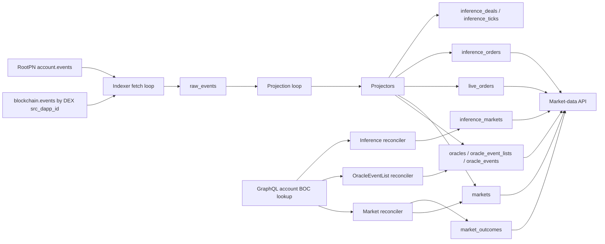

# Market Data Indexer Technical Specification

Implementation-facing requirements for the indexer side of the market-data path. This document covers how data gets *into* the read-model: ingestion from events stream, projection of contract events, and reconciliation of fields that events alone do not carry. The HTTP layer that serves these tables is described in [read-api.md](read-api.md). Postgres tables referenced below are documented column-by-column in [data-schema.md](data-schema.md).

## Glossary

**Read-model** — Postgres tables prepared for API reads. The indexer builds them from chain events and contract state.

**Raw event** — one message from the chain event stream stored in `raw_events`, decoded or not. It is kept so projections can be retried or rebuilt later.

**Projector** — code that applies one decoded on-chain event to the read-model. For example, the `OrderBook.OrderPlaced` event updates `live_orders`.

**Reconciler** — background task that periodically reads contract state through getters and fills fields that events alone do not provide.

**Reconciliation** — the process where reconcilers periodically fetch contract state and copy missing fields into the read-model. It complements event projection because some fields are available only through getters, not through chain events.

**Projection loop** — the single consumer that drains decoded `raw_events` rows (`processed_at IS NULL`) in `chain_order` and applies each to the read-model. It is the sole projector: the capture path no longer projects inline. A row that cannot apply yet (a child arriving before its parent) is left `processed_at NULL` and retried on the next pass — the loop is both first-projection and retry.

**BOC** — serialized contract state fetched from GraphQL and passed to the local TVM runner so getters can be executed off-chain.

## Data Flow



## Ingestion

The indexer follows two independently paginated GraphQL message-edge streams. Every in-scope edge becomes one row in [`raw_events`](data-schema.md#raw_events) regardless of whether it could be decoded — the raw log is the recovery boundary, and any downstream table can be rebuilt from `raw_events` plus a clean schema. The unique `raw_events.msg_id` constraint deduplicates an event if the streams ever overlap.

### Server-side capture scope

The primary stream uses the gateway's indexed ExtOutV2 source-dApp field:

```graphql
blockchain {
  events(src_dapp_id: "0000000000000000000000000000000000000000000000000000000000000004", first: $first, after: $after) { ... }
}
```

The value comes from `dodex_chain::DEX_DAPP_ID` (`SystemDapp::Dex`), not configuration. This one query selects events from every current DEX contract without issuing one request per event `dst`.

`RootPN` is the sole legacy contract whose ExtOut messages do not carry `src_dapp_id`, so the primary query cannot return them. Its events come from a second, address-scoped query:

```graphql
blockchain {
  account(
    account_id: "1010101010101010101010101010101010101010101010101010101010101010"
    dapp_id: "0000000000000000000000000000000000000000000000000000000000000004"
  ) {
    events(first: $first, after: $after) { ... }
  }
}
```

The account id is `RootPn::DEFAULT_ADDRESS` without its `0:` workchain prefix. The account-events query deliberately has no `dst` argument; local routing filters run after this server-side source selection and before ABI decode. A protected gateway may use optional `graphql.bearer_token`; the indexer sends it as `Authorization: Bearer ...` on both GraphQL queries.

These are the only live capture queries. In particular, the indexer does not issue one query per OrderBook event route or per-deal `TokenContract`: OrderBook traffic is covered by the DEX dApp stream, and the legacy RootPN traffic is covered by its fixed account address. If a TokenContract edge is nevertheless present in a source page, the local `dst` allow-list drops it before decode.

### Pre-decode filters

Three local filters run against the already source-scoped message edge — before any ABI decode — and drop matching edges entirely: `ignored_addresses`, the emitted-event `dst` allow-list, and `ignored_event_types`. The page cursor still advances past every dropped edge, so the indexer makes forward progress without storing or projecting them. Dropped edges do not produce a `raw_events` row and are outside the recovery boundary (they cannot be reprojected or rebuilt from `raw_events`).

Only the first **selects**; the other two subtract. That asymmetry is the point — on a shared chain a set of deny-lists cannot bound what is ingested.

#### Ingest scope: emitted-event `dst` (not configurable)

After the gateway has selected the DEX dApp or RootPN source, capture keeps an edge only when its `dst` is one of the 69 routing destinations in `config::SCOPED_EVENT_IDS`. Every `TokenContract.*` destination is deliberately excluded, so per-deal settlement events are dropped before decode and never written to `raw_events`. Everything else outside the allow-list is also dropped before decode and counted as `out_of_scope`. `dst` is a 1:1 discriminator of event type readable from the message header, so this costs no decode.

An edge with **no** `dst` is dropped too — every event we emit is routed to one — but counted separately as `dst_missing`, and any nonzero count emits a `warn!`.

This filter is unconditional and has no config key. Server-side source selection prevents the global-chain scan; the local `dst` allow-list prevents unrelated DEX-dApp or RootPN outbound messages from reaching decode or storage.

The id list is pinned by `crates/infrastructure/tests/ingest_scope.rs`, which re-derives it from the indexed `makeAddrExtern` call sites under `contracts/**` on every run and separately asserts that all TokenContract call sites remain excluded. It cannot be derived from the ABI bundle: the ABI carries the event's *signature-hash* id, which is a different number from the EVENT_ID constant that forms the `dst`.

The list is load-bearing in both directions. An indexed id missing from it is lost before `raw_events` and is **not** recoverable by reprojection; a stale id admits a route the indexer does not intend to store. The pinning test fails on either, while the explicit TokenContract exclusion test prevents those 15 routes from being added accidentally.

#### Self-rooted edges are in scope

An `airegistry` `TokenContract` is deployed by an external message, so the gateway
reports its `src_dapp_id` as the contract's own account id — never the configured
`dapp_id`. A strict equality check would drop the entire settlement path
(`inference_deals`, `inference_ticks`) before the `raw_events` insert, which is
outside the recovery boundary: neither a replay nor a reprojection can bring back an
edge that was never stored. `edge_in_scope` therefore keeps an edge whose
`src_dapp_id` equals its own `src`.

This admits a *foreign* self-rooted contract as well — self-rootedness says how a
contract was deployed, not who owns it. That edge is stored and then dropped by the
decoder, since none of its events are in a loaded ABI, so the cost is one stored row
against the alternative of losing settlement entirely. A foreign edge that is neither
in our dapp nor self-rooted is still dropped at ingest.

#### No-op filter: `indexer.ignored_event_types`

`indexer.ignored_event_types` accepts a list of event-type names (e.g. `"OrderBook.Queued"`). An edge whose external `dst` matches a configured entry is dropped before decode. The `dst` of an external event is `makeAddrExtern(EVENT_ID, 256)`, rendered as `:` followed by 64 lowercase hex digits; because the width is fixed, each `EVENT_ID` yields one stable `dst` string that acts as a 1:1 discriminator of event type — readable from the message header before the body is decoded. See [dex-events-routing.md](../contract-specs/dex-events-routing.md) for the full `dst` derivation and per-event values.

Matching is by `dst` alone, but it runs only after the GraphQL query has selected the DEX dApp or RootPN source. Our own non-no-op events use distinct EVENT_IDs outside the no-op set, so a wanted event is never dropped by this filter.

Each per-tick log line includes a `type_ignored` count of edges dropped by this filter. A high `type_ignored` rate is not warned by itself because this filter is deliberately used to shed observability-only floods such as `OrderBook.Queued`.

The startup guard accepts **only** the known droppable no-op types — `OrderBook.Queued` / `FullyFilled` / `Rejected` / `CallbackBounced` and `PMP.StakeAccepted` / `PMP.MergeProcessed` (the `IGNORABLE_EVENT_TYPES` allow-list) — and refuses any other entry. It fires at startup, not at ingest time, so a bad entry prevents the service from starting rather than failing silently. The allow-list closes three otherwise-silent failures:

- A **metric-critical** type (`OrderBook.OrderPlaced`, `OrderBook.PartialFill`) is rejected because those must always land in `raw_events` for the OTLP counters to stay accurate.
- A **state-changing** type (anything the projector routes to a real handler, e.g. `OrderBook.OrderFilled`) is rejected before it could corrupt `live_orders`.
- A **typo** (e.g. `OrderBook.Quued`) is rejected rather than silently matching nothing. Because matching is by `dst`, a misspelled name would map to a wrong or absent ID and never drop an edge — `type_ignored=0` is indistinguishable from "configured correctly, zero volume". The guard catches this at startup instead.

Intended use: shed confirmed observability-only floods (e.g. `OrderBook.Queued`, which fires at queue entry before any order ID exists and has no read-model effect) without decoding or projecting them.

### Ingestion sequence per edge

1. The gateway selects the edge through either the DEX `src_dapp_id` stream or the RootPN account stream.
2. If the edge's `src` is in `indexer.ignored_addresses`, drop it. The page cursor still advances.
3. If the edge's `dst` is not one of the emitted-event destinations in `config::SCOPED_EVENT_IDS` — including when the edge carries no `dst` at all — drop it. `out_of_scope` is incremented, and a missing `dst` additionally increments `dst_missing`.
4. If the edge's `dst` matches a configured `indexer.ignored_event_types` entry, drop it and increment `type_ignored`.
5. Try to decode the message body against the ABI bundle (`crates/infrastructure/src/decoder.rs`). The decoder is **route-aware**: when an event id is ambiguous it resolves `event_type` by the message's `dst` address (the external `makeAddrExtern(EVENT_ID, 256)` in the message header) rather than a flat event-name scan. **One loaded pair does collide, by construction:** `RootModel.ContractDeployed(address self)` and `TokenContract.ContractDeployed(address self)` are byte-identical in their ABIs, so they share a body id and only `dst` tells them apart (`ContractDeployedEmit` = 703 for the root model, `DealDeployedEmit` = 732 for a deal). Both routes are pinned and both are mandatory: with `RootModel` unloaded the id looked unique and every root-model deploy decoded as a deal deploy, seeding a phantom [`inference_deals`](data-schema.md#inference_deals) row keyed on the root model's address — silently, because `indexer_decode_ambiguous_collisions` only fires when two *loaded* ABIs collide. The `InferenceOrderBook` events, by contrast, carry an `Inference` prefix, so `InferenceOrderBook.InferenceOrderCancelled` no longer shares an event id with `OrderBook.OrderCancelled`; the two `OrderCancelled` dsts stay pinned defensively to keep the path exercised. The id index tolerates collisions (one id may map to several `(contract, event)` entries) and reports an unrouted collision as ambiguous rather than guessing the first ABI. Each route records the event's expected id, so a decoded body whose own id does not match its route is left undecoded with a warning rather than mis-attributed. `RootModel` is loaded for disambiguation only — neither of its two events is projected; both carry explicit no-op arms so they cannot fall through to `Unknown`, which would mark them processed and lose them forever. On success, store the decoded JSON payload alongside `event_type`.
6. Persist the row in `raw_events` with `processed_at = NULL`. The unique `msg_id` constraint deduplicates overlapping page fetches and any cross-stream overlap.
7. After the page commits, persist that source stream's resume cursor in [`indexer_cursors`](data-schema.md#indexer_cursors). An empty `endCursor` is refused before persistence and local assignment (`warn!`, cursor not advanced).
8. Only after both streams complete successfully in the same tick, update the aggregate `blockchain_events` projection barrier and `at_head` state. A failed stream leaves the aggregate row unchanged and eventually makes the API freshness gate fail closed.

### Dual-stream ordering barrier

The DEX-dApp and RootPN queries have independent `after` cursors because either filtered stream can advance without returning an event from the other. Their source rows are `blockchain_events_dex_dapp` and `blockchain_events_root_pn`. The existing `blockchain_events` row is retained as an aggregate compatibility row consumed by the projector, metrics, inference orphan gate, and read API.

The aggregate cursor is the largest globally ordered prefix known complete across both streams:

- While one or both streams are still backfilling (`at_head=false`), the barrier is the minimum cursor among only those backfilling streams. A stream already at head imposes no bound; otherwise a quiet RootPN stream would freeze projection at its last event forever.
- When both streams are at head, the maximum of their last event cursors becomes a **candidate** barrier. A head stream with no cursor is ignored because it has proved that it currently has no matching events.
- A backfilling stream with no cursor makes the aggregate cursor NULL and blocks projection until that stream establishes progress.

The all-head candidate is published only after the **next** successful poll of both streams. The two filtered queries do not share a database snapshot: if one answer returns before the other, a new event for the first stream can have a lower `chain_order` than an event observed by the second. The next poll captures any such event before releasing the previous candidate. Backfill barriers are safe immediately because their limiting cursor is behind the chain head. This one-poll stabilization is process-local; after a restart, the persisted safe barrier remains in place and the first all-head poll establishes a new candidate.

`run_reprojection_loop` always caps its SQL scan at `raw_events.chain_order <= blockchain_events.cursor`. Rows captured by the faster stream or the current all-head poll remain pending above the barrier; they neither project out of order nor cause a busy loop. The aggregate `at_head` is true only when both source drains reached `hasNextPage=false` in the same successful tick.

On the first deployment of this design, the old global-scan `blockchain_events` cursor is not a valid cross-stream barrier. Startup clears it when either source row is absent. On later restarts it preserves the last synchronized cursor but resets aggregate `at_head=false` until both streams have polled again.

### Cold start

With no source [`indexer_cursors`](data-schema.md#indexer_cursors) row — a fresh deployment, or a database restored without one — that source has no resume point. It does **not** ask for `after: null`. That is a legal query, but an unfiltered gateway query cannot answer it on a chain the size of mainnet: it fails the `blockchain` resolver with a `TIMEOUT` extension after ~2s. A stored empty-string cursor is treated as no resume point and logs a `warn!`. Capture sends the sentinel `after: "0"` instead (`EARLIEST_CURSOR`, `crates/infrastructure/src/graphql.rs`): cursors are `msg_chain_order` values — lex-sortable and always ordered above `"0"` — so the sentinel names the earliest retained matching event while staying on the indexed cursor path. Each source logs its cold start separately.

The sentinel is load-bearing, not a tidiness fix. Sent verbatim, `after: null` deadlocks the deployment: the page fails, so no cursor is persisted, so the next tick asks the same unanswerable question. The read-model stays empty indefinitely instead of degrading, and every page failure is retried forever at the polling interval.

A cold start recovers only what the gateway still holds. The event index keeps a bounded window (~39h on mainnet as measured 2026-08-19), so events older than that window are unreachable at any cursor; replaying them requires an archive node.

### Noise log

When `LOG_DIR` is set, the projector's "no handler for event type" warnings are split by novelty. The projection loop is the sole emitter of these warnings (the capture path no longer projects). The **first** time the process sees a given unhandled `event_type`, the warning is emitted at the normal target, so it reaches stdout and the main `<service>.log` — this is the operator's signal that a deployed contract emits an event the indexer does not yet handle. Every **later** repeat of that same type is written to `<service>.noise.log` (a separate daily-rotating file in `LOG_DIR`, like the main log) via the `dodex::event_noise` tracing target, configured by the `dodex-logging` crate (`EVENT_NOISE_TARGET`), so a steady flood does not drown the main log. When `LOG_DIR` is not set, all of these warnings appear on stdout alongside the rest of the log output.

Capture stores the event body verbatim: the GraphQL edge's `body` is the base64 BOC, and
`persist_page` writes it into `raw_events.body_json` unchanged. There is no separate raw-body
column — `body_json` *is* the body, held as a JSON string. That is why harvesting real bodies for
fixtures is a SQL query against any populated indexer database rather than a chain export tool.

How much history that query reaches is a property of the deployment, not of the schema:
`deploy/sql/prune_raw_events.sql` deletes *processed* rows past its retention (three days by
default) and never touches un-projected ones. A rare event's body can therefore be gone.

## Replay: what the bytes prove

Fixtures under `crates/infrastructure/tests/fixtures/chain_bodies.rs` are real event bodies
captured from chain. Tests built on them confirm the payload layout by observation, not by
intention — the distinction that matters, because a hand-built `DecodedEvent` asserts only that
the test and the projector agree with each other.

Three layers are separate claims, and each fails differently: the decoder turns bytes into fields;
capture stores the row with the right `event_type` and the body verbatim; the projector puts those
fields in the right columns.

Getter output is proved the same way, against a real account BOC, run locally — and through the
runner the indexer itself uses, `tvm_runner::run_getter`, not the contract wrapper. That distinction
is the point of the row: the reconciler's getters are mocked behind the `OrderBookGetter` seam, and
`run_getter` is what sits behind it in production. It does three things a mock cannot exercise — it
pins the `expire` header (the ABI default trips replay protection on any real account), it accepts
the reply under either ext-out header tag, and it decodes the output.

What it does not prove: fetching an account (covered separately by `account_boc.rs` against a mock
gateway), and the two-line `DecoderGetter` wrapper, which has no public constructor.

What replay does not cover, and the reasons differ per event.

`StreamReclaimed` and `ProbeCommissionFunded` are absent from the current ABI, so the decoder does
not know their ids; historical rows carrying them were decoded by an earlier build. The two got
there differently, and the difference matters to anyone reading the census. `StreamReclaimed` was
deleted: its projector arm and the `close_kind='RECLAIMED'` projection went with it, and a guard
test pins its absence (`decoder.rs`) so that its return is loud rather than silent.
`ProbeCommissionFunded` was **renamed** — `ProbeCommissionFunded → SellerBondFunded`, part of the
seller-bond terminology change with no compatibility alias (`CHANGELOG.md`). So its behaviour is not
uncovered at all; it is covered under the new name, whose bodies are current and plentiful. Only the
old name's historical rows are unusable.

`TickFinalized` is still in the ABI and still emitted. What is established about it is narrower than
it looks: no body newer than the 2026-07-30 upgrade was found. Whether its layout changed is not
known, and a fixture built on an older body would be unverifiable either way — so it is left out for
lack of a current sample, not for a proven incompatibility.

"A body exists in the database" is therefore not the same claim as "a body can be pinned by a
test". Replay is bounded twice over: by the ABI in the tree, and by whether a sample exists on this
side of the last upgrade.

## Projection — lifecycle events

Lifecycle events drive transitions on [`markets`](data-schema.md#prediction-markets) and the [`oracles`](data-schema.md#oracles) / [`oracle_event_lists`](data-schema.md#oracle_event_lists) / [`oracle_events`](data-schema.md#oracle_events) hierarchy. Each projector identifies its row by `pmp_address` (or the relevant parent address); if that row does not exist yet, the projector returns `Deferred` so the projection loop will retry once the parent event has landed.

| Event | Read-model effect |
| --- | --- |
| `RootOracle.OracleDeployed` | Inserts into [`oracles`](data-schema.md#oracles). Sets `address`, `name`, `pubkey`. |
| `Oracle.OracleEventListDeployed` | Inserts [`oracle_event_lists`](data-schema.md#oracle_event_lists) under the parent oracle, including the per-list `description` carried by the event. The field is read **strictly** (a missing `description` fails the projection) and written via `coalesce` so replays do not clobber it; the column is `NOT NULL`. |
| `OracleEventList.EventAdded` | Upserts [`oracle_events`](data-schema.md#oracle_events) with `event_name`, `oracle_fee`, `deadline`. Does NOT carry `describe`, `trust_addr`, or `outcome_names_jsonb` — those come from the OracleEventList reconciler. |
| `OracleEventList.EventConfirmed` | Stamps `oracle_events.confirmed_pmp_address` and `confirmed_at`. Links an event to the PMP that will market it. |
| `OracleEventList.RangeEventAdded` | Fills [`oracle_events.range_ob_address`](data-schema.md#oracle_events) (the settling `InferenceOrderBook`) and `range_bounds_jsonb` (decimal-string bounds) on the matching event. The event carries both, so this is **projector-sourced** (not reconciler `getRangeData`). Emitted alongside `EventAdded` with the same `eventId`; if the `oracle_events` row is not yet present, it **defers**. Backs the `resolvesFrom` block/filter on `/api/v1/prediction/markets` (read-time join via `confirmed_pmp_address`). |
| `PrivateNote.PMPDeployed` | Inserts a row in [`markets`](data-schema.md#prediction-markets) with `pmp_address`, `event_id`, `token_type`, `token_code`. Lifecycle columns (`stake_*`, `result_*`, `frozen_at`, etc.) stay NULL — they belong to later events. The row is invisible to the API until the reconciler stamps `last_reconciled_at`. |
| `PMP.TimingsSet` | Updates `stake_start`, `stake_end`, `result_start`, `result_end`, sets `approved = true`. May fire repeatedly while `now < resultStart` — keep the latest by block time. This projector is the **sole writer** of the four timing columns. |
| `PMP.PoolsFrozen` | Sets `frozen_at` via `coalesce` (never overwritten). This is the on-chain signal that the OrderBook contract has been deployed — `_ensureFrozen()` emits it after the freeze snapshot and after the deploy (see [dex-events-routing.md](../contract-specs/dex-events-routing.md#pmp)). |
| `PMP.Resolved` | Sets `resolved_at` and `resolved_outcome_id`. |
| `PMP.PMPRejected` | Sets `is_cancelled = true`, `cancelled_at`, `cancel_reason = 'PMP_REJECTED_BY_ORACLE'`. |
| `PMP.EventCancelled` | Same shape but `cancel_reason = 'EVENT_CANCELLED'`. The two reasons distinguish cancellation source and have different UI meaning. |
| `PMP.StakeAccepted` / `PMP.MergeProcessed` | Observability-only — no read-model table is touched (`ProjectionOutcome::Applied` no-op). Both are in the `IGNORABLE_EVENT_TYPES` allow-list and listed in the deployed `indexer.ignored_event_types`, so the edge is dropped before decode and no `raw_events` row is written. |

## Projection — order events

OrderBook events drive [`live_orders`](data-schema.md#live_orders), the
per-order read model backing `/api/v1/prediction/depth` and account-scoped
`GET /api/v1/prediction/orders`.

Three OrderBook events mutate order book state, one
PrivateNote confirmation event attaches ownership for private reads, and five OrderBook
events are observability-only.

| Event | Effect |
| --- | --- |
| `OrderBook.OrderPlaced` | Upserts into `live_orders` with `status = 'OPEN'`, full `amount_initial`, and full `amount_remaining`. `owner_pn_address` remains NULL until the matching PrivateNote confirmation arrives. `last_chain_order` is set to the event’s `msg_chain_order`. On conflict the upsert is `WHERE`-guarded against terminal rows (`FILLED` / `CANCELLED` / `REJECTED`): an isolated replay landing on a closed row is a no-op rather than reopening to OPEN, surfaced at `warn!` with `msg_id` / `chain_order` for triage. The handler sets: `chain_created_at` using first-write-wins semantics via `coalesce(...) on conflict` — the creation timestamp must never move once recorded; `chain_updated_at` using `greatest(...) on conflict`; `placed_chain_order` using `coalesce(live_orders.placed_chain_order, excluded.placed_chain_order)` from the event’s msg_chain_order. `placed_chain_order` is the sole sort key for `/api/v1/prediction/orders` and never changes once recorded, matching the first-write-wins semantics of chain_created_at. |
| `OrderBook.OrderFilled` | For a non-terminal row: decrements `amount_remaining` by `filledAmount`, flips `status` to `FILLED` when the remainder reaches zero, advances `last_chain_order` via `greatest(existing, new)`, advances `chain_updated_at` via `greatest`. For a row whose prior status is already terminal (`FILLED` / `CANCELLED` / `REJECTED`) all four mutation columns (`amount_remaining`, `status`, `last_chain_order`, `chain_updated_at`) are CASE-gated to leave the row unchanged; the event is logged at `warn!` and the projector still reports `Applied`. |
| `OrderBook.OrderCancelled` | For a non-terminal row: preserves `amount_remaining` as the unfilled cancelled remainder, flips `status` to `CANCELLED`, advances `last_chain_order` and `chain_updated_at` via `greatest`. For a row whose prior status is already terminal (`FILLED` / `REJECTED`) all three mutation columns are CASE-gated to leave the row unchanged; the event is logged at `warn!` and the projector still reports `Applied`. The terminal-state guard prevents a late cancel from demoting `FILLED` or rewriting `REJECTED`. |
| `PrivateNote.OrderPlacedConfirmed` | Updates the matching `(orderBook, orderId)` row with `owner_pn_address = event.src`, where `event.src` is the authenticated account's trading PrivateNote address. If the OrderBook row has not arrived yet, the confirmation is deferred and replayed later. This ownership update does not advance `last_chain_order`, so public depth cursors continue to represent OrderBook activity only. Refuses to overwrite an already-attached `owner_pn_address`; that path is reported as `Applied` (no-op). |
| `OrderBook.PartialFill` / `FullyFilled` / `Queued` / `Rejected` / `CallbackBounced` | Observability-only — no read-model table is touched. The row is recorded in `raw_events` for audit, unless its type is listed in `indexer.ignored_event_types` (e.g. `OrderBook.Queued` in the deployed config), in which case the edge is dropped before decode — no `raw_events` row is written. |

`PartialFill` / `FullyFilled` are derived aggregates that the contract emits for MM-friendly UX; the underlying state is already captured by `OrderFilled`. `Queued` / `Rejected` occur at the queue level, before any order ID is assigned. `CallbackBounced` is a diagnostic event — the OrderBook state is not automatically rolled back, and the bounced credit requires operator-driven recovery.

Event ordering is anchored on `raw_events.chain_order` (set from the GraphQL gateway’s `msg_chain_order`). All projection now runs through the projection loop, which reads pending rows from Postgres ordered by `chain_order ASC`; a single consumer applies them so `OrderPlaced → OrderFilled → OrderCancelled` preserves the natural sequence. Fills reduce `amount_remaining`, and cancellation then closes the order without erasing the unfilled remainder. `greatest(existing, new)` on `last_chain_order` is a belt-and-suspenders monotonicity guard for the row’s column, not the primary correctness mechanism.

## Projection — public trades

The public trade tape behind [`GET /api/v1/prediction/trades`](../api-spec.md#prediction-trades) is built from the
same `OrderBook.OrderFilled` event that drives `live_orders`, written into a separate
append-only `trades` table. Only the `tradeId` derivation is specified here; the table
shape lives in [data-schema.md](data-schema.md#trades) and the HTTP layer in
[read-api.md](read-api.md#apiv1predictiontrades).

A single match emits **two** `OrderFilled` events — one for the resting (maker) order
and one for the aggressor (taker) order, distinguished by the boolean `isTaker` field.
Recording a trade row on both would double-count the match, and the two events carry
different `msg_chain_order` values, so the algorithm canonicalises on one side:

1. On `OrderFilled` with **`isTaker == true`**, insert one `trades` row. On
   `isTaker == false`, do not write to `trades` (the maker-side event only mutates its
   `live_orders` row). Selection is by the explicit `isTaker` flag, not by
   observed emission order — the flag is authoritative and independent of how the pair
   landed in the stream.
2. `tradeId` is the **`chain_order` of that taker-side event** (`raw_events.chain_order`,
   the gateway's `msg_chain_order`). It is globally unique per match and lex-comparable,
   matching the cursor convention used elsewhere in the read-model.
3. Trade fields come from the same event: `price` from `clearingPrice`, `qty` from
   `filledAmount`, `time` from the event's chain time. `feeAmount` is deliberately not
   projected into the public tape. `isBuyerMaker` is derived from the taker order's side
   — taker selling ⇒ buyer is the maker ⇒ `true`; taker buying ⇒ `false`.

No pairing of the two per-side events is required for the tape: each taker-side fill is
exactly one trade. One taker order crossing N makers produces N taker-side `OrderFilled`
events and therefore N trades, each with its own `chain_order` as `tradeId`.

Idempotency follows from the key: `tradeId` is unique, so a replayed insert conflicts on
it and leaves every immutable column alone — the conflict arm's only action is
`chain_time = coalesce(trades.chain_time, excluded.chain_time)`, a first-write-wins fill
of a `NULL` chain time, and even that fires only when the replayed values match the
recorded row on every immutable column (a divergent conflict — drifted payload or
duplicate `msg_chain_order` — skips the arm and is logged at `error!`; first write wins,
never silently). `chain_time` itself is not guarded: a replay differing only in
timestamp passes the guard and the coalesce silently keeps the first value. This makes
the *trades* write replay-safe; the surrounding
`OrderFilled` projection as a whole is not (the `live_orders` fill arm re-subtracts
`filledAmount` on a non-terminal order — see `reproject_pending`'s doc), so a hidden
`NULL`-`chain_time` row on a live order is recovered by updating the `trades` row
directly, never by clearing `processed_at`; see the recovery notes in
[`data-schema.md`](data-schema.md#trades). As with `OrderFilled` on `live_orders`, an
event observed before its parent `OrderPlaced` is `Deferred` and retried.

The same canonical `tradeId` is the value the private `orderUpdate` WebSocket frame must
surface as `t` (see [api-spec.md](../api-spec.md#prediction-trades)); associating it with the
maker side's frame as well is part of that stream's implementation and is out of scope
here.

## Projection — inference order events

`InferenceOrderBook` events drive [`inference_orders`](data-schema.md#inference_orders), the per-order read model behind `/api/v1/inference/depth` (order-book depth) and `/api/v1/inference/orders` (per-order listing). The shape mirrors [order events](#projection--order-events): one row per chain-side order, mutated in place, never deleted. The unit is a **tick** (one unit of inference); `price` is price-per-tick in SHELL atoms.

| Event | Effect |
| --- | --- |
| `InferenceOrderBook.InferenceOrderPlaced` | Upserts into `inference_orders` with `status = 'OPEN'`, `amount_initial = amount_remaining = ticks`, `price`, `is_buy`, `note_address = note`, `last_chain_order = msg_chain_order`. `tokenContract` and `deadline` are mandatory in the ABI and decoded strictly — a missing field fails the projection rather than inserting a row with a NULL that nothing would ever repair. A successfully decoded zero address or zero deadline normalizes to SQL NULL (`non_zero_address` / `non_zero_uint`): on chain a BUY carries the zero address for `tokenContract`. The zero-deadline branch is **not** a resting SELL: a SELL offer must carry a non-zero deadline or it is rejected as malformed. Two layers enforce it: `PrivateNote.postSellOffer` requires `ttl != 0 && ttl <= MAX_SELL_TTL` and derives the absolute deadline from it, and `InferenceOrderBook.placeSellOffer` lists `deadline == 0` among the conditions that bounce the offer back — the book's own comment calls the bound "the note's job" and keeps the zero check as the backstop. Zero means good-till-cancel, which on this book is a bid. The upsert's conflict arm is NULL-preserving on both columns (`coalesce(excluded.…, inference_orders.…)`), so a replay cannot erase a value the reconciler later recovered from chain. `chain_created_at` first-write-wins via `coalesce`; `chain_updated_at` via `greatest`. Conflict is `WHERE`-guarded against terminal rows (an isolated replay on a closed row is a no-op, logged at `warn!`). If `orderbook_address` is unknown, the projector also seeds a skeleton [`inference_markets`](data-schema.md#inference_markets) row (`orderbook_address`, `created_at_chain`, `last_reconciled_at = NULL`) so the inference reconciler picks it up — this first-order-event seed is the discovery trigger (the book does emit an `InferenceOrderBookDeployed` event, recognized as observability but no `inference_orders` mutation). `flags` (8th field, v4.0.33) is read for the `FLAG_SUBSCRIPTION` bit (`0x40`) and drives `is_subscription`; a subscription is this event with that bit set, not an event of its own. **Caveat:** the event is emitted for *every* **accepted** placement — including pure-taker (`IOC`/`FOK`/`MARKET`) orders that never rest. A crossing `POST_ONLY` and an under-liquid `FOK` are refused before an id is issued and emit no placement at all. See [Non-resting orders](#non-resting-orders). |
| `InferenceOrderBook.InferenceFilled` | Decrements `amount_remaining` by `ticks` on **both** the `makerId` and `takerId` rows; advances `last_chain_order` / `chain_updated_at` via `greatest`. Close rule, mirroring the contract's one-deal-slot semantics: a **SELL offer** (`is_buy = false`) is consumed by the book on any match — flip it to `FILLED` on the first `InferenceFilled` that names it, even a partial one. A **BUY maker** spans deals — it stays `OPEN` until `amount_remaining` reaches zero, then flips to `FILLED`. A named row that has not arrived yet defers the event. **Also upserts [`inference_deals`](data-schema.md#inference_deals)** using the `sellerTC` field as the PK: sets `orderbook_address` (the source contract), `seller_note` (the event's own `sellerNote` field, v4.0.33; the SELL leg's `note_address` in `inference_orders` remains a fallback for payloads that carry no `sellerNote`), and `buyer_note` (`buyerNote` field). Uses `coalesce` so a row seeded by an earlier `TokenContract.*` event keeps any columns already filled. This is the only event carrying both `sellerTC` and `buyerNote`, so it is the authoritative source for the orderbook↔deal cross-link. **Also appends one row to [`inference_trades`](data-schema.md#inference_trades)** — unlike `OrderFilled` on the prediction side there is no taker-side gate, since `InferenceFilled` is already one-per-match. `price`/`qty` come from `clearingPrice`/`ticks`; `isBuyerMaker` (not carried by the event) is read off the locked MAKER leg's `is_buy`, falling back to the inverse of the taker leg's `is_buy` when the maker leg is absent. The append is skipped only when neither leg is present (the direction is then unrecoverable) — see the orphan-repair note below. |
| `InferenceOrderBook.InferenceOrderCancelled` | Flips `status` to `CANCELLED`, preserves `amount_remaining` as the unfilled remainder, advances `last_chain_order` / `chain_updated_at` via `greatest`. Terminal-state guard prevents a late cancel from demoting a `FILLED` row. |
| `InferenceOrderBook.InferenceOrderExpired` | Flips the named order to `EXPIRED` — the terminal status for an order the book dropped because its deadline passed. Written **only** by this event (and by a past-deadline `InferenceRefunded`, below): a row whose `deadline` already lies in the past stays `OPEN` until one of them lands, so nothing derives a status from the clock. It overrides a provisional sweep-cancel (`swept_at` NOT NULL — the sweep guessed `CANCELLED` precisely because the order had vanished from the book, which is what expiry does) and clears `swept_at`; a `FILLED` row or a real event-cancel (`swept_at` NULL) stands. Once written it is terminal in both directions — see [`inference_orders.status`](data-schema.md#inference_orders). A missing parent row defers the event. |
| `InferenceOrderBook.InferenceRefunded` | Sets `status = 'EXPIRED'` (clearing any provisional `swept_at`) on the named order — **but only when the row's `deadline` is non-NULL and at or before the event's chain time**. The event carries `(orderId, note, amount)` since v4.0.33, yet it is not a general close signal: the contract emits it from four sites, and only two are time-based removals (`_removeExpiredBid` -> `_refundAndRemove`, and a continuation resuming past its deadline — the latter emits **no** `InferenceOrderExpired` at all, so this projector is the only thing that ever closes it). The other two are `_finalizeTaker`, which announces the end of a taker's life including a **fully filled** one, with a zero refund. The deadline separates them exactly: placement requires `deadline == 0 or deadline > now`, and the re-check on re-entry diverts an expired continuation into the refund branch *before* matching, so `_finalizeTaker` is unreachable past the deadline and both expiry branches are unreachable before it. Below the deadline the row is left untouched: what happened to the order is told by `InferenceFilled`, and closing it first would strand a filled order under the wrong terminal status once a deferred fill retries. An IOC/MARKET leftover and a dust removal therefore stay `OPEN` until the phantom sweep reconciles them against the book. An orphan (no parent row) returns `Deferred` and ages into the dead-letter repair. |
| `InferenceOrderBook.InferenceExecuted` / `InferenceOrderCancelRejected` / `InferenceOrderRejected` / `InferenceOrderBookDeployed` | Observability-only — no `inference_orders` mutation. `InferenceOrderCancelRejected` reports a cancel that matched no resting order (`reason = 0`) or came from a foreign owner (`reason = 1`) — the book is unchanged by construction, so there is nothing to project. `InferenceOrderRejected` (id 1011) carries no `orderId`: the placement was refused before anything rested, so there is no row to key on. |

Ordering is anchored on `raw_events.chain_order` as elsewhere. `InferenceOrderPlaced` for a taker is emitted at queue-entry before its `InferenceFilled` events, so the parent row always exists by the time a fill applies; a `InferenceFilled` seen first is `Deferred` and retried.

### Non-resting orders

The contract emits `InferenceOrderPlaced` *before* it knows whether the order will rest: pure-taker orders (`IOC` / `FOK` / `MARKET`) are placed, emit `InferenceOrderPlaced`, then either fill or are refunded — without resting. A crossing `POST_ONLY` and an under-liquid `FOK` are **not** in this set, contrary to what this section used to say: both are refused *before* `_nextOrderId++`, so they never receive an id, never emit `InferenceOrderPlaced`, and create no row to clean up — the only event they produce is `InferenceOrderRejected`. Three closure paths exist:

- **Fully filled** — `InferenceFilled` reduces `amount_remaining` to zero → `FILLED`. Correct from events alone.
- **Explicitly cancelled** — `InferenceOrderCancelled` → `CANCELLED`. Correct from events alone.
- **Placed-but-never-rested** (IOC/MARKET leftover, dust removal) — `InferenceRefunded` does name the order, but below its deadline it cannot say whether the order filled or merely stopped existing (`_finalizeTaker` emits it for a fully filled taker too), so the projector deliberately leaves the row alone. Left untreated, the `InferenceOrderPlaced` row sits `OPEN` and pollutes depth (a phantom level).

The inference reconciler closes this gap: it sweeps the book's `OPEN` rows with a **bounded round-robin cursor** — each tick reads a fixed batch via `InferenceOrderBook.getOrder(orderId)` and, when an order is no longer in the book (`getOrder` reports zero amount), flips the row to `CANCELLED`. This is the same getter-fills-what-events-miss pattern used by the market reconciler. The cursor advances per tick and resets to the start once a batch returns fewer rows than the batch size (the `(cursor, max]` range is exhausted), so every `OPEN` row — including long-lived subscriptions — is revisited over successive cycles without scanning the whole book in one pass. See [Inference reconciler](#inference-reconciler) for the cursor/cycle mechanics and the catch-up gates.

> **The contract delivered all three; the sweep stays anyway.** This paragraph used to ask for `flags` on `OrderPlaced`, an `orderId` on `Refunded`, or an explicit `OrderClosed(orderId)`, and claimed any one of them would remove the getter sweep. All three arrived (v4.0.33 / v4.0.35) and the indexer now reads them, but the conclusion was wrong: those fields complete the event path for events that **arrive**, while the sweep also serves as the only reconciliation against actual chain state. An edge lost before it reaches `raw_events` (no `msg_chain_order`) is unrecoverable from any ABI field, and all three sweep gates pass in exactly that case. `InferenceRefunded` in particular cannot stand in for it: below an order's deadline the same event is emitted for a fully filled taker, so it must not close the row (see its projection row above), which leaves an IOC/MARKET leftover resting until the sweep reconciles it. Removing the scan therefore requires an equivalent chain-state check, and there is none — decided in wave 0 of the inference indexer test matrix. Placeholder text for it touches `InferenceOrderBook` (and re-pins the note↔book code hash).

## Projection — TokenContract SETTLEMENT events

The handlers in this section apply only when `TokenContract.*` rows already exist in `raw_events` (for example, rows retained from the earlier global capture design and replayed during a rebuild). The current two-stream live capture excludes every TokenContract `dst` before decode, so it does not ingest new `TokenContract.*` events. Public inference endpoints continue to derive their order and trade data from `InferenceOrderBook.*`; they do not depend on settlement-event capture.

For retained rows, `TokenContract.*` events drive [`inference_deals`](data-schema.md#inference_deals) and [`inference_ticks`](data-schema.md#inference_ticks) — the per-deal read model for the inference SETTLEMENT phase. A `TokenContract` is deployed per matched SELL offer; its address is the PK for `inference_deals`.

The projector seeds a skeleton `inference_deals` row on the **first** `TokenContract.*` event it sees for a given address (keyed by `src_address = event.src`), so out-of-order or early delivery still records the deal. The `orderbook_address`, `seller_note`, and `buyer_note` cross-link columns are filled by the `InferenceOrderBook.InferenceFilled` handler (see the table above) — it is the only event carrying `sellerTC` + `buyerNote` together; the SETTLEMENT projector does not touch those columns. Both sides use `coalesce`-guarded upserts so whichever event arrives first preserves the other side's contribution.

| Event | Effect |
| --- | --- |
| `ContractDeployed` | Seeds the `inference_deals` skeleton only; no additional columns. |
| `StreamFunded` | Sets `buyer_note` (first-write-wins), `deposit` (first-write-wins), `funded_at_chain` (first-write-wins). |
| `StreamOpened` | Sets `buyer_note` (first-write-wins), `price_per_tick` (first-write-wins), `opened_at_chain` (first-write-wins). |
| `TickFinalized` | Inserts one `inference_ticks` row **per event**, keyed by `(token_contract_address, chain_order)`. A row is not a week: `_chargeWeeksThrough` walks week boundaries in a loop and `_settleBoundaries` emits once *after* the loop, so one event — and one `finalized_ticks` increment — can represent a batch of closed boundaries — idempotent on replay via `ON CONFLICT DO NOTHING`. Increments `finalized_ticks` on `inference_deals` **only** when the insert was a real insert (rows affected = 1), so `finalized_ticks` = count of `TickFinalized` events and replay does not double-count. The event's `finalizedOwed` is the contract's cumulative `_finalizedOwed`; it is stored on the tick row, not summed. |
| `StreamStopped` | Sets `settled_at_chain` (first-write-wins), `close_kind = 'STOPPED'`, `clean_settlement = true` (first-write-wins). |
| `DisputeResolved` | Sets `settled_at_chain` (first-write-wins), `close_kind = 'DISPUTE_RESOLVED'`, `clean_settlement = false` (first-write-wins). |
| `StreamDisputed` | Sets `disputed_at_chain` (first-write-wins), `clean_settlement = false`. |
| `ContractDestroyed` | Sets `settled_at_chain` (first-write-wins), `close_kind = 'DESTROYED'`. |
| `ProbeBurned` | Terminal close (buyer stop before probe-accept, or dispute-burn): sets `close_kind = 'PROBE_BURNED'` + `settled_at_chain` (first-write-wins). Does NOT set `clean_settlement` (stays NULL → not a clean settlement, no settlement-complete reward). |
| `TicksClaimed` | Advances `trusted_ticks` and `claimed_ticks` on `inference_deals` monotonically (`greatest(coalesce(col, 0), value)`), so a replayed or out-of-order event can never walk either counter backwards. Also advances `last_chain_order`. |
| `SellerBondFunded` / `BuyerBondFunded` / `ProbeAccepted` / `ShellWithdrawn` / `EndpointSet` | No-op beyond skeleton seed — these carry no deal-level state the SETTLEMENT read-model needs. `BuyerBondFunded` and `EndpointSet` arrived with v4.0.35 and are listed here explicitly so "decided not to project" stays distinguishable from "forgotten": an unlisted type falls through to `Unknown`, which marks the row processed and never retries it. |

The projector never returns `Deferred`; the skeleton seed ensures the row always exists before the event-specific handler runs. All close columns use `coalesce(existing, new)` first-write-wins so late or replayed close events cannot overwrite an already-settled row.

**Read-model contract consumed by the rewards service.** Given a deal's `TokenContract` address, a single query — `SELECT orderbook_address, seller_note, buyer_note, clean_settlement, (settled_at_chain is not null) AS settled FROM inference_deals WHERE token_contract_address = $1` — resolves the originating order book, both parties, and whether settlement completed, without replaying raw events. These five expressions are the contract, and `crates/infrastructure/tests/rewards_query_compat.rs` pins them against this schema so a rename or a type change goes red here rather than silently in the other repository. `finalized_ticks` and `close_kind` are **not** part of it — they are available on the row, but no consumer reads them, so they carry no compatibility promise. `inference_ticks` provides per-event granularity for tick-level scoring such as "Tick issued / Tick spent" — one row per `TickFinalized` event, which is not the same as one row per week: `_chargeWeeksThrough` walks week boundaries in a loop and the emit sits after the loop, so a single event can close a batch of them.

## Deliberately not projected

These event types are decoded and routed, but write nothing to the read model. The
distinction matters: an arm that returns `Applied` records a decision, while an
unrouted type falls through to `Unknown`, which marks the `raw_events` row processed
**on first sight and never retries it** — so adding a projector later needs an explicit
backfill of everything already swallowed. Every type below therefore has an explicit
arm, and this table is the record of why.

| Event type | Why nothing is written |
|---|---|
| `PMP.StakeForfeited` | Payload is consumed straight from `raw_events` by dodex-rewards; a projection would duplicate it. Deliberately **not** added to `ignored_event_types` either — dropping it at ingest would cut that consumer off from the payload. |
| `PrivateNote.StakeForfeitConfirmed` / `StakeDroppedLocally` / `DealCredited` / `BookCredited` | Note-side accounting mirrors. The note's own contract is the authority for its owner; nothing in the public read model depends on them. |
| `PrivateNote.InferenceOrderPlacedConfirmed` / `InferenceFilledConfirmed` | Note-side mirrors of book events. The **book** is the authority on an order — `inference_orders` is built from `InferenceOrderBook.*` — and the note's copy exists for its owner. |
| `PrivateNote.InferenceOrderRemoved` / `InferenceOrderRejectedMirror` | Same rule, for the removal and rejection mirrors. |
| `PrivateNote.InferenceDealClosed` | **The one note-side mirror that is not observability-only.** Sets `settled_at_chain` on [`inference_deals`](data-schema.md#inference_deals). Keyed by the event's PAYLOAD (`deal`), not by `src` — the emitter is the note, not the deal. `TokenContract._die` is the single funnel every close path ends in and notifies BOTH notes before self-destructing, so the event arrives twice per deal; `coalesce` keeps the first moment and makes it idempotent under replay too. It carries no branch, so `close_kind` and `clean_settlement` are **not** written — telling the close kinds apart would mean reading the shape of the surrounding `DealCredited` payments, whose patterns overlap. A deal row that does not exist (its `InferenceFilled` predates captured history) gets a skeleton rather than a `Deferred`: the parent is unreachable rather than late, and this type is not dead-letterable, so deferring would leave the row pending forever. |
| `RootPN.DealWriteOffReported` | Reporting event; no read-model column corresponds to it. |
| `RootModel.ContractDeployed` / `TokenContractRegistered` | The `RootModel` ABI is loaded **only** to disambiguate the `ContractDeployed` id collision by `dst` (see [Ingestion](#ingestion-sequence-per-edge)); neither event feeds the read model. `ContractDeployed` in particular must write nothing: attributing it to a deal is exactly the bug the route fixes. |

## Payload-shape guard

Four assertions tie the code to the contract sources. Each derives its EXPECTED SET
from the ABI or the emit sites rather than from a list — with one hand-written
exception that is deliberate and marked as such: `PARTIALLY_IN_SCOPE` in
`routed_events_manifest.rs` names the eight event types the matrix scopes in but the
ABI cannot identify, and that file's own header says only the scope is written by
hand.

| Guard | Source of truth | Where |
|---|---|---|
| Event ids of the typed enums | `modifiers.sol`, via the emit sites | `airegistry_event_manifest.rs` |
| Enum variants == ABI events | `contracts/**/*.abi.json` | `crates/contracts/src/airegistry/tests.rs` |
| DTO fields == ABI inputs, both ways | same, via `deny_unknown_fields` | same |
| Routed set covers every in-scope event | same | `routed_events_manifest.rs` |

The projectors route on the typed enum variant rather than a string literal, so an
arm naming an event the ABI does not declare is not expressible — the variant would
have to exist, and the second guard forbids that. Most arms also read their payload by
destructuring a DTO exhaustively, so a field that arrives and is consumed by nobody is
a compile error rather than a silent loss, and a field deliberately unused is bound to
`_` with the reason next to it. NOT all of them: `apply_inference_order_cancelled` and
`apply_inference_order_expired` pull `orderId` out of `event.value` ad hoc, so a new
field on either event is ignored silently rather than caught by the compiler. The
guarantee is per arm, not per projector. A round-trip test walks every declared variant through
`Display` → `TryFrom`, because that conversion matches on the numeric id with a
catch-all `_` arm: adding a variant does not break it, and without the arm the
variant's decoder path is dead on arrival.

**One conversion stays outside the DTOs on purpose.** `uint256` values arrive as
`"0x"` + 64 hex; the DTO holds the raw ABI string and the projector converts via
`uint256_maybe_hex`. Four fields are affected — `InferenceFilled.clearingPrice`,
`InferenceOrderPlaced.price`, `RangeEventAdded.eventId` and `.bounds`. Fixtures that
use decimal strings cannot tell a correct conversion from a missing one, so the
affected projectors carry hex-payload tests.

`deny_unknown_fields` is `cfg(test)`-gated. It makes the guard two-way while leaving
production lenient: a field added by a contract upgrade would otherwise fail the
projection, leave the row pending forever, and from there wedge the phantom sweep and
fail-close the read gate for that book. Contract drift must go red in CI, not in the
market.

## Run-level observer

The e2e pipeline ends with a step that creates no traffic and reads only the database
(`crates/infrastructure/tests/e2e_observer.rs`). It lives in the infrastructure crate
rather than the api one for two reasons: it calls `IndexerRepository` directly — it
writes no SQL of its own, because `PENDING_PROJECTION_WHERE` and `WEDGED_BOOKS_WHERE`
are the single source of the gauges it checks (IX-MET-03) — and its dev-dependencies
are four light crates rather than `ackinacki-kit` + `dodex-chain[test-helpers]` +
`salvo/test`, which matters because it compiles on the stand host inside the pipeline
budget.

Two properties make it usable as a blocking step:

- it **polls to convergence** with a deadline (`OBSERVER_DEADLINE_SECS`; the default
  lives in one place, `DEFAULT_DEADLINE_SECS` in the test, and the step prints the
  effective value) rather than taking one snapshot. Capture ticks at 3s, the inference
  reconciler at 15s, and visibility is stamped only after a full sweep cycle, so a book
  seeded seconds before the tail is legitimately still `discovering`;
- every assertion is scoped to the **run window**. The stand's Postgres outlives
  pipelines, so a book abandoned in `discovering` by a cancelled run would otherwise
  fail the next one for a foreign reason. The window is compared against
  `raw_events.created_at` — ingest time, stamped by the same host's Postgres — and the
  window's start is reconstructed on the host as `now - elapsed`, where `elapsed` is a
  difference taken entirely on the CI runner's clock, so the two clocks' offset cancels.

What it asserts about the run:

- the projectable backlog converged to zero for rows ingested in the window — same
  predicate as `count_pending_projection`. Undecodable rows are counted and **printed**
  separately: their growth diagnoses ABI drift, but an event from a contract we do not
  know is not our failure;
- every book with events in the window carries a verdict — `visible`, `superseded`, or
  `failing` **with a reason in `last_reconcile_error`**. A failure timestamp without
  text is not a verdict. `superseded` is a correction, not a concession: a superseded
  book is by construction neither visible nor failing, and a two-way check would fail
  every run that redeploys a book. Note that the benign `NoBoc` outcome also stamps a
  failure and supplies its own text, so this assertion proves the reason is *recorded*,
  not that it is severe — which is why the step prints the failing books and their
  reasons even when it passes;
- no visible book of the run holds unprocessed events (the wedged-books predicate,
  scoped to the run's books).

A separate assertion anchors the run positively: at least one visible book carries a
projected order and at least one event ingested inside the window. Without it an empty
database passes every diagnostic above. The anchor cannot name a specific book —
addresses deployed by scenarios are not recorded anywhere a database-tail step could
read them — so it proves that projection happened for a book this run touched, not that
a particular scenario's book is the one it found, and not that the order itself was
projected during this run. When it fails it prints the diagnostic line first: "books in
window = 0" means traffic never reached the indexer at all, a non-zero count means it
arrived but nothing became visible.

## In-scene end-to-end assertions

The observer above proves the pipeline drained; it cannot prove that a *particular*
chain action arrived, because a database-tail step cannot know which addresses the
scenarios deployed. That gap is closed inside the scenario binaries themselves: the
inference e2e binaries run after `deploy_dexdo`, i.e. against a live indexer, and three
of them carry read-model phases over the production router built in-process
(`common::setup()`), asserting on the exact book and order they created.

This is also the first time an e2e run seeds anything into the stand's own database:
`common::setup()` calls `seed_accounts_from_notes`, so a stand operator who queries the
`accounts` table will find `test-mm-001` / `dk_live_test_001` rows with no other
explanation. They are inert by construction: the fixture addresses are `0:000…001`
fillers, not real notes, and their secrets are encrypted under a fixed test KEK
(`common::test_kek()`) that the deployed API does not hold, so it cannot decrypt them.

Two rules govern those phases, both in `common::read_model`:

- **Poll for presence, assert on content.** `poll_read_with` returns as soon as the row
  appears; the field checks run once, outside the loop. A loop that retried until the
  *values* matched would turn a wrong remaining amount into an expired budget reading
  "not yet" — a read-model defect disguised as a slow indexer.
- **Never panic mid-scenario.** Every outcome comes back as a `Result` and joins the
  binary's `failures` vector. The scenarios cancel their resting orders before the
  single closing assertion; a panic before that point would leave escrow locked on the
  note for the rest of the stand's life.

What counts as "not yet" and is retried: an empty result set while projection catches
up, `404` (`-1121`) while the book is not yet visible, and `503` (`-1500`) from the
read path. Everything else is terminal: a `400` is a wrong URL in the test, and
retrying it would turn a typo into an expired budget.

One clarification about that `503`, because the obvious reading is wrong: the
fail-closed gate over unprojected rows only fires for queries that name a
`tokenContract` and scope live SELLs. None of these phases do, so for them a `503` can
only come from the scale guard — a visible book whose precision columns the reconciler
has not filled yet. The arm is kept for that case.

What these phases do **not** prove: that the deployed `dodex-api` serves the same
bytes. The router is the production one and reads the stand's database, so the read
path — visibility gate, scaling, filters — is genuinely exercised; the deployment is
not.

Two more gaps are structural, not incidental. The in-process `AppState` these phases
build leaves `request_timeout = Duration::ZERO` (`services/api/src/lib.rs:163`), so
`enforce_request_timeout` — the hoop wrapping every production read — is disabled
here; production can answer `504` on a slow query where these phases structurally
cannot. And each on-chain binary spends one budget (`ReadBudget`, `common::read_model`)
shared across its own read phases, and that clock starts before the binary's chain
waits run — so a CI log reading "...the binary's shared budget was spent earlier"
means the shared clock ran out against a slow chain, not that the read model itself
stalled.

The TOTAL of that one budget is per-binary, not a constant. Most take the 240s
default, which assumes the read phases follow a few minutes of chain.
`e2e_inference_stream` and `e2e_inference_range_link` size their own
(`ReadBudget::with_total`) because their last phase follows far more than that —
`PROBE_WINDOW` alone is 180s and sits BETWEEN the stream binary's two phases. On
the default the budget would be spent before the stop even settles, `left()`
would be zero, and the phase would fire a single probe the instant the fact was
created: a guaranteed false red rather than a strict check. One budget per
binary is the rule; 240s is a default, and the rule is what matters — it exists
so per-fact budgets cannot sum past nextest's 600s kill and take the collected
failures with them.

## Reconciliation

Three reconcilers (market, OracleEventList, inference) fill metadata that the event stream alone does not carry. All run on a fixed cadence (configured under `indexer:` in `config/indexer.<env>.yaml`) and share a failure-backoff pattern (`last_reconcile_failed_at`, `reconcile_attempts` on the parent row) so a permanently broken contract cannot starve the queue. The inference reconciler additionally exposes three cadence knobs (`inference_reference_price_refresh_ms`, `inference_sweep_interval_ms`, `inference_orphan_cutoff_ms`) beyond its base interval; see [Inference reconciler](#inference-reconciler) for the full table.

### Market reconciler

For each [`markets`](data-schema.md#prediction-markets) row that needs catch-up, the reconciler:

1. Fetches the PMP account BOC from chain.
2. Runs `PMP.getDetails()` off-chain through the local TVM emulator (`crates/infrastructure/src/tvm_runner.rs`).
3. Runs `PMP.getOrderBookAddress()` the same way.
4. Writes `market_id`, `name`, `oracle_list_hash`, `approved`, `is_cancelled`, `num_outcomes`, and outcome rows in [`market_outcomes`](data-schema.md#market_outcomes).
5. Stamps `last_reconciled_at`. The market becomes visible to the API only after this point.

Two invariants the reconciler enforces on the write side:

- **`orderbook_address` is stamped on the first reconcile pass — pre-freeze rows included.** `getOrderBookAddress()` is deterministic (`contracts/dex/PMP.sol:1360`) and returns the precomputed address regardless of `frozen_at`, so any market visible to the API carries a usable address. DB schema pins this with a CHECK constraint (`last_reconciled_at IS NOT NULL ⇒ orderbook_address IS NOT NULL`) and un-stamps `last_reconciled_at`.
- **Timing columns (`stake_*`, `result_*`) are never written by the reconciler.** On pre-`TimingsSet` PMPs `getDetails()` returns contract-default zeros; copying those would make the API flip out of PENDING. The `TimingsSet` projector is the sole writer of those columns.

Queue ordering (the SELECT in `MarketReconciler::run_once`):

- A row enters the queue when `last_reconciled_at IS NULL` (never reconciled). The first successful pass stamps both the address and `last_reconciled_at`; the getter result is stable, so there is no later re-queue trigger.
- Failed rows go to the back via `nulls first` ordering on `last_reconcile_failed_at`. A 5-minute backoff filter excludes recently-failed rows entirely so they don't dominate the batch.

### OracleEventList reconciler

For each [`oracle_event_lists`](data-schema.md#oracle_event_lists) row that has at least one event still missing reconciler-only metadata, the OracleEventList reconciler runs `OracleEventList._events` and fills `describe` / `trust_addr` / `outcome_names_jsonb` per event. The `outcomeNames` map (used to render `/api/v1/oracles` `events[].outcomes`) lives only in the getter, not in `EventAdded`, so it is reconciler-sourced like the other two.

For a numeric **range event**, [`oracle_events.range_ob_address`](data-schema.md#oracle_events) (the `InferenceOrderBook` the event resolves from) and `range_bounds_jsonb` are **projector-sourced** — the `RangeEventAdded` event carries both, so no reconciler getter is needed (see the projector table above). They are what links a prediction market to an inference market: `/api/v1/prediction/markets?resolvesFrom=<inferenceOrderBookAddress>` reverse-looks-up markets by `range_ob_address`. A plain (non-range) event leaves both NULL.

Not yet projected: `OracleEventList.DescriptionUpdated` (post-deploy edits to a list's description). The read-model therefore reflects the list `description` as of deploy time; a later on-chain description update is not surfaced until a projector for that event is added. The decoder counts it (it is part of the pinned ABI total) but no projector consumes it today.

Key column: [`oracle_events.meta_reconciled_at`](data-schema.md#oracle_events). The reconciler stamps this **unconditionally** on every successful pass — even when the on-chain `trustAddr` is legitimately null, the marker is set so the row drops out of the pending queue. The marker replaced an earlier `describe IS NULL OR trust_addr IS NULL` predicate that never cleared for events with null on-chain metadata.

The reconciler selects an OracleEventList when this condition is true:

```sql
exists (select 1 from oracle_events oe
         where oe.eventlist_id = oel.id
           and oe.meta_reconciled_at is null)
```

Two anti-starvation outcomes share the failure-backoff path with the market reconciler (`last_reconcile_failed_at`, 5-minute cooldown):

- **`NoBoc`** — the OracleEventList account BOC is not yet available from the gateway.
- **`Reconciled(0)` — no-progress pass.** The BOC is queryable but the run does not stamp any child. Two shapes collapse into this: an empty `_events` map, and a non-empty map whose items all target children that are already `meta_reconciled_at IS NOT NULL`. Both mean the indexed contract state lags the event stream — `EventAdded` persisted a pending child that `_events` does not yet reflect. Without the backoff the OracleEventList would be picked every sweep (the pending SELECT still matches it) and starve later rows behind the LIMIT 16 batch until the node catches up.

### Inference reconciler

The inference reconciler is the third reconciler — a sixth long-running indexer loop alongside capture, projection, the market and OracleEventList reconcilers, and metrics. It manages two work queues with separate cadences:

- **Queue A — Discovery** (`last_reconciled_at IS NULL`): newly seeded books that need identity + static columns filled.
- **Queue B — Refresh** (already-reconciled rows): periodic re-fetch of the reference price and sweep of phantom open orders.

**What a standing `last_reconcile_failed_at` means depends on which queue the book is in.** For a VISIBLE book (Queue B) it means the most recent refresh failed, not "failed once, ever". Three writers keep it that way: the visibility stamp clears it (`advance_sweep_and_maybe_stamp`), a refresh pass that reaches the end of `refresh_against_boc` clears it (`clear_failure`), and `stamp_failure` sets it. That matters because a visible book can never return to discovery — `select_discovery_candidates` requires `last_reconciled_at IS NULL`, and both sites that null it set `superseded_at` in the same UPDATE — so before the refresh-side clear, one transient getter error after a book went visible marked it for the rest of the row's life, and the observer's `failing` list had to choose between naming recovered books and hiding broken ones. For a DISCOVERING book (Queue A) the older, weaker reading still holds — "failed at least once since seeding" — because no Queue A outcome clears the mark: a book that failed once and then keeps missing its sweep gates stays marked until the visibility stamp lands. `NoBoc` counts as a failure in both queues: the account is not on chain yet, and the reason text is what tells a routine `NoBoc` from an outage.

**Config knobs** (all under `indexer:` in `config/indexer.<env>.yaml`):

| Key | Default | Purpose |
| --- | --- | --- |
| `inference_reconciliation_interval_ms` | `15000` | How often Queue A runs. |
| `inference_reference_price_refresh_ms` | `3600000` | Minimum age before a book's `reference_price` is re-fetched. |
| `inference_sweep_interval_ms` | `30000` | Minimum age before a book's sweep cycle re-runs. |
| `inference_orphan_cutoff_ms` | `1800000` | Projection-loop dead-letter window: an inference `InferenceFilled`, `InferenceOrderCancelled`, `InferenceOrderExpired` or `InferenceRefunded` — the four types that can defer — whose parent `InferenceOrderPlaced` row is absent and whose ingest age exceeds this is dropped (marked `Applied`, with a counter increment) rather than deferred forever. Keyed on `raw_events.created_at` (wall-clock ingest time), not `created_at_chain`. |

**Discovery pass (Queue A)**

For each `inference_markets` row with `last_reconciled_at IS NULL` and `superseded_at IS NULL`, the reconciler:

1. Fetches the `InferenceOrderBook` account BOC from chain.
2. Runs `getParams()` off-chain → resolves `model_hash`, `platform_fee_bps`. Runs `getModelName()` → the model-name string, parsed into the identity columns `model_ref` / `producer` / `model_name` / `model_version` (see [Model identity](#model-identity-from-getmodelname) below). Runs `getVersion()` off-chain (on the same already-fetched BOC) → resolves the **contract** `version` string (e.g. `4.0.14`), stored in the `version` column — distinct from the model's `model_version` — and used by the **model-slot claim** (see below). Also sets the **constant** precision/quote columns that do not come from the getter but are protocol-fixed: `quote_token_type = SHELL (2)`, `price_precision = 9`, `quantity_precision = 0`, `tick_size = "0.000000001"`, `step_size = "1"`, `min_notional = "0.000000001"`. Note: `getParams()` no longer returns `tickSize`/`stepSize`/`minNotional` — these are reconciler-set constants, not getter-sourced.
3. Runs `getWeeklyMedianPrice()` → writes `reference_price` (+ `reference_price_at`). The getter **reverts with TVM exit code `ERR_NO_LIQUIDITY`** on a dry book; the reconciler recognises this typed revert, writes `reference_price = NULL` (the API surfaces `referencePrice: null`), and continues — it is not a failure.
4. Runs a **bounded round-robin phantom-cancel sweep** over `OPEN` [`inference_orders`](data-schema.md#inference_orders) for the book (see [Non-resting orders](#non-resting-orders)). Each tick advances `sweep_cursor`; the cycle completes when a batch returns fewer than `sweep_batch_n` OPEN rows in `(sweep_cursor, sweep_cycle_max)` (the range is exhausted), which resets `sweep_cursor` to NULL so the next cycle restarts from the lowest `order_id`. Completion is *not* keyed on the cursor reaching `sweep_cycle_max`: `sweep_cycle_max` is `nextOrderId` and normally has no OPEN row at the boundary, so an equality test would never reset and would starve long-lived rows. Newly-minted orders above `sweep_cycle_max` (the snapshot of the highest `order_id` at cycle start) are deferred to the next cycle. The upper bound is **exclusive** — `nextOrderId` names the next *unassigned* id, so an inclusive bound could probe an id a placement projected after the BOC was fetched now occupies, reading `amount == 0` on a live order and cancelling it. The bound is additionally **clamped** to `min(sweep_cycle_max, boc_next_order_id)`, where `boc_next_order_id` is re-read from `getStats()` on every step rather than replayed from the cycle's stored `sweep_cycle_max`: mid-cycle, `sweep_cycle_max` describes the account state that opened the cycle, and a gateway serving a rolled-back state must never be asked about an id it has not assigned yet. When the BOC clamps the bound below `sweep_cycle_max`, the cycle is **not** reported complete — even a short batch — because the ids in `[boc_next_order_id, sweep_cycle_max)` were never probed; the cursor keeps whatever progress the clamped batch made (or stays put on an empty clamped batch) and the cycle retries next tick against a fresh BOC. This is the load-bearing correctness fix for the phantom sweep: no downstream check catches a wrongly-cancelled row.
5. The sweep runs only when **all three** catch-up gates pass:
   - **(i) idle gate**: `getQueueSize() == 0` — the book has no in-flight queue continuation. A book with a pending queue item must not be swept yet.
   - **(ii) `at_head` gate**: `indexer_cursors.at_head = true` — the capture loop is caught up to the chain tip. If false, the indexer is still replaying old pages; a sweep firing now would cancel orders that have already been filled by events not yet projected.
   - **(iii) pending-events gate**: no **decoded** `raw_events` row for this book remains `processed_at IS NULL` — the predicate is `processed_at is null AND event_type is not null AND decoded is not null` (checked via `raw_events_pending_src_idx`). The two extra conjuncts matter: an undecodable row would otherwise hold the gate shut forever, which is why the same section below notes that such rows are invisible to this gate. An unprocessed event could be a `InferenceFilled` that closes the phantom order the sweep would otherwise cancel.
6. **All-or-nothing visibility stamp**: stamps `last_reconciled_at` only after a complete sweep cycle (not mid-cycle). The stamp is guarded by a CAS on `sweep_override_seq` — if a `InferenceFilled` event overrode a provisionally cancelled order mid-cycle (bumping `sweep_override_seq`), the stamp is deferred until a fresh cycle completes cleanly. This prevents a book from becoming API-visible with phantom `CANCELLED` rows that events will later re-open. The stamp is additionally blocked by `AND superseded_at IS NULL` in the UPDATE WHERE, so a row retired mid-batch can never be stamped visible.

**Model-slot claim and version-based supersede**

One book per `model_hash` is an on-chain invariant: every `InferenceOrderBook` contract has a single static `_modelHash`. Duplicates only appear after cross-version redeploys, where a new code-hash contract is deployed for the same model before the old one is retired. Without a resolution strategy the new book would fail discovery forever on the `model_hash` partial unique index.

The reconciler resolves collisions transactionally (`claim_model_slot`) using the `getVersion()` getter (run on the already-fetched BOC — no extra round-trip):

- If no other `inference_markets` row currently holds the `model_hash` slot (no collision), the book claims it unconditionally and proceeds normally.
- On a collision with a different address, the incoming book's version is compared against the incumbent's:
  - **Incoming version is unknown / unparseable** (getter returned no `value0`): the reconciler returns `Err` without modifying either row. Discovery fails and the book retries on the next tick. This prevents a malformed-getter result from silently retiring a good incumbent.
  - **Incoming version is higher**: the incumbent is retired — its `model_hash` and `last_reconciled_at` are cleared and `superseded_at` is set. The incoming book then claims the slot and continues discovery normally.
  - **Incoming version is lower or equal**: the incoming book is retired — its `model_hash` and `last_reconciled_at` are cleared and `superseded_at` is set (recording the fetched `version` for audit). Discovery returns `Superseded` and the book no longer enters the visible or metric sets.

Both retire branches clear `model_hash` and `last_reconciled_at` symmetrically, so a superseded row can never hold a slot or appear API-visible. The `superseded_at IS NULL` guard on the Queue A SELECT and on the stamp UPDATE keeps this invariant stable across ticks — a retired row drops out of discovery immediately and can never be stamped back in.

Superseded books are excluded from all three `indexer_inference_markets{state=discovering|visible|failing}` buckets. Each `count(*) filter` in `inference_market_state_counts` carries an explicit `AND superseded_at IS NULL` guard so a superseded row contributes to none of the buckets — even one that also has `last_reconcile_failed_at` set from a prior discovery attempt before it was retired.

**Provisional sweep-cancel**

When `getOrder(orderId)` confirms an order is no longer in the book (zero amount), the reconciler writes `status = 'CANCELLED'` and stamps `swept_at`. This is provisional: a `InferenceFilled` or `InferenceOrderCancelled` event that arrives later will advance the row normally. Terminal-row guards ensure a late event on an already-`FILLED` row is a no-op.

**`token_contract` / `deadline` repair**

The same `getOrder(orderId)` call the sweep already makes for the phantom-cancel check also carries `tokenContract` and `deadline` — the reconciler repairs a row missing either at no extra chain cost. The gap this closes is a LEGACY row, on both columns, and it is worth being exact because the obvious reading is wrong. It is not a race with the placement: `placeSellOffer` passes the TokenContract as `msg.sender`, `InferenceOrderPlaced` carries it verbatim, and the projector decodes both fields strictly — so every SELL the current projector writes already has both. The rows that need repair were written before commit 9350896, where `upsert_resting_order` began writing `token_contract` and `deadline` at all; every row it inserted before that carries NULL in both, nothing backfilled them, and this sweep is their only migration path. That is also what the read path's fail-closed probe is guarding (see [`inference_orders.token_contract`](data-schema.md#inference_orders)). A subscription BUY is NOT such a gap: the contract fixes its term at one month, so the order carries no duration of its own and a zero deadline is the value it actually rests with. The batch `SELECT` behind the sweep carries `token_contract IS NULL AS tc_missing` and `deadline IS NULL AS deadline_missing` alongside each `order_id`, and the two columns repair **independently**: `token_contract` is written only when `tc_missing` is true and the getter's `tokenContract` decodes to a non-zero address (`non_zero_address`), and `deadline` only when `deadline_missing` is true and the getter's `deadline` decodes to a non-zero value (`non_zero_uint`) — the same normalization the placement projector applies. A row with both columns already set costs a `getOrder` call but never reaches the UPDATE; a BUY's permanently-zero `token_contract` and a GTC bid's zero `deadline` are intentional NULLs and are never targeted (a resting SELL always has a non-zero deadline on chain — the contract rejects a zero one — so its NULL is a gap the probe does fill), so a healthy row's `updated_at` never churns on a sweep cycle it does nothing for.

**Refresh pass (Queue B)**

For each already-reconciled, non-superseded book (`last_reconciled_at IS NOT NULL AND superseded_at IS NULL`) that is due for refresh:

1. If the price cadence is due (reference_price_at stale), re-fetches `getWeeklyMedianPrice()` → updates `reference_price` / `reference_price_at`. The `ERR_NO_LIQUIDITY` revert maps to NULL as on the discovery pass.
2. Runs the phantom-cancel sweep under the same `at_head` + pending-events gates, over OPEN rows only (the sweep is a no-op if there are no open orders).

**Orphan dead-letter (projection loop)**

The cutoff applies to an explicit **allow-list** of event types, not to deferral in general: `InferenceOrderBook.*` and `OracleEventList.RangeEventAdded`. The list is an allow-list because the cutoff asserts "this parent will never arrive", which is a claim about a specific parent. Most of the projector's fourteen deferral sites wait for something that legitimately arrives later — `PMPDeployed` waits for its `token_type` to appear in `ref_tokens`, `TimingsSet`/`PoolsFrozen`/`Resolved` wait for their own `PMPDeployed` — and dead-lettering those at the 30-minute production cutoff would kill a market silently and permanently, since the row is marked processed and never re-asked. `RangeEventAdded` earns its place separately: it annotates an `oracle_events` row it does not create, and its parents come from an oracle list that may have been deployed before this deployment's capture cursor ever started — outside the captured history rather than merely late. For an `InferenceOrderBook.*` row the drop is preceded by a repair that corrects depth on whichever leg is present; for `RangeEventAdded` there is nothing in the read model to repair, so the row is dropped with a `warn!` naming the loss and nothing else.

The projection loop applies the `inference_orphan_cutoff_ms` window as a dead-letter for events on that list that have waited beyond the cutoff without their parent arriving. Specifically: an allow-listed event whose `raw_events.created_at` (wall-clock ingest time) is older than `inference_orphan_cutoff_ms` and whose parent row is absent is dropped (marked `Applied` with a counter increment) rather than deferred forever. On the book's side four event types can reach that state — `InferenceFilled`, `InferenceOrderCancelled`, `InferenceOrderExpired` and `InferenceRefunded` — and each has its own repair outcome, so the `warn!` names the actual data consequence instead of a generic drop: a lost expiry means the order will never reach `EXPIRED`, and a lost refund means the return cannot be attributed to any order at all (without the row, not even its deadline is known, so whether it was an expiry or a taker ending its life is unknowable). The cutoff is keyed on ingest time — a row with an old `created_at_chain` but recent `created_at` (e.g. a late-arriving event) is not dropped. An expired `InferenceFilled` orphan still records the `inference_deals` link (`orderbook_address`, `buyer_note` **and `seller_note`** all from the event; the SELL-leg walk is only a fallback and is precisely what used to lose the seller here, since on the orphan path that leg is what never arrived) so the deal remains visible to settlement rewards even when one or both `InferenceOrderPlaced` parents were dropped at capture. The same repair also appends the [`inference_trades`](data-schema.md#inference_trades) row whenever the direction still resolves from whichever leg IS present; with neither leg present the match is omitted from the public tape (logged at `warn!`) rather than landing with a guessed side.

#### Model identity (from `getModelName`)

The order book carries only `model_hash`; the human `producer--model--version` name is not in `getParams()`. On the discovery pass the reconciler reads it from the book's `getModelName()` getter and parses it into the identity columns:

- `model_ref` — the trimmed name verbatim.
- `producer` / `model_name` / `model_version` — set only when the name is a clean three-part `producer--model--version` (exactly three non-empty `--`-separated parts); otherwise only `model_ref` is filled. An empty name leaves all four NULL, and the API then renders the model by `model_hash`.

This follows the "getter backfills what events don't carry" pattern: discovery is still triggered by the first order event ([projection](#projection--inference-order-events) routes `InferenceOrderBookDeployed` to observability-only), and the reconciler completes identity from the getter. `model_version` (the model's own version, rendered as the API's `model.version`) is distinct from the `version` column (the **contract** version from `getVersion()`, used only by the supersede logic).

> 🚧 **Still deferred — registry-walk fields.** `owner_pubkey`, `manifest_address`, and `root_model_address` require a registry walk (`SuperRoot` → `RootModel`) that is not yet implemented (the `ManifestMetadata` contract that earlier held the manifest was removed upstream in v4.0.10). These columns stay NULL.

## Failure handling

Two outcomes leave a `raw_events` row pending:

- **`Deferred`** — the projector knows it cannot apply this event yet (typically a child arriving before its parent). `processed_at` stays NULL and the projection loop retries it on a later pass. Forward passes resume above the last-drained ceiling; a separate retry pass rewinds to the front of the pending queue on a timer — roughly every `polling_interval_ms`, independent of whether the loop idled, so stuck rows are re-attempted on that cadence even under sustained ingest. A permanently deferred row is therefore retried at most once per interval, not on every ingest batch.
- **`Err`** — the projector hit an unexpected error. Same effect on `processed_at`, plus a warn log and an increment in the failure counter. Useful for spotting ABI drift.

The projection loop (`indexer_repo.rs::run_reprojection_loop`, draining via `reproject_pending_from`) picks pending rows in `chain_order` sequence up to the synchronized dual-stream barrier, holds them with `for update skip locked` so a row is never projected twice even if a second consumer is ever added, and reuses the already-decoded payload from `raw_events.decoded` — bodies are not re-decoded. It is the sole projector: the capture path writes `raw_events` rows with `processed_at NULL` and never projects inline.

A batch is drained optimistically in a single transaction with **no per-row savepoint**, so an applied row costs only its projector statements — not an extra `SAVEPOINT`/`RELEASE` round-trip pair, which matters when the database is far (high per-round-trip latency). If a projector returns `Err`, that transaction is rolled back untouched and the same range is replayed with per-row savepoints, which applies the clean rows and leaves the failing one pending — the identical outcome to savepointing every row, paid for only when a failure actually occurs. The savepointed replay is paid only on passes that hit a projector error — in practice the periodic retry pass re-attempting a stuck row, though a newly captured row that errors on first sight also drops its forward pass to the fallback. A clean forward drain stays on the savepoint-free fast path.

Reconciler-side failures use a separate mechanism — `last_reconcile_failed_at` and `reconcile_attempts` on the [`markets`](data-schema.md#prediction-markets) and [`oracle_event_lists`](data-schema.md#oracle_event_lists) rows. The 5-minute backoff window prevents a permanently broken `getDetails()` from blocking the batch every tick.

## Metrics

The indexer exports two OpenTelemetry counters over OTLP, covering all markets and users (no per-market or per-user labels):

| Metric | Source |
| --- | --- |
| `orders_created_event_cnt` | `count(*)` of `raw_events` where `event_type = 'OrderBook.OrderPlaced'` |
| `order_partially_filled_event_cnt` | `count(*)` of `raw_events` where `event_type = 'OrderBook.PartialFill'` |

Both are `ObservableCounter`s whose value is read from `raw_events`. Because `raw_events` is the append-only, `msg_id`-deduplicated event log, the counts are exactly-once, monotonic, replay-safe, and recovered from the database after a restart — no hot-path instrumentation.

A background loop (`services/indexer/src/metrics_refresh.rs`) refreshes the cached counts every 15s; the OTLP `PeriodicReader` pushes them every 30s. Collection follows the OpenTelemetry env convention: metrics are exported only when `OTEL_EXPORTER_OTLP_METRICS_ENDPOINT` or `OTEL_EXPORTER_OTLP_ENDPOINT` is set. With neither set the meter provider is not created and nothing is collected. The OTLP setup is encapsulated in the `dodex-metrics` crate. The healthcheck endpoint and the monitoring stack (collector, dashboards, alerts) are out of scope.

### Gauges

Four gauges complement the counters, covering projection health and connection saturation:

| Metric | Type | What it measures | Source |
| --- | --- | --- | --- |
| `indexer_projection_backlog` | gauge | `raw_events` rows waiting for the projection loop (typed + decoded, `processed_at NULL`) | `count(*)` from `raw_events` |
| `indexer_projection_lag_seconds` | gauge | Wall-clock age of the oldest eligible-but-unprojected `raw_events` row; read-model staleness | `extract(epoch from now() - min(created_at_chain))` over pending rows |
| `indexer_capture_cursor_age_seconds` | gauge | Seconds since both capture streams last completed a synchronized tick | `extract(epoch from now() - updated_at)` from the aggregate `blockchain_events` cursor row |
| `indexer_db_pool_connections{state=in_use\|idle}` | gauge | sqlx DB pool connections by state | `pool.size()` / `pool.num_idle()` — in-memory, no DB query |

All four ride the same OTLP path as the counters: exported only when `OTEL_EXPORTER_OTLP_METRICS_ENDPOINT` or `OTEL_EXPORTER_OTLP_ENDPOINT` is set, refreshed every `REFRESH_INTERVAL` (15s). The pool gauge is sampled in the refresh loop (≤15s granularity). Diagnostic shape: backlog rising + pool `in_use` at max + cursor age small = projection stalled on connection exhaustion.

### Fallback counter

| Metric | Type | What it measures | Source |
| --- | --- | --- | --- |
| `indexer_projection_fallbacks` | counter | Projection batches that aborted the optimistic (savepoint-free) pass and replayed with per-row savepoints | in-process counter, polled each refresh |

Unlike `orders_created_event_cnt` and `order_partially_filled_event_cnt` (read from `raw_events`), this is an in-process count: the projection loop increments it whenever an optimistic batch hits a projector error and falls back, and the refresh loop polls it like the gauges. A steadily climbing rate means the fast path is routinely aborting — each fallback adds one extra SAVEPOINT/RELEASE round-trip pair per row on top of each projector's own statements, a per-row cost the backlog/lag gauges only surface as a symptom (slower drain), so this pins the cause. The per-row failure is logged once: a `warn` from the savepointed replay for a deterministic error, or from the optimistic pass itself for a DB-layer/transient error (so a transient hiccup the replay silently recovers from is still visible). The deterministic fallback transition is otherwise `debug`-level, so the counter — not a log — is the dashboard signal for fallback frequency.

### Decode + orphan counters

| Metric | Type | What it measures | Source |
| --- | --- | --- | --- |
| `indexer_inference_orphans_dropped` | counter | Rows dead-lettered because their parent lies outside the captured history: the four inference events (`InferenceFilled`, `InferenceOrderCancelled`, `InferenceOrderExpired`, `InferenceRefunded`) plus `OracleEventList.RangeEventAdded`. The metric keeps its name — dashboards depend on it — and the range case is counted here rather than left uncounted, because a dropped row is a dropped row whichever contract emitted it | in-process counter, polled each refresh |
| `indexer_decode_errors` | counter | Event bodies that failed to decode (`decode_output`/`detokenize` error or an unparseable cell) and were stored undecoded | in-process counter, polled each refresh |
| `indexer_decode_ambiguous_collisions` | counter | Bodies left undecoded because their event id is shared by two loaded ABIs and no `dst` route disambiguated it (the `AmbiguousCollision` outcome). Distinct from a hard decode error and from a benign unknown id; the row keeps its payload and stays replayable once a route is added. Unreachable today — the collision `decoder.rs` names as REAL is `ContractDeployed`, declared byte-identically by `RootModel` and `TokenContract`, and both sides carry a mandatory `dst` route | in-process counter, polled each refresh |
| `indexer_unknown_events` | counter | Decoded rows that matched no projector arm; the row is marked processed and never retried, so this is the only durable trace of an event dropped for good | in-process counter, polled each refresh |

`indexer_unknown_events` sits beside them and differs in the way that matters most: a decode error or an ambiguous id leaves the row's payload intact in `raw_events`, so the row stays replayable once the ABI or the route is fixed, whereas an `Unknown` row is marked processed and never re-asked (IX-FAIL-06) — recovering it needs an explicit backfill. A rising count means a contract event is arriving that no projector arm claims: a new event after an upgrade, or an arm removed while its type still flows. It has both a panel and an alert rule (`dodex-unknown-events`, `> 0` over an hour). The threshold needs no tuning and no first data to set, because there is no healthy non-zero value: a projector arm either exists for a type or it does not, and one event of a new type says as much as a thousand. The rule is not redundant with the logs, either — `warn_unknown` demotes every repeat of a type to the noise target after its first sighting, so past that point the counter is the only place the loss shows at all. The shape is copied from `dodex-orphans-dropped`, which watches the other counter whose rows do not stay replayable.

`indexer_inference_reconcile_failures` is deliberately NOT in the same position, and the difference is the recoverability of what it counts. A reconcile failure is retried on the next cadence, so a non-zero rate is a routine transient (an unavailable getter, a BOC not yet served) and the threshold genuinely would need first data; its lasting consequence — a book that stays unreconciled — is already alerted on by `dodex-inf-failing-warn` / `-crit` reading the database rather than the counter. `AGENT_REQUIREMENTS.md` allows an informational metric a panel without a rule, and that is the exemption this one uses.

All four of the counters in the table above are in-process counts polled by the refresh loop, like `indexer_projection_fallbacks` — none is a query over `raw_events`. `indexer_decode_errors` is the durable signal for a *hard* decode failure of a delivered body — distinct from an unknown event id, which is a normal outcome counted by `indexer_unknown_events` rather than by this one. An *ambiguous* id — one shared by two loaded ABIs with no `dst` route — is counted separately again, by `indexer_decode_ambiguous_collisions`, and warns on first sighting. A non-zero rate means ABI drift or a malformed cell for an otherwise known event; the row is stored undecoded (`event_type`/`decoded` NULL), skipped by projection, and invisible to the inference sweep's `decoded IS NOT NULL` pending-events gate — so the counter, not a log, is the operator's signal.

### Inference market gauges

| Metric | Type | What it measures | Source |
| --- | --- | --- | --- |
| `indexer_inference_markets{state=discovering\|visible\|failing}` | gauge | Inference order-book markets by lifecycle state | `count(*) filter (…)` over `inference_markets` |
| `indexer_inference_reference_price_lag_seconds` | gauge | Age of the most stale `reference_price_at` across visible markets; price-refresh (Queue B) staleness | `extract(epoch from now() - min(reference_price_at))` over visible rows |
| `indexer_inference_sweep_lag_seconds` | gauge | Age of the most stale `last_swept_at` across visible markets; order-book-depth staleness | `extract(epoch from now() - min(last_swept_at))` over visible rows |
| `indexer_inference_orders{status=open\|filled\|cancelled\|expired}` | gauge | Resting inference orders by status; `open` is live order-book depth; `expired` counts deadline-expired orders (own terminal status, not `cancelled`) | `count(*) filter (…)` over `inference_orders` |
| `indexer_inference_wedged_books` | gauge | Visible inference books where a `tokenContract` query scoping live SELLs currently fails `GET /api/v1/inference/orders` with `MarketInconsistent` (503), because of an unprojected `raw_events` row under their address | `count(*)` over `inference_markets` with a correlated `EXISTS` on `raw_events` |

These ride the same OTLP path and `REFRESH_INTERVAL` (15s) as the other gauges. `discovering` is a seeded skeleton not yet stamped visible; `visible` has `last_reconciled_at` set and is served by the API; `failing` is still invisible but the reconciler has recorded a failure (`last_reconcile_failed_at` set) — the bucket where an ABI-drift book or a never-deployed / wrong-dApp address surfaces instead of accruing `reconcile_attempts` silently. All three buckets exclude superseded rows (`superseded_at IS NOT NULL`): a retired book — even one that has a `last_reconcile_failed_at` stamp from a prior attempt — contributes to none of the counts. The two lag gauges read `now() - min(ts)` over visible markets (oldest timestamp = largest age) and report 0 when nothing is visible yet; a visible book always has both timestamps stamped because discovery refreshes the price and completes a sweep cycle before stamping visibility.

`indexer_inference_wedged_books` mirrors the read gate's arm-2 exactly (`inference_read_repo::build_snapshot_query`): a visible book (`last_reconciled_at IS NOT NULL AND superseded_at IS NULL`) with at least one `raw_events` row where `src_address = orderbook_address AND processed_at IS NULL` — pending, undecodable, bodyless, or an unknown id, any of which means the read model cannot vouch for that book's completeness. The gate returns `MarketInconsistent` for a `tokenContract` query that scopes live SELLs (`side` not BUY and a status set including LIVE) against such a book until the row clears; other reads of the same book — a `note` filter, a `side=BUY` query, or a status set without LIVE — still succeed. Because every event an `InferenceOrderBook` emits is in the ABI this indexer loads, a row that never clears usually means a deployed contract upgrade outran the indexer's ABI. Without this gauge that state reads to an operator as an unexplained wave of 503s rather than a fail-closed gate wedged on one specific book; a non-zero, non-transient value should page. The correlated `EXISTS` rides `raw_events_unprocessed_src_idx`, the same partial index the gate's own probe uses. That page must be paired with `indexer_metrics_refresh_failures` (or the underlying error log): the same DB outage that wedges books also stops the refresh loop from reading `raw_events`, so `set_inference_wedged_books` is skipped and the gauge freezes at its last value rather than climbing — a frozen `0` from before the outage started would otherwise read as healthy.

### Inference reconcile counter

| Metric | Type | What it measures | Source |
| --- | --- | --- | --- |
| `indexer_inference_reconcile_failures` | counter | Hard inference reconcile failures — `Err` outcomes from a discovery or refresh tick | in-process counter, polled each refresh |

In-process count like `indexer_projection_fallbacks`: the inference reconciler bumps it on each per-book `Err` (a BOC-fetch error, a getter error, or a write error during discovery/refresh). It excludes the benign `NoBoc` skip (a book whose account is not on chain) — that case is already visible as the `failing` bucket of `indexer_inference_markets`. A climbing rate points at a getter ABI mismatch or a persistently unreachable dApp, distinct from the steady-state staleness the lag gauges track.

### Metrics-refresh failure counter

| Metric | Type | What it measures | Source |
| --- | --- | --- | --- |
| `indexer_metrics_refresh_failures` | counter | DB query failures inside the metrics-refresh loop itself (`services/indexer/src/metrics_refresh.rs`) | in-process counter, incremented by the refresh loop |
| `indexer_metrics_refresh_passes` | counter | Completed passes of the metrics-refresh loop; a flat line is the only signal a DEAD refresh task gives | in-process counter, incremented at the end of each pass |

Unlike every other counter and gauge on this page, this one is owned and incremented by the refresh loop, not polled from a value the loop reads elsewhere — it is the loop's own health signal.

`indexer_metrics_refresh_passes` closes the gap that counter cannot close by itself. `indexer_metrics_refresh_failures` reports failures *of* the loop, so it can only rise while the loop runs: a panicked refresh task freezes every DB-derived gauge it feeds AND stops the failure counter at the same instant, and a frozen "0 failures" reads as healthy. The heartbeat is incremented as the last statement of a pass, so it counts passes that reached the end. Alert on the ABSENCE of growth (`dodex-refresh-loop-dead`), never on a value: a dead database keeps it growing — all eight sections fail and the pass still completes — which is exactly the distinction the two counters draw between "the DB is down" and "the loop is gone". That rule is also this service's whole liveness signal, and the only one in the file with `noDataState: Alerting`: the indexer pushes OTLP rather than being scraped, so Prometheus holds no `up` series for it, and a dead process shows up here twice — the counter stops growing while the series lives, then the series expires and NoData fires the same rule. Every `Err` arm on a DB query in `run_refresh_loop` (the counts backing `orders_created_event_cnt`/`order_partially_filled_event_cnt`, `indexer_projection_backlog`, `indexer_projection_lag_seconds`, `indexer_capture_cursor_age_seconds`, `indexer_inference_markets`, the two inference staleness gauges, `indexer_inference_orders`, and `indexer_inference_wedged_books`) logs an `error!` and now also bumps this counter; the `set_*` call for that metric is skipped, so that metric's reported value freezes at its last-known value rather than updating. The in-memory reads that back the other in-process counters (`indexer_projection_fallbacks`, the decode/orphan counters, `indexer_inference_reconcile_failures`) have no `Err` arm and do not bump it.

A rising rate means the refresh loop cannot read the DB and every gauge it feeds is stale, not merely quiet — most importantly `indexer_inference_wedged_books`, whose entire purpose is outage visibility: a `>0` alert on that gauge can never fire during the DB outage it exists to surface, because the same outage blocks the query that would raise it. Pair any alert on `indexer_inference_wedged_books` (or on the other refresh-loop-fed gauges) with this counter, or with the `error!` log it accompanies, so a frozen gauge during an outage is not mistaken for a healthy one.

## Schema invariants — write side

| Invariant | Enforced by |
| --- | --- |
| `markets.last_reconciled_at IS NOT NULL ⇒ orderbook_address IS NOT NULL` | CHECK constraint `markets_orderbook_address_set_after_reconcile`. The reconciler writes `orderbook_address` unconditionally from `getOrderBookAddress()`. |
| Lifecycle timings (`stake_*`, `result_*`) are projector-only | Reconciler does not write these columns. |
| `oracle_events.meta_reconciled_at` set after every successful reconciler pass | OracleEventList reconciler UPDATE always stamps it. |
| `live_orders.last_chain_order` lex-monotonic per row | `greatest(existing, new)` on every UPDATE; chain-order sorted reproject keeps natural arrival order monotonic too. |
| `live_orders.placed_chain_order` set once and never moves | `coalesce(live, excluded)` on every `OrderPlaced` upsert; column is `text not null` so a missing `chain_order` fails the insert outright. |
| Cancellation reason matches its source | Projector picks `PMP_REJECTED_BY_ORACLE` or `EVENT_CANCELLED` based on event type, never NULL. |
| `inference_markets.last_reconciled_at IS NOT NULL ⇒ model_hash IS NOT NULL` | Inference reconciler writes `model_hash` from `getParams()` on the discovery pass before stamping `last_reconciled_at`. |
| `inference_markets.superseded_at IS NOT NULL ⇒ model_hash IS NULL AND last_reconciled_at IS NULL` | `claim_model_slot` clears both columns on both retire branches (symmetric); the `AND superseded_at IS NULL` stamp guard prevents them being re-set after retirement. |
| `inference_orders.last_chain_order` lex-monotonic per row | `greatest(existing, new)` on every book-event UPDATE. |
| A SELL offer never rests after a match | `InferenceFilled` flips an `is_buy = false` row to `FILLED` on first match (one-deal slot), independent of `amount_remaining`. |

The API enforces complementary read-side invariants on the assembled DTO — see [read-api.md](read-api.md#fail-closed-validation). Together they guarantee that an inconsistent indexer state (e.g. `PMP.Resolved` indexed before `PoolsFrozen`) cannot leak into a client response.

## Visibility gate

A market is visible to the public API only when `markets.last_reconciled_at IS NOT NULL`. Until the market reconciler runs, the row exists internally (`PMPDeployed` inserted it) but is hidden — clients see consistent, fully-populated markets only.

This pairs with the API's PENDING short-circuit: a row with NULL timing columns (reconciled but pre-`TimingsSet`) surfaces as `status = "PENDING"` with `timings = null`, per [read-api.md](read-api.md#status-derivation).

The same gate applies to inference markets: an [`inference_markets`](data-schema.md#inference_markets) row is hidden until the inference reconciler stamps `last_reconciled_at`, so a book seeded by a first `InferenceOrderPlaced` but not yet reconciled (no `model_hash` / precision) never reaches `/api/v1/inference/markets`.

## Capture-freshness / polling-interval coupling

`GET /api/v1/inference/orders` fails closed whenever it cannot vouch for the completeness of its view of a book — see [read-api.md § Fail-closed gate](read-api.md#fail-closed-gate). One of that gate's three arms reads the aggregate [`indexer_cursors`](data-schema.md#indexer_cursors) row for `CAPTURE_STREAM` (`blockchain_events`). Its `at_head` is true only when both the DEX-dApp and RootPN drains reached head in the same successful tick; its `updated_at` is refreshed only after that synchronization. The gate additionally requires the row to be newer than `CAPTURE_FRESHNESS_SECS` (30s, `crates/infrastructure/src/config.rs`). A failed or stopped source therefore turns every book's TokenContract-filtered live-SELL queries into `MarketInconsistent` / 503 once the aggregate row ages past that bound.

`IndexerConfig::validate` refuses to start a config whose `indexer.polling_interval_ms` cannot land at least two polls inside that window: `2.0 * polling_interval_ms / 1000.0 <= CAPTURE_FRESHNESS_SECS`. Two polls, not one, because a single slow poll near the boundary must not be able to make every book unqueryable on its own — the margin absorbs one missed or delayed tick. The shipped configs poll every 3 s (`polling_interval_ms: 3000`), ten polls inside the 30 s window; raising it above 15 s trips this check at startup rather than failing silently at request time with no indication of why.

## Glossary of `IX-*` identifiers

Test and code comments cite rows of the inference test matrix by identifiers of
the form `IX-SEQ-02`. The matrix is an external planning document and is not part
of this repository: the identifier in a comment names the FACT the test is
required to prove, and stays readable without it. The prefix gives the area.

| Prefix | Area | Example fact |
|---|---|---|
| `IX-CAP-*` | Capture: the GraphQL edge to a `raw_events` row | an undecodable body is stored with a NULL `event_type` and raises `indexer_decode_errors` |
| `IX-OB-*` | Order-book projection into `inference_orders` | a zero `tokenContract` on a BUY normalises to SQL NULL |
| `IX-TC-*` | Settlement projection into `inference_deals` / `inference_ticks` | `StreamStopped` closes the deal with `clean_settlement` |
| `IX-REC-*` | Reconciler: discovery, refresh, phantom sweep | an undecodable row does not close the sweep gate |
| `IX-GATE-*` | Reads: visibility and fail-closed | an unprojected row under a book yields 503 `MarketInconsistent` |
| `IX-FAIL-*` | Projection failures and retries | `Deferred` leaves the row pending and retries on the timer |
| `IX-MET-*` | Metrics | every schema status has a bucket in the gauge |
| `IX-SEQ-*` | End-to-end chains on the stand | a placed order reaches `/orders` and `/depth` |

These are the prefixes that actually occur in the repository. The matrix defines
further areas (the trade feed, for one) that nothing here cites yet — when such an
identifier appears in the code, add its row above.

The full text of a row lives in the matrix
(`specs/2026-08-11-inference-indexer-test-matrix.md` under the planning working
directory). An identifier in a comment must be accompanied by prose explaining the
fact: a comment consisting of an identifier alone does not pass review, because it
points at a document the reader does not have.
