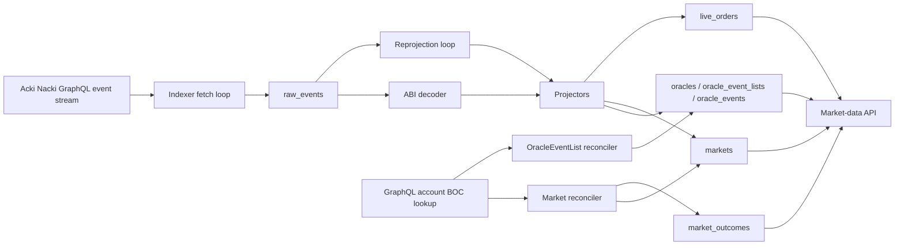

# Market Data Indexer Technical Specification

Implementation-facing requirements for the indexer side of the market-data path. This document covers how data gets *into* the read-model: ingestion from events stream, projection of contract events, and reconciliation of fields that events alone do not carry. The HTTP layer that serves these tables is described in [read-api.md](read-api.md). Postgres tables referenced below are documented column-by-column in [data-schema.md](data-schema.md).

## Glossary

**Read-model** — Postgres tables prepared for API reads. The indexer builds them from chain events and contract state.

**Raw event** — one message from the chain event stream stored in `raw_events`, decoded or not. It is kept so projections can be retried or rebuilt later.

**Projector** — code that applies one decoded on-chain event to the read-model. For example, the `OrderBook.OrderPlaced` event updates `live_orders`.

**Reconciler** — background task that periodically reads contract state through getters and fills fields that events alone do not provide.

**Reconciliation** — the process where reconcilers periodically fetch contract state and copy missing fields into the read-model. It complements event projection because some fields are available only through getters, not through chain events.

**Reprojection** — retry pass for `raw_events` rows that were decoded but could not be applied yet, usually because a child event arrived before its parent row existed.

**BOC** — serialized contract state fetched from GraphQL and passed to the local TVM runner so getters can be executed off-chain.

## Data Flow



## Ingestion

The indexer follows a GraphQL message-edge stream. Every edge becomes one row in [`raw_events`](data-schema.md#raw_events) regardless of whether it could be decoded — the raw log is the recovery boundary, and any downstream table can be rebuilt from `raw_events` plus a clean schema.

Sequence per edge:

1. Try to decode the message body against the ABI bundle (`crates/infrastructure/src/decoder.rs`). On success, store the decoded JSON payload alongside `event_type`.
2. Persist the row in `raw_events` with `processed_at = NULL`. The unique `msg_id` constraint deduplicates overlapping page fetches.
3. If decoding produced a known event, dispatch the projector inside the same transaction. The projector outcome decides whether `processed_at` is stamped now (`Applied`, `Unknown`) or left null for retry (`Deferred`).
4. After the page commits, persist the resume cursor in [`indexer_cursors`](data-schema.md#indexer_cursors). A restart resumes from this cursor — already-projected rows are not replayed.

## Projection — lifecycle events

Lifecycle events drive transitions on [`markets`](data-schema.md#markets) and the [`oracles`](data-schema.md#oracles) / [`oracle_event_lists`](data-schema.md#oracle_event_lists) / [`oracle_events`](data-schema.md#oracle_events) hierarchy. Each projector identifies its row by `pmp_address` (or the relevant parent address); if that row does not exist yet, the projector returns `Deferred` so the reprojection loop will retry once the parent event has landed.

| Event | Read-model effect |
| --- | --- |
| `RootOracle.OracleDeployed` | Inserts into [`oracles`](data-schema.md#oracles). Sets `address`, `name`, `pubkey`. |
| `Oracle.OracleEventListDeployed` | Inserts [`oracle_event_lists`](data-schema.md#oracle_event_lists) under the parent oracle. |
| `OracleEventList.EventAdded` | Upserts [`oracle_events`](data-schema.md#oracle_events) with `event_name`, `oracle_fee`, `deadline`. Does NOT carry `describe` or `trust_addr` — those come from the OracleEventList reconciler. |
| `OracleEventList.EventConfirmed` | Stamps `oracle_events.confirmed_pmp_address` and `confirmed_at`. Links an event to the PMP that will market it. |
| `PrivateNote.PMPDeployed` | Inserts a row in [`markets`](data-schema.md#markets) with `pmp_address`, `event_id`, `token_type`, `token_code`. Lifecycle columns (`stake_*`, `result_*`, `frozen_at`, etc.) stay NULL — they belong to later events. The row is invisible to the API until the reconciler stamps `last_reconciled_at`. |
| `PMP.TimingsSet` | Updates `stake_start`, `stake_end`, `result_start`, `result_end`, sets `approved = true`. May fire repeatedly while `now < resultStart` — keep the latest by block time. This projector is the **sole writer** of the four timing columns. |
| `PMP.PoolsFrozen` | Sets `frozen_at` via `coalesce` (never overwritten). This is the on-chain signal that the OrderBook contract has been deployed (see [dex-events-routing.md](../dex-events-routing.md): "after deploy OrderBook"). |
| `PMP.Resolved` | Sets `resolved_at` and `resolved_outcome_id`. |
| `PMP.PMPCancelled` | Sets `is_cancelled = true`, `cancelled_at`, `cancel_reason = 'PMP_CANCELLED'`. |
| `PMP.EventCancelled` | Same shape but `cancel_reason = 'EVENT_CANCELLED'`. The two reasons distinguish cancellation source and have different UI meaning. |

## Projection — order events

OrderBook events drive [`live_orders`](data-schema.md#live_orders), the per-order read-model that backs `/api/v1/depth`. Three events mutate state; five more are observability-only.

| Event | Effect |
| --- | --- |
| `OrderBook.OrderPlaced` | Upserts into `live_orders` with `status = 'OPEN'` and full `amount_remaining`. `last_chain_order` set to the event's `msg_chain_order`. A conflict on `(orderbook_address, order_id)` resets the row to OPEN. |
| `OrderBook.OrderFilled` | Decrements `amount_remaining` by `filledAmount`. Flips `status` to `FILLED` when the remainder reaches zero. Updates `last_chain_order` via `greatest(existing, new)` (lex compare). |
| `OrderBook.OrderCancelled` | `status = 'CANCELLED'`, `amount_remaining = 0`, monotonic `last_chain_order` update. |
| `OrderBook.PartialFill` / `FullyFilled` / `Queued` / `Rejected` / `CallbackBounced` | Observability-only. The row is recorded in `raw_events` for audit but no read-model table is touched. |

`PartialFill` / `FullyFilled` are derived aggregates the contract emits for MM-friendly UX; the underlying state is already captured by `OrderFilled`. `Queued` / `Rejected` happen at queue level, before any order id is assigned. `CallbackBounced` is a diagnostic — OrderBook state is not auto-rolled back, and the bounced credit needs operator-driven recovery.

Event ordering is anchored on `raw_events.chain_order` (set from the GraphQL gateway's `msg_chain_order`). The GraphQL events connection already returns edges in strict `msg_chain_order` order, and pagination preserves that order across pages; the live persist path therefore projects newly fetched edges in the received order. The reproject loop sorts deferred rows by `chain_order asc` because it reads from Postgres rather than directly from the ordered GraphQL page. Together these rules give `OrderPlaced → OrderFilled → OrderCancelled` the correct natural sequence. `greatest(existing, new)` on `last_chain_order` is a belt-and-suspenders monotonicity guard for the row's column, not the primary correctness mechanism.

## Reconciliation

Two reconcilers fill metadata that the event stream alone does not carry. Both run on a fixed cadence (`reconciliation_interval_ms`, `oracle_event_list_reconciliation_interval_ms` in `config/indexer.*.yaml`) and share a failure-backoff pattern (`last_reconcile_failed_at`, `reconcile_attempts` on the parent row) so a permanently broken contract cannot starve the queue.

### Market reconciler

For each [`markets`](data-schema.md#markets) row that needs catch-up, the reconciler:

1. Fetches the PMP account BOC from chain.
2. Runs `PMP.getDetails()` off-chain through the local TVM emulator (`crates/infrastructure/src/tvm_runner.rs`).
3. Runs `PMP.getOrderBookAddress()` the same way.
4. Writes `market_id`, `name`, `oracle_list_hash`, `approved`, `is_cancelled`, `num_outcomes`, and outcome rows in [`market_outcomes`](data-schema.md#market_outcomes).
5. Stamps `last_reconciled_at`. The market becomes visible to the API only after this point.

Two invariants the reconciler enforces on the write side:

- **`orderbook_address` is stamped on the first reconcile pass — pre-freeze rows included.** `getOrderBookAddress()` is deterministic (`contracts/PMP.sol:1360`) and returns the precomputed address regardless of `frozen_at`, so any market visible to the API carries a usable address. Migration 0014 pins this with a CHECK constraint (`last_reconciled_at IS NOT NULL ⇒ orderbook_address IS NOT NULL`) and un-stamps `last_reconciled_at` on legacy rows that migration 0013 left in the (reconciled, null-address) state so the next reconciler sweep re-fills them.
- **Timing columns (`stake_*`, `result_*`) are never written by the reconciler.** On pre-`TimingsSet` PMPs `getDetails()` returns contract-default zeros; copying those would make the API flip out of PENDING. The `TimingsSet` projector is the sole writer of those columns.

Queue ordering (the SELECT in `MarketReconciler::run_once`):

- A row enters the queue when `last_reconciled_at IS NULL` (never reconciled). The first successful pass stamps both the address and `last_reconciled_at`; the getter result is stable, so there is no later re-queue trigger.
- Failed rows go to the back via `nulls first` ordering on `last_reconcile_failed_at`. A 5-minute backoff filter excludes recently-failed rows entirely so they don't dominate the batch.

### OracleEventList reconciler

For each [`oracle_event_lists`](data-schema.md#oracle_event_lists) row that has at least one event still missing reconciler-only metadata, the OracleEventList reconciler runs `OracleEventList._events` and fills `describe` / `trust_addr` per event.

Key column: [`oracle_events.meta_reconciled_at`](data-schema.md#oracle_events). The reconciler stamps this **unconditionally** on every successful pass — even when the on-chain `trustAddr` is legitimately null, the marker is set so the row drops out of the pending queue. The marker replaced an earlier `describe IS NULL OR trust_addr IS NULL` predicate that never cleared for events with null on-chain metadata; the change shipped in migration 0012 with a backfill that stamps `meta_reconciled_at` for rows that already had either field populated.

The reconciler selects an OracleEventList when this condition is true:

```sql
exists (select 1 from oracle_events oe
         where oe.eventlist_id = oel.id
           and oe.meta_reconciled_at is null)
```

Two anti-starvation outcomes share the failure-backoff path with the market reconciler (`last_reconcile_failed_at`, 5-minute cooldown):

- **`NoBoc`** — the OracleEventList account BOC is not yet available from the gateway.
- **`Reconciled(0)` — no-progress pass.** The BOC is queryable but the run does not stamp any child. Two shapes collapse into this: an empty `_events` map, and a non-empty map whose items all target children that are already `meta_reconciled_at IS NOT NULL`. Both mean the indexed contract state lags the event stream — `EventAdded` persisted a pending child that `_events` does not yet reflect. Without the backoff the OracleEventList would be picked every sweep (the pending SELECT still matches it) and starve later rows behind the LIMIT 16 batch until the node catches up.

## Failure handling

Two outcomes leave a `raw_events` row pending:

- **`Deferred`** — the projector knows it cannot apply this event yet (typically a child arriving before its parent). `processed_at` stays NULL and the reprojection loop retries the row on every tick.
- **`Err`** — the projector hit an unexpected error. Same effect on `processed_at`, plus a warn log and an increment in the failure counter. Useful for spotting ABI drift.

The reprojection loop (`indexer_repo.rs::reproject_pending`) picks pending rows in chain-arrival order, uses `for update skip locked` to coexist with the main fetch loop, and reuses the already-decoded payload from `raw_events.decoded` — bodies are not re-decoded.

Reconciler-side failures use a separate mechanism — `last_reconcile_failed_at` and `reconcile_attempts` on the [`markets`](data-schema.md#markets) and [`oracle_event_lists`](data-schema.md#oracle_event_lists) rows. The 5-minute backoff window prevents a permanently broken `getDetails()` from blocking the batch every tick.

## Schema invariants — write side

| Invariant | Enforced by |
| --- | --- |
| `markets.last_reconciled_at IS NOT NULL ⇒ orderbook_address IS NOT NULL` | Migration-0014 CHECK constraint `markets_orderbook_address_set_after_reconcile`. The reconciler writes `orderbook_address` unconditionally from `getOrderBookAddress()`. |
| Lifecycle timings (`stake_*`, `result_*`) are projector-only | Reconciler does not write these columns. |
| `oracle_events.meta_reconciled_at` set after every successful reconciler pass | OracleEventList reconciler UPDATE always stamps it. |
| `live_orders.last_chain_order` lex-monotonic per row | `greatest(existing, new)` on every UPDATE; chain-order sorted reproject keeps natural arrival order monotonic too. |
| Cancellation reason matches its source | Projector picks `PMP_CANCELLED` or `EVENT_CANCELLED` based on event type, never NULL. |

The API enforces complementary read-side invariants on the assembled DTO — see [read-api.md](read-api.md#fail-closed-validation). Together they guarantee that an inconsistent indexer state (e.g. `PMP.Resolved` indexed before `PoolsFrozen`) cannot leak into a client response.

## Visibility gate

A market is visible to the public API only when `markets.last_reconciled_at IS NOT NULL`. Until the market reconciler runs, the row exists internally (`PMPDeployed` inserted it) but is hidden — clients see consistent, fully-populated markets only.

This pairs with the API's PENDING short-circuit: a row with NULL timing columns (reconciled but pre-`TimingsSet`) surfaces as `status = "PENDING"` with `timings = null`, per [read-api.md](read-api.md#status-derivation).
